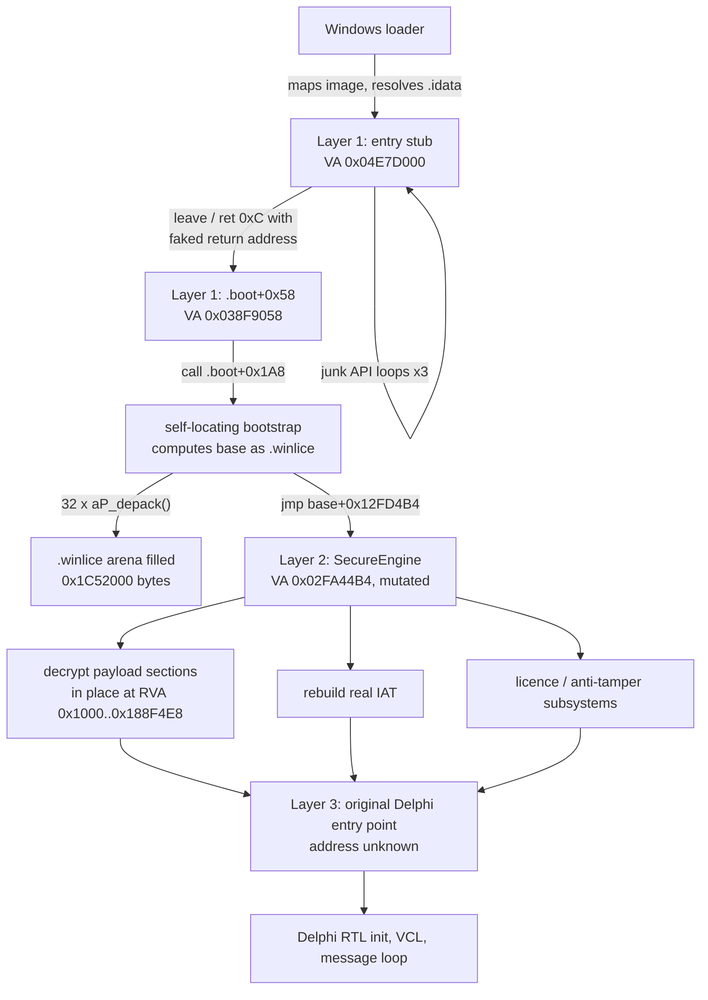
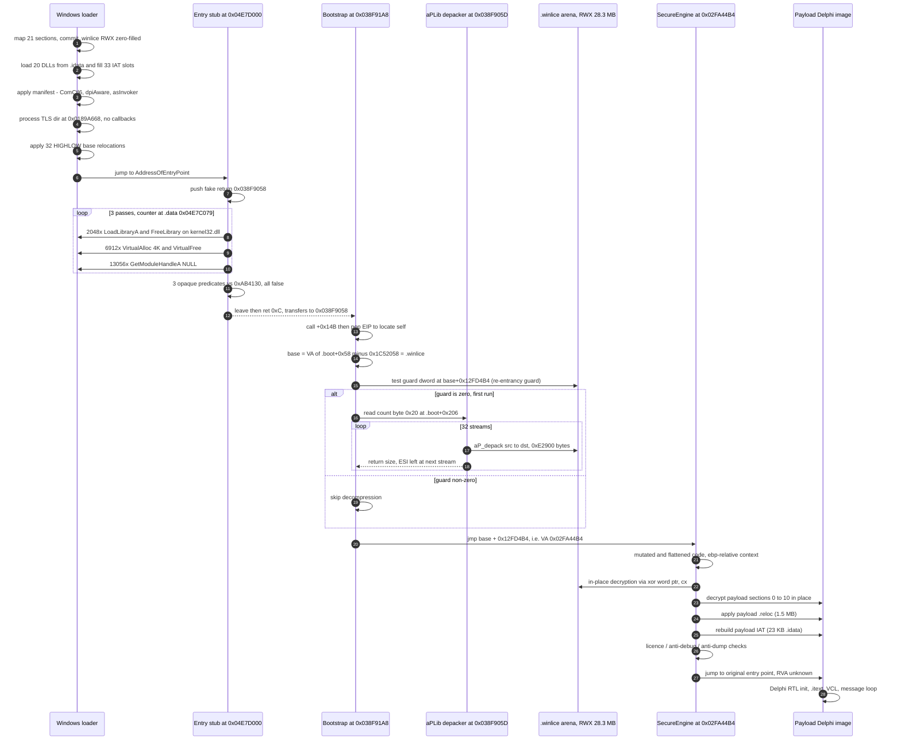
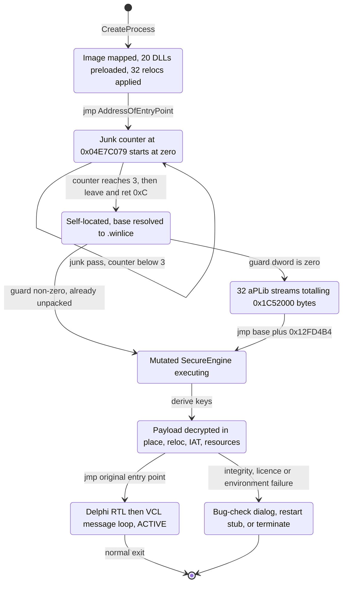
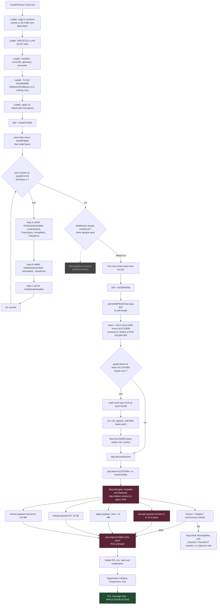

# `Test2.exe` — Reverse-Engineering Analysis

**Target:** `Test2.exe` (32,868,040 bytes)
**Analysis date:** 2025-09-30
**Analysis type:** Static. No Windows execution environment was available, so every runtime claim below is derived from recovered code/data and is labelled accordingly.
**Tooling:** `pefile`, `capstone`, `openssl`, and a purpose-written aPLib depacker (`tools/aplib_unpack.c`) built during this analysis.

---

## Table of Contents

1. [Executive Summary](#1-executive-summary)
2. [File and Binary Identification](#2-file-and-binary-identification)
3. [Architecture](#3-architecture)
4. [Dependencies and External Interfaces](#4-dependencies-and-external-interfaces)
5. [Entry Point](#5-entry-point)
6. [Complete Initialization Flow](#6-complete-initialization-flow)
7. [Initialization Sequence Diagram / Flow](#7-initialization-sequence-diagram--flow)
8. [Major Components](#8-major-components)
9. [Functions and Important Symbols](#9-functions-and-important-symbols)
10. [Data Structures](#10-data-structures)
11. [Runtime State and Control Flow](#11-runtime-state-and-control-flow)
12. [Feature-by-Feature Analysis](#12-feature-by-feature-analysis)
13. [Detailed Program Logic](#13-detailed-program-logic)
14. [Filesystem Behavior](#14-filesystem-behavior)
15. [Registry / System Interaction](#15-registry--system-interaction)
16. [Process and Thread Behavior](#16-process-and-thread-behavior)
17. [Network / IPC Behavior](#17-network--ipc-behavior)
18. [Configuration](#18-configuration)
19. [Resources](#19-resources)
20. [Error Handling](#20-error-handling)
21. [Security-Relevant Behavior](#21-security-relevant-behavior)
22. [Reverse-Engineering Evidence](#22-reverse-engineering-evidence)
23. [Confirmed vs Inferred Findings](#23-confirmed-vs-inferred-findings)
24. [Unknowns and Limitations](#24-unknowns-and-limitations)
25. [Reconstructed Execution Flow](#25-reconstructed-execution-flow)
26. [Overall Technical Architecture](#26-overall-technical-architecture)
27. [Appendix A — Reproducing This Analysis](#appendix-a--reproducing-this-analysis)
28. [Appendix B — Complete Recovered String Inventory](#appendix-b--complete-recovered-string-inventory)

---

## 1. Executive Summary

`Test2.exe` is a **32-bit native Windows GUI executable protected with Themida / WinLicense 3.2.4.52 (Oreans Technologies' "SecureEngine")**. It is **not** malware-obfuscated in an ad-hoc way and it is **not** a .NET/managed assembly; it is a commercial, code-signed, packed native binary.

The file has a two-layer structure:

* **Outer layer (protector).** A ~1.5 KB entry stub (`.text`), an import "DLL-preload" table (`.idata`), a 21.5 MB aPLib-compressed blob (`.boot`), a 28.3 MB zero-filled RWX runtime arena (`.winlice`), and a small branch-fixup table (`.vm_sec`).
* **Inner layer (payload).** The original application's 11 sections, left at their original RVAs but with their **section names wiped and their contents encrypted** (entropy 7.89–7.99).

The single most productive result of this analysis is that **the protector's first decompression stage was fully recovered and re-implemented**. The entry stub reaches `.boot+0x58` through a *fake return address*; `.boot+0x5D` contains a textbook **aPLib** depacker in plain, un-obfuscated x86. Re-implementing it (`tools/aplib_unpack.c`) decompresses 32 back-to-back streams into exactly **0x1C52000 bytes — bit-for-bit the declared virtual size of `.winlice`** — confirming the reconstruction is exact.

From that recovered 28.3 MB image the analysis extracted:

* the **SecureEngine runtime string pool** (registry keys, licence filenames, 16 command-line switches, the bug-check/diagnostic report template),
* **two complete embedded PE files** — `XBundlerTlsHelper.dll` (with its original Oreans PDB path) and a small **process terminate-and-relaunch stub**, which was reverse-engineered in full,
* a **437-entry branch-trampoline fixup table** in `.vm_sec`, every entry verified to point at a 5-byte `E9 jmp rel32`.

**Identity.** The payload is, with high confidence, **Oreans' own `Themida.exe` version 3.2.4.52 protected with itself**:

| Evidence | Value |
|---|---|
| `RT_VERSION` | `Oreans Technologies` / `Themida - Advanced Windows Software Protection` / `3.2.4.52` |
| Export directory module name | `Themida.exe` (a byte-exact copy of the original `.edata`, size `0xB3`) |
| Authenticode signer | `Rafael Patricio Ahucha Ruiz`, Jerez de la Frontera, Cádiz, ES |
| Authenticode digest | **Verified — matches the signature exactly** (file unmodified since signing) |
| Signing time | 2025-10-10 09:25:29 UTC |
| Protection project name | `Themida64_GUI` (UTF-16, adjacent to `WLProjectName`) |
| Compiler exports | `__dbk_fcall_wrapper`, `dbkFCallWrapperAddr`, `TMethodImplementationIntercept` → Delphi/RAD Studio |
| Third-party export | `madTraceProcess` → **madExcept** exception-reporting library |

Rafael Ahucha is the registrant of oreans.com [1](https://website.informer.com/Rafael+Ahucha+Oreans+Technologies.html), and Themida being a Delphi application is corroborated by the vendor's own PAD listing and community reports [2](https://www.oreans.com/ThemidaPad.xml) [3](https://stackoverflow.com/questions/2290324/tool-for-licensing-and-protect-my-delphi-win32-apps). The three Delphi exports are the well-documented default exports of every RAD Studio binary [4](https://en.delphipraxis.net/topic/330-how-to-remove-default-dll-exports-delphi-rio/).

**What could not be recovered:** the payload's own code. The original `.text` (16.0 MB), `.rsrc` (6.8 MB) and the remaining nine sections are encrypted with a key that is derived at runtime inside heavily mutated SecureEngine code. Nothing about the application's *own* features, UI, algorithms or logic can be established from this file alone. Section [24](#24-unknowns-and-limitations) enumerates this precisely.

---

## 2. File and Binary Identification

### 2.1 Hashes and size — **confirmed**

| Field | Value |
|---|---|
| File name | `Test2.exe` |
| Size | 32,868,040 bytes (`0x1F586C8`) |
| MD5 | `e29e999cd9f5dcbe189fe938ecc84c89` |
| SHA-1 | `ec356769c3fefb63b05e230a78d5e72173c898c3` |
| SHA-256 | `1fe62f8ea1879b34d5cc711a8999e878e3394896dbd761d8bd95b8d8c51f0e27` |
| Authenticode SHA-256 | `27ce79462c82d368da3cfa079e2bc38bf366c703f23cefb4dce2e0eb4b730797` |

> Throughout this report **KB/MB mean KiB/MiB** (1 MB = 1,048,576 bytes), matching the values shown by PE tooling. Exact byte and hex figures are given in the tables wherever precision matters.

### 2.2 Headers — **confirmed**

The DOS header begins `4D 5A 50` — **`MZP`**, not the usual `MZ\x90`. The stub text is `This program must be run under Win32`. Both are the signature of the **Borland / Embarcadero `ILINK32`** linker family (Delphi, C++Builder).

```
00000000  4d 5a 50 00 02 00 00 00  04 00 0f 00 ff ff 00 00   MZP.............
00000050  54 68 69 73 20 70 72 6f  67 72 61 6d 20 6d 75 73   This program mus
00000060  74 20 62 65 20 72 75 6e  20 75 6e 64 65 72 20 57   t be run under W
00000070  69 6e 33 32 0d 0a 24 37                            in32..$7
```

| COFF / Optional header field | Value | Note |
|---|---|---|
| `e_lfanew` | `0x100` | |
| `Machine` | `0x014C` | IMAGE_FILE_MACHINE_I386 — **32-bit x86, native** |
| `NumberOfSections` | **21** | unusually high; protector added 10 |
| `TimeDateStamp` | `0x68E8D0CD` | **2025-10-10 09:24:29 UTC** |
| `Characteristics` | `0x81AE` | EXECUTABLE_IMAGE, LINE_NUMS_STRIPPED, LOCAL_SYMS_STRIPPED, **LARGE_ADDRESS_AWARE**, BYTES_REVERSED_LO/HI, 32BIT_MACHINE |
| `Magic` | `0x010B` | PE32 |
| Linker version | 2.25 | Embarcadero `ILINK32` |
| `AddressOfEntryPoint` | `0x04A7D000` | in the **last** `.text` section (protector stub) |
| `BaseOfCode` | `0x00001000` | original payload code base |
| `ImageBase` | `0x00400000` | |
| `SectionAlignment` / `FileAlignment` | `0x1000` / `0x200` | |
| `SizeOfImage` | `0x04A7F000` (≈74.5 MB virtual) | |
| `SizeOfHeaders` | `0x600` | |
| `CheckSum` | `0x01F5D153` | **valid** (recomputes identically) |
| `Subsystem` | 2 | IMAGE_SUBSYSTEM_WINDOWS_GUI |
| `MajorSubsystemVersion` | 5.0 | Windows 2000+ |
| `DllCharacteristics` | **`0x0000`** | **no ASLR, no DEP/NX, no SEH hardening, no CFG** |
| Stack reserve / commit | `0x100000` / `0x4000` | Delphi defaults |
| Heap reserve / commit | `0x100000` / `0x1000` | |

> **Security note (confirmed).** `DllCharacteristics == 0` means `IMAGE_DLLCHARACTERISTICS_DYNAMIC_BASE`, `NX_COMPAT`, and `NO_SEH` are all clear. The image therefore loads at its preferred base `0x00400000` with ASLR and DEP opt-out. This is *required* by the design: the protector hard-codes absolute addresses (e.g. `mov eax, 0x38F9058`) and executes code from a writable section.

### 2.3 Data directories — **confirmed**

| Directory | RVA | Size | Resides in |
|---|---|---|---|
| EXPORT | `0x01890000` | `0x0000_00B3` | `.edata` (protector-rebuilt) |
| IMPORT | `0x01899329` | `0x0000_027C` | `.idata` (protector-built) |
| RESOURCE | `0x0189B000` | `0x0000_BFF4` | `.rsrc` (protector-built) |
| SECURITY | `0x01F55E58` (file offset) | `0x0000_2870` | overlay / Authenticode blob |
| BASERELOC | `0x04A7E000` | `0x0000_0054` | `.reloc` (protector-built) |
| TLS | `0x0189A668` | `0x0000_0018` | `.tls` (second, protector-built) |
| DELAY_IMPORT | `0x0103C000` | `0x0000_0B34` | **original, now-encrypted `.didata`** |

The **DELAY_IMPORT directory still points at the original payload section** (section 5, RVA `0x0103C000`, virtual size `0xB34` — an exact match). That data is encrypted on disk, so the directory is unparseable. This is strong evidence that the original program used Delphi's delay-loaded imports (`.didata`) and that the protector only *redirected* the import/export/resource directories, leaving the delay-import pointer stale. — **confirmed** (structural), **strongly inferred** (interpretation).

### 2.4 Section table — **confirmed**

21 sections. Entropy computed over raw data.

| # | Name | VA (RVA) | VSize | RawPtr | RawSize | Entropy | Flags | Role |
|---|---|---|---|---|---|---|---|---|
| 0 | *(wiped)* | `00001000` | `00FFBFD4` | `00000600` | `005A4200` | **7.985** | CODE r-x | payload `.text` (16.0 MB) — encrypted |
| 1 | *(wiped)* | `00FFD000` | `0000916C` | `005A4800` | `00004E00` | **7.889** | CODE r-x | payload `.itext` — encrypted |
| 2 | *(wiped)* | `01007000` | `00024314` | `005A9600` | `00015C00` | **7.928** | IDATA rw- | payload `.data` — encrypted |
| 3 | `.bss` | `0102C000` | `00009F5C` | — | 0 | — | rw- | payload `.bss` (**name survives**) |
| 4 | *(wiped)* | `01036000` | `00005B78` | `005BF200` | `00000800` | 6.893 | IDATA rw- | payload `.idata` — encrypted |
| 5 | *(wiped)* | `0103C000` | `00000B34` | `005BFA00` | `00000400` | 7.731 | IDATA rw- | payload `.didata` — encrypted |
| 6 | *(wiped)* | `0103D000` | `000000B3` | `005BFE00` | `00000200` | 2.733 | IDATA r-- | payload `.edata` — encrypted |
| 7 | `.tls` | `0103E000` | `00000654` | — | 0 | — | rw- | payload `.tls` (**name survives**) |
| 8 | *(wiped)* | `0103F000` | `0000005D` | `005C0000` | `00000200` | 1.776 | IDATA r-- | payload `.rdata` — encrypted |
| 9 | *(wiped)* | `01040000` | `001820C0` | `005C0200` | `000D7E00` | **7.973** | IDATA r-- | payload `.reloc` (1.5 MB) — encrypted |
| 10 | *(wiped)* | `011C3000` | `006CC4E8` | `00698000` | `00325800` | **7.960** | IDATA r-- | payload `.rsrc` (6.8 MB) — encrypted |
| 11 | `.edata` | `01890000` | `00001000` | `009BD800` | `00000200` | 2.201 | IDATA r-- | **protector**: rebuilt export dir |
| 12 | `.vm_sec` | `01891000` | `00008000` | `009BDA00` | `00008000` | 4.992 | IDATA rw- | **protector**: branch-fixup table |
| 13 | `.idata` | `01899000` | `00001000` | `009C5A00` | `00000600` | 4.430 | IDATA rw- | **protector**: DLL-preload imports |
| 14 | `.tls` | `0189A000` | `00001000` | `009C6000` | `00000800` | 0.061 | rw- | **protector**: relocated TLS dir |
| 15 | `.rsrc` | `0189B000` | `0000C000` | `009C6800` | `0000C000` | 7.080 | IDATA r-- | **protector**: loader-visible resources |
| 16 | **`.winlice`** | `018A7000` | **`01C52000`** | — | **0** | — | **rwx CODE** | **protector**: 28.3 MB RWX runtime arena |
| 17 | **`.boot`** | `034F9000` | `01582C00` | `009D2800` | `01582C00` | 7.885 | CODE r-x | **protector**: aPLib-packed engine (21.5 MB) |
| 18 | `.data` | `04A7C000` | `00000400` | `01F55400` | `00000400` | 3.278 | IDATA rw- | **protector**: stub data (`skeleton.dll`) |
| 19 | `.text` | `04A7D000` | `00000600` | `01F55800` | `00000600` | 2.681 | CODE r-x | **protector**: entry stub (EP here) |
| 20 | `.reloc` | `04A7E000` | `00001000` | `01F55E00` | `00000054` | 4.585 | r-- | **protector**: 34 relocations only |

**Section-name wiping rule — confirmed by perfect correlation.** Every section that has file-backed content had its name zeroed; the only two sections whose names survived (`.bss`, `.tls`) are exactly the two with `SizeOfRawData == 0`. The protector wipes the name of any section whose content it rewrites.

**Protector identification — confirmed.** `.winlice` and `.boot` are the documented Oreans section names. `.winlice` is a 28.3 MB **RWX** (`0xE0000060`) section with **zero raw bytes** — a pure runtime arena.

### 2.5 Recovered original section layout — **strongly inferred**

Combining the surviving names, the section flags, the exact virtual-size matches of the EXPORT (`0xB3`) and DELAY_IMPORT (`0xB34`) directories, and the ordering, the original image is reconstructed as a **Delphi XE2-or-later Win32 build** (modern RAD Studio uses lower-case dotted section names; Delphi ≤ 2010 used `CODE`/`DATA`/`BSS`):

```
 #  name       RVA         VSize        note
 0  .text      0x00001000  0x00FFBFD4   16.0 MB of compiled Pascal/Object Pascal
 1  .itext     0x00FFD000  0x0000916C   Embarcadero "initialization code" section
 2  .data      0x01007000  0x00024314
 3  .bss       0x0102C000  0x00009F5C   (name survives - no raw data)
 4  .idata     0x01036000  0x00005B78   23 KB import table => large API surface
 5  .didata    0x0103C000  0x00000B34   == DELAY_IMPORT dir size, exact match
 6  .edata     0x0103D000  0x000000B3   == EXPORT dir size, exact match
 7  .tls       0x0103E000  0x00000654   (name survives) Delphi threadvars
 8  .rdata     0x0103F000  0x0000005D
 9  .reloc     0x01040000  0x001820C0   1.5 MB of relocations
10  .rsrc      0x011C3000  0x006CC4E8   6.8 MB of resources (VCL DFMs, images)
```

Total original virtual extent ≈ `0x188F4E8` ≈ **24.6 MB**, versus ≈ 9.7 MB of (compressed + encrypted) on-disk content — an in-place expansion ratio of ~2.6×.

### 2.6 Classification summary

| Question | Answer | Confidence |
|---|---|---|
| Native or managed? | **Native x86**, no CLR header, no `mscoree` | confirmed |
| Packed? | **Yes** — Themida/WinLicense 3.2.4.52 + aPLib + in-place section encryption | confirmed |
| Obfuscated? | **Yes** — junk code, opaque predicates, fake return addresses, code mutation | confirmed |
| Frameworks | Delphi/RAD Studio VCL + madExcept | strongly inferred |
| Signed? | **Yes, and the digest verifies** | confirmed |

---

## 3. Architecture

`Test2.exe` is a **self-decrypting container**. Three distinct bodies of code live in one address space:

```
 VA 0x00400000 ─────────────────────────────────────────────────────── ImageBase
 │
 │  ┌──────────────────────────────────────────────────────────────┐
 │  │ LAYER 3 — PAYLOAD (Delphi/VCL application, ENCRYPTED)        │
 │  │   RVA 0x00001000 .. 0x0188F4E8   (24.6 MB virtual)           │
 │  │   .text .itext .data .bss .idata .didata .edata .tls         │
 │  │   .rdata .reloc .rsrc                                        │
 │  │   -> decrypted in place by Layer 2; not recoverable statically│
 │  └──────────────────────────────────────────────────────────────┘
 │
 │  ┌──────────────────────────────────────────────────────────────┐
 │  │ LAYER 2 — SecureEngine runtime (RECOVERED, but mutated)      │
 │  │   .winlice  RVA 0x018A7000 .. 0x034F9000  (28.3 MB, RWX)     │
 │  │   filled at run time by Layer 1; contains the licence engine,│
 │  │   anti-debug/anti-dump, the VM, and the payload decryptor    │
 │  └──────────────────────────────────────────────────────────────┘
 │
 │  ┌──────────────────────────────────────────────────────────────┐
 │  │ LAYER 1 — bootstrap (FULLY RECOVERED, plain x86)             │
 │  │   .text  0x04A7D000  entry stub ("skeleton.dll")             │
 │  │   .data  0x04A7C000  stub strings + import name pool         │
 │  │   .idata 0x01899000  IAT / DLL-preload list                  │
 │  │   .boot  0x034F9000  aPLib depacker + 32 packed streams      │
 │  └──────────────────────────────────────────────────────────────┘
 │
 VA 0x04E7F000 ────────────────────────────────────────── end of image
```

Control flows strictly upward through the layers: **Layer 1 builds Layer 2, Layer 2 decrypts and starts Layer 3.**



---

## 4. Dependencies and External Interfaces

### 4.1 Import table — **confirmed** (structure), **strongly inferred** (purpose)

The import directory lists **20 DLLs and only 33 functions in total** (19 of the 20 contribute just one or two). This is the classic protector "DLL-preload" pattern: the imports exist only so the Windows loader maps each DLL *before* the protector runs, allowing SecureEngine to resolve the real API set later by walking `PEB->Ldr` and the export tables.

| DLL | Imported symbol(s) | IAT slot (VA) | Referenced by the stub? |
|---|---|---|---|
| `kernel32.dll` | `GetModuleHandleA` | `01C994D0` | **yes** |
| | `GetProcessHeap` | `01C994D4` | yes (junk) |
| | `GetVersionExA` | `01C994D8` | yes (junk) |
| | `HeapAlloc` | `01C994DC` | yes (junk) |
| | `GetModuleHandleA` *(duplicate)* | `01C994E0` | no |
| | `LoadLibraryA` | `01C994E4` | **yes** |
| | `VirtualAlloc` | `01C994E8` | **yes** |
| | `VirtualFree` | `01C994EC` | **yes** |
| | `GetCurrentThreadId` | `01C994F0` | yes (junk) |
| | `GetCommandLineA` | `01C994F4` | yes (junk) |
| | `HeapFree` | `01C994F8` | yes (junk) |
| | `FreeLibrary` | `01C994FC` | **yes** |
| `oleaut32.dll` | `SysFreeString` | `01C99504` | no |
| `advapi32.dll` | `RegQueryValueExW` | `01C9950C` | no |
| `user32.dll` | `CharNextW` | `01C99514` | no |
| | `MessageBoxA` | `01C99518` | **yes** |
| `gdi32.dll` | `WidenPath` | `01C99520` | no |
| `version.dll` | `VerQueryValueA` | `01C99528` | no |
| `IMAGEHLP.DLL` | `ImageDirectoryEntryToData` | `01C99530` | no |
| `SHFolder.dll` | `SHGetFolderPathW` | `01C99538` | no |
| `netapi32.dll` | `NetWkstaGetInfo` | `01C99540` | no |
| `ole32.dll` | `CreateILockBytesOnHGlobal` | `01C99548` | no |
| `comctl32.dll` | `InitializeFlatSB` | `01C99550` | no |
| | `ImageList_EndDrag` | `01C99554` | yes (junk) |
| `shell32.dll` | `ShellExecuteExA` | `01C9955C` | no |
| `comdlg32.dll` | `PrintDlgW` | `01C99564` | no |
| `wsock32.dll` | `__WSAFDIsSet` | `01C9956C` | no |
| `msvcrt.dll` | `memset` | `01C99574` | no |
| `winspool.drv` | `OpenPrinterW` | `01C9957C` | no |
| `winmm.dll` | `sndPlaySoundW` | `01C99584` | no |
| `shlwapi.dll` | `PathRelativePathToW` | `01C9958C` | no |
| `oledlg.dll` | `OleUIObjectPropertiesW` | `01C99594` | no |
| `IMM32.dll` | `ImmSetCompositionWindow` | `01C9959C` | yes (junk) |

The chosen function names are deliberately obscure (`WidenPath`, `__WSAFDIsSet`, `InitializeFlatSB`, `OleUIObjectPropertiesW`) — they are placeholders, not real dependencies of the stub.

> **Inference about the payload.** The *DLL set* is meaningful even though the function names are not: a protector must preload every DLL the payload will need. This set is a textbook **Delphi VCL** dependency profile:
> * `comctl32`, `comdlg32`, `shell32`, `shlwapi`, `oledlg`, `winspool.drv`, `imm32` → `Vcl.Forms`, `Vcl.Dialogs`, `Vcl.Printers`, `Vcl.OleCtnrs`
> * `SHFolder!SHGetFolderPathW` → Delphi's `Vcl.SHFolder` / special-folder lookup
> * `wsock32` → WinSock (Indy / `ScktComp` / raw sockets)
> * `IMAGEHLP!ImageDirectoryEntryToData` + `netapi32!NetWkstaGetInfo` → **madExcept**, which uses ImageHlp for stack-trace symbolisation and NetWkstaGetInfo for machine details in bug reports. This corroborates the `madTraceProcess` export.
>
> — **strongly inferred**

### 4.2 Export table — **confirmed**

`.edata` at RVA `0x01890000` (raw offset `0x9BD800`). Byte-level layout:

```
+0x00 Characteristics        00000000
+0x04 TimeDateStamp          00000000
+0x08 Major/MinorVersion     0000 0000
+0x0C Name                   01890028 -> "Themida.exe"
+0x10 Base                   00000001
+0x14 NumberOfFunctions      00000004
+0x18 NumberOfNames          00000004
+0x1C AddressOfFunctions     01890093
+0x20 AddressOfNames         018900A3
+0x24 AddressOfNameOrdinals  0189008B
+0x28 string pool:
      "Themida.exe\0"                      (12 bytes, ends 0x34)
      "TMethodImplementationIntercept\0"   (30 bytes, ends 0x52)
      "__dbk_fcall_wrapper\0"              (20 bytes, ends 0x66)
      "dbkFCallWrapperAddr\0"              (20 bytes, ends 0x7A)
      "madTraceProcess\0"                  (16 bytes, ends 0x8A)
+0x8B ordinals (4 x WORD)                  ends 0x93
+0x93 functions (4 x DWORD)                ends 0xA3
+0xA3 names     (4 x DWORD)                ends 0xB3   <-- total 0xB3
```

`0xB3` equals both the EXPORT data-directory size **and** the virtual size of the original (now-encrypted) `.edata` section at RVA `0x0103D000`. The protector therefore reproduced the payload's export directory **byte for byte**, only relocating it.

| Ord | RVA | Name | Meaning |
|---|---|---|---|
| 1 | `0x0102F5AC` | `dbkFCallWrapperAddr` | Delphi debug-kernel pointer (lives in payload `.data`) |
| 2 | `0x00012660` | `__dbk_fcall_wrapper` | Delphi debug-kernel thunk (payload `.text`) |
| 3 | `0x000B0CBC` | `madTraceProcess` | **madExcept** stack-trace entry (payload `.text`) |
| 4 | `0x000DEB70` | `TMethodImplementationIntercept` | Delphi `System.Rtti` (payload `.text`) |

Exports 1, 2 and 4 are the default exports emitted by every RAD Studio Win32 binary [4](https://en.delphipraxis.net/topic/330-how-to-remove-default-dll-exports-delphi-rio/). Export 3 proves madExcept is linked in. Because the RVAs point into the payload's own code, the original module name at link time was `Themida.exe`. — **confirmed** (data), **strongly inferred** (conclusion).

### 4.3 Digital signature — **confirmed and verified**

* `WIN_CERTIFICATE`: length 10,352, revision `0x0200`, type `0x0002` (PKCS#7 `SignedData`).
* Located at file offset `0x01F55E58`; `0x01F55E58 + 0x2870 = 0x1F586C8` = **exact end of file**, so there is **no additional overlay data**.

Certificate chain:

| Role | Subject | Validity |
|---|---|---|
| **Leaf (signer)** | `C=ES, ST=Cadiz, L=Jerez de la Frontera, O=Rafael Patricio Ahucha Ruiz, CN=Rafael Patricio Ahucha Ruiz` | 2024-05-27 → 2027-05-27 |
| Intermediate | `CN=Certum Code Signing 2021 CA, O=Asseco Data Systems S.A., C=PL` | 2021-05-19 → 2036-05-18 |
| Roots/TSA | `Certum Trusted Network CA`, `Certum Trusted Network CA 2`, `Certum Timestamping 2021 CA`, `Certum Timestamp 2025` | |

* Digest algorithm: **SHA-256**; leaf signature algorithm `sha256WithRSAEncryption`; RSA **4096-bit** key.
* `signingTime` attribute: **`251010092529Z` = 2025-10-10 09:25:29 UTC**, RFC-3161 counter-signed by Certum Timestamp 2025.

**Integrity verification performed in this analysis:**

```
computed Authenticode PE digest : 27CE79462C82D368DA3CFA079E2BC38BF366C703F23CEFB4DCE2E0EB4B730797
digest inside SpcIndirectData   : 27CE79462C82D368DA3CFA079E2BC38BF366C703F23CEFB4DCE2E0EB4B730797
                                   ^ identical
```

The PE image is therefore **byte-identical to what the signer signed** — it has not been patched, trojanised or re-packed after signing. The stored PE `CheckSum` (`0x01F5D153`) also recomputes correctly. — **confirmed**.

### 4.4 Build-timeline correlation — **confirmed**

| Source | Timestamp (UTC) |
|---|---|
| PE `TimeDateStamp` | 2025-10-10 **09:24:29** |
| UTF-16 string at `.winlice+0x1EA4`: `Fri Oct 10 11:25:48 2025` | 09:25:48 (CEST = UTC+2, Spain) |
| Authenticode `signingTime` | 2025-10-10 **09:25:29** |

All three fall inside an ~80-second window on 2025-10-10, consistent with a single automated protect-then-sign build step executed in a UTC+2 timezone — matching the signer's location (Spain). The internal string is written by the protector at protection time.

---

## 5. Entry Point

**`AddressOfEntryPoint = 0x04A7D000` → VA `0x04E7D000`**, inside the protector's `.text` (section 19, raw offset `0x01F55800`). Only `0x265` of the section's `0x600` bytes are used; the rest is zero padding.

### 5.1 Complete disassembly of the entry stub — **confirmed**

```asm
; ---- entry point -------------------------------------------------------
04E7D000  ff74240c        push  dword [esp+0xC]     ; forward arg 3
04E7D004  ff74240c        push  dword [esp+0xC]     ; forward arg 2
04E7D008  ff74240c        push  dword [esp+0xC]     ; forward arg 1
04E7D00C  b858908f03      mov   eax, 0x038F9058     ; <-- .boot + 0x58   (RELOCATED)
04E7D011  50              push  eax                 ; FAKE RETURN ADDRESS
04E7D012  e900000000      jmp   0x04E7D017          ; jmp +0 (disassembly desync bait)
04E7D017  55              push  ebp
04E7D018  8bec            mov   ebp, esp            ; [ebp+4] == 0x038F9058
04E7D01A  e9d1000000      jmp   0x04E7D0F0          ; -> loop guard

; ---- junk / anti-emulation body, executed exactly 3 times --------------
04E7D01F  b823d2e704      mov   eax, 0x04E7D223     ; dead
04E7D024  c1e810          shr   eax, 0x10           ; dead
04E7D027  0513090000      add   eax, 0x913          ; dead
04E7D02C  25ff1f0000      and   eax, 0x1FFF         ; dead
04E7D031  8bc8            mov   ecx, eax            ; dead
04E7D033  b900000100      mov   ecx, 0x10000        ; overwritten
04E7D038  b823d2e704      mov   eax, 0x04E7D223     ; dead
04E7D03D  81e100060000    and   ecx, 0x600          ; overwritten
04E7D043  b900080000      mov   ecx, 0x800          ; <-- real: loop count = 2048
04E7D048  eb42            jmp   0x04E7D08C
; -- loop A (2048 iterations) --
04E7D04A  81f900020000    cmp   ecx, 0x200
04E7D050  7600            jbe   0x04E7D052          ; jbe +0  (opaque, always falls through)
04E7D052  51              push  ecx
04E7D053  6a00            push  0
04E7D055  e8c9010000      call  0x04E7D223          ; GetModuleHandleA(NULL)
04E7D05A  686cc0e704      push  0x04E7C06C          ; "kernel32.dll"
04E7D05F  e8dd010000      call  0x04E7D241          ; LoadLibraryA("kernel32.dll")
04E7D064  50              push  eax
04E7D065  e8a7010000      call  0x04E7D211          ; FreeLibrary(hKernel32)
04E7D06A  6a04            push  4                   ; PAGE_READWRITE
04E7D06C  6800100000      push  0x1000              ; MEM_COMMIT
04E7D071  6800100000      push  0x1000              ; dwSize = 4096
04E7D076  6a00            push  0                   ; lpAddress = NULL
04E7D078  e8ca010000      call  0x04E7D247          ; VirtualAlloc(...)
04E7D07D  6800800000      push  0x8000              ; MEM_RELEASE
04E7D082  6a00            push  0
04E7D084  50              push  eax
04E7D085  e8c3010000      call  0x04E7D24D          ; VirtualFree(p, 0, MEM_RELEASE)
04E7D08A  59              pop   ecx
04E7D08B  49              dec   ecx
04E7D08C  0bc9            or    ecx, ecx
04E7D08E  75ba            jne   0x04E7D04A
; -- loop B (0x1300 = 4864 iterations, same body minus LoadLibrary) --
04E7D090  b900130000      mov   ecx, 0x1300
      ... (identical GetModuleHandleA / VirtualAlloc / VirtualFree body) ...
04E7D0CB  75ca            jne   0x04E7D097
; -- loop C (0x1800 = 6144 iterations, GetModuleHandleA only) --
04E7D0CD  b900180000      mov   ecx, 0x1800
04E7D0D4  81f900020000    cmp   ecx, 0x200
04E7D0DA  7600            jbe   0x04E7D0DC
04E7D0DC  51              push  ecx
04E7D0DD  6a00            push  0
04E7D0DF  e83f010000      call  0x04E7D223          ; GetModuleHandleA(NULL)
04E7D0E4  59              pop   ecx
04E7D0E5  49              dec   ecx
04E7D0E6  0bc9            or    ecx, ecx
04E7D0E8  75ea            jne   0x04E7D0D4
04E7D0EA  ff0579c0e704    inc   dword [0x04E7C079]  ; outer counter (in .data)
; ---- outer loop guard: repeat the whole junk body 3 times --------------
04E7D0F0  833d79c0e70403  cmp   dword [0x04E7C079], 3
04E7D0F7  0f8222ffffff    jb    0x04E7D01F

; ---- three dead MessageBoxA branches (opaque predicates) ---------------
04E7D0FD  817d0c3041ab00  cmp   dword [ebp+0xC], 0x00AB4130   ; fdwReason == 0xAB4130 ?
04E7D104  7515            jne   0x04E7D11B
04E7D106  6a00            push  0
04E7D108  6848c0e704      push  0x04E7C048          ; "dummy"
04E7D10D  6854c0e704      push  0x04E7C054          ; "dummy"
04E7D112  6a00            push  0
04E7D114  e83a010000      call  0x04E7D253          ; MessageBoxA(0,"dummy","dummy",0)
04E7D119  eb3a            jmp   0x04E7D155
04E7D11B  817d0c3041ab00  cmp   dword [ebp+0xC], 0x00AB4130   ; same constant again
04E7D122  7515            jne   0x04E7D139
      ... identical dead branch ...
04E7D139  817d0c3041ab00  cmp   dword [ebp+0xC], 0x00AB4130   ; and a third time
04E7D140  7513            jne   0x04E7D155
      ... identical dead branch ...

; ---- the actual transfer of control -----------------------------------
04E7D155  b800000000      mov   eax, 0
04E7D15A  c9              leave                     ; esp <- ebp ; pop ebp
04E7D15B  c20c00          ret   0xC                 ; *** jumps to 0x038F9058, pops 12 bytes ***
```

### 5.2 Why `ret 0xC` is the real jump — **confirmed**

The stub is a compiled `DllMain(hinstDLL, fdwReason, lpvReserved)` whose prologue was hand-edited. Stack layout after `push ebp; mov ebp, esp`:

```
  [ebp+0x00] = saved EBP
  [ebp+0x04] = 0x038F9058          <-- pushed at 04E7D011, occupies the return-address slot
  [ebp+0x08] = hinstDLL   (forwarded)
  [ebp+0x0C] = fdwReason  (forwarded)   <-- compared against 0xAB4130
  [ebp+0x10] = lpvReserved(forwarded)
```

`leave` sets `esp = ebp` then pops EBP, so `esp` now points at `0x038F9058`; `ret 0xC` pops it into EIP and discards the three forwarded arguments. **The stub "returns" straight into the packed body.** This defeats naive call-graph reconstruction — no `call`/`jmp` instruction ever references `.boot`.

The three `cmp [ebp+0xC], 0xAB4130` tests are **opaque predicates**: `0xAB4130` is not a valid `DLL_PROCESS_ATTACH`/`_DETACH`/`THREAD_*` value, and comparing the same operand against the same constant three times in sequence guarantees all three `MessageBoxA("dummy","dummy")` blocks are unreachable.

### 5.3 Unconsumed SDK protection-macro markers — **confirmed**

`.text` contains an **unreachable tail** (`0x04E7D15E`–`0x04E7D20F`; unreachable because `ret 0xC` at `0x04E7D15B` never falls through) that preserves the **Oreans SDK protection-macro sentinels** verbatim. Raw bytes:

```
04E7D15E  eb 10                                   jmp 0x04E7D170   ; hop over marker
04E7D160  57 4c 20 20  0c 00 00 00  00 00 00 00  57 4c 20 20
          "WL  "       id = 0x0C     pad          "WL  "           ; START marker block
04E7D170  be 53 d2 e7 04                          mov  esi, 0x04E7D253
04E7D175  6a 00 68 48 c0 e7 04 68 4e c0 e7 04 6a 00 ff d6
                                                  MessageBoxA(0,"dummy","dummy",0)
04E7D185  eb 10                                   jmp 0x04E7D197   ; hop over marker
04E7D187  57 4c 20 20  0d 00 00 00  00 00 00 00  57 4c 20 20
          "WL  "       id = 0x0D     pad          "WL  "           ; END marker block
04E7D197  01 be ad de                             dd 0xDEADBE01    ; START marker
04E7D19B  53 51 b9 ... 81 04 24 81 01 42 00 c7 04 24 01 ad ef be
                                                  ; guarded body: arithmetic-obfuscated
                                                  ; constant builder ending in 0xBEEFAD01
04E7D1DE  02 be ad de                             dd 0xDEADBE02    ; END marker
04E7D1E2  c3                                      ret
04E7D1E3  e8 3b 00 00 00 ... e8 4f 00 00 00       ImportAnchor: 8 calls, one per thunk
04E7D210  cc                                      int3
04E7D211..04E7D264                                14 IAT jump thunks
```

Two distinct sentinel schemes are present, both **left unprocessed in the shipped file**:

| Scheme | Encoding | Instances |
|---|---|---|
| `"WL  "` blocks | `"WL  "` + 4-byte macro id + 4-byte pad + `"WL  "`, preceded by a `jmp` that skips them | id `0x0C` at `04E7D160`, id `0x0D` at `04E7D187` |
| `0xDEADBExx` | bare little-endian dword | `0xDEADBE01` at `04E7D197`, `0xDEADBE02` at `04E7D1DE` |

The pattern — `jmp` over a start sentinel, a short guarded body, `jmp` over a matching end sentinel — is precisely how the Themida/WinLicense SDK macros (`VM_START`/`VM_END`, `CHECK_PROTECTION`, …) are emitted into source before the protection tool rewrites the bracketed code. Here they wrap a sample `MessageBoxA("dummy","dummy")` call and a junk constant-builder: leftovers of the Oreans **template project**, never rewritten because this stub *is* the protector's own loader rather than user code. — **confirmed** (bytes); **strongly inferred** (interpretation).

`.data` at `0x04E7C282` / `0x04E7C28F` holds **`skeleton.dll`** and **`TestHello`** — the module name and exported function of that template DLL project. The PDB path recovered from `.winlice` (`Z:\Development\SecureEngine\src\plugins_manager\internal_plugins\embedded dlls\...`) shows the same build tree.

### 5.4 Relocations — **confirmed**

Only **two** relocation blocks survive (`.reloc`, 84 bytes total):

| Block RVA | Entries | Contents |
|---|---|---|
| `0x0189A000` | 3 × `HIGHLOW` + 1 pad | `0189A668`, `0189A66C`, `0189A670` — the three pointer fields of the relocated TLS directory |
| `0x04A7D000` | 29 × `HIGHLOW` + 1 pad | every absolute address in the entry stub, including `04A7D00D` (the `mov eax, 0x038F9058` fake-return constant) and all 14 IAT thunk operands at `04A7D213`–`04A7D261` |

The payload's own 1.5 MB `.reloc` (section 9) is encrypted and is applied later by SecureEngine, not by the Windows loader.

---

## 6. Complete Initialization Flow

### Stage 0 — Windows loader (before any image code runs) — **confirmed**

1. `CreateProcess` maps `Test2.exe` at `0x00400000` (no ASLR — `DllCharacteristics == 0`).
2. All 21 sections are mapped. `.winlice` (28.3 MB) is committed as **zero-filled RWX**; `.bss` and the payload `.tls` are likewise zero-filled.
3. The loader parses `.idata` (RVA `0x1899329`) and **loads all 20 DLLs**: `kernel32, oleaut32, advapi32, user32, gdi32, version, imagehlp, shfolder, netapi32, ole32, comctl32, shell32, comdlg32, wsock32, msvcrt, winspool.drv, winmm, shlwapi, oledlg, imm32`, writing 33 IAT slots at `0x01C994D0`–`0x01C9959C`.
4. The activation-context manager processes `RT_MANIFEST` #1: Common-Controls v6.0 side-by-side binding, `dpiAware = True/PM`, `requestedExecutionLevel = asInvoker` (**no elevation requested**).
5. The TLS directory at `0x0189A668` is processed: raw template `0x01C9A000`–`0x01C9A654` (0x654 bytes, all zero), index slot `0x01C9A658`, **`AddressOfCallBacks = 0`** — *no TLS callbacks run*.
6. Base relocations are applied: 34 entries, of which 32 are `HIGHLOW` and 2 are `ABSOLUTE` padding.
7. Control transfers to `0x04E7D000`.

> **Note.** The absence of TLS callbacks is significant: many protectors place anti-debug code there. This build does not.

### Stage 1 — Entry stub (`.text`, `0x04E7D000`) — **confirmed**

1. Forward three stack dwords; push the constant `0x038F9058` as a **fake return address**; build a frame.
2. Run the junk body three times (outer counter at `.data:0x04E7C079`, guard `cmp …, 3`). Each pass issues:
   * loop A — 2,048 × { `GetModuleHandleA(NULL)`, `LoadLibraryA("kernel32.dll")`, `FreeLibrary`, `VirtualAlloc(4 KB, MEM_COMMIT, PAGE_READWRITE)`, `VirtualFree(MEM_RELEASE)` }
   * loop B — 4,864 × { `GetModuleHandleA`, `VirtualAlloc`, `VirtualFree` }
   * loop C — 6,144 × { `GetModuleHandleA` }
   Totals per process start: **39,168 `GetModuleHandleA`, 6,144 `LoadLibraryA` + 6,144 `FreeLibrary`, 20,736 `VirtualAlloc` + 20,736 `VirtualFree` — 92,928 calls in all.**
3. Evaluate three opaque predicates (all false) — the `MessageBoxA("dummy","dummy")` paths are dead.
4. `leave` / `ret 0xC` → **`0x038F9058`**.

### Stage 2 — Self-locating bootstrap (`.boot+0x1A8`) — **confirmed**

```asm
038F9058  e84b010000   call 0x038F91A8      ; pushes 0x038F905D
;                        ^ the aPLib depacker function begins at 0x038F905D

038F91A8  58           pop  eax             ; eax = 0x038F905D (runtime address of the depacker)
038F91A9  53 51 52 56 57 55                 ; push ebx,ecx,edx,esi,edi,ebp
038F91AF  89c3         mov  ebx, eax
038F91B1  83eb05       sub  ebx, 5          ; ebx = VA(.boot+0x58)
038F91B4  b95820c501   mov  ecx, 0x01C52058
038F91B9  29cb         sub  ebx, ecx        ; ebx = VA(.boot+0x58) - 0x1C52058
;                                             = ImageBase + 0x34F9058 - 0x1C52058
;                                             = ImageBase + 0x018A7000  == .winlice  <<<<
038F91BB  50           push eax
038F91BC  b8b4d42f01   mov  eax, 0x012FD4B4
038F91C1  01d8         add  eax, ebx        ; eax = .winlice + 0x12FD4B4
038F91C3  833800       cmp  dword [eax], 0
038F91C6  7403         je   decompress
038F91C8  58           pop  eax
038F91C9  eb2c         jmp  done            ; already unpacked -> skip (re-entrancy guard)

decompress:
038F91CB  58           pop  eax
038F91CC  b9ae010000   mov  ecx, 0x1AE
038F91D1  83e905       sub  ecx, 5
038F91D4  01c1         add  ecx, eax        ; ecx = VA(.boot + 0x206)  <- stream table
038F91D6  53           push ebx
038F91D7  89ce         mov  esi, ecx        ; esi -> table
038F91D9  89df         mov  edi, ebx        ; edi -> .winlice (destination cursor)
038F91DB  8a0e         mov  cl, [esi]       ; cl = stream count  (= 0x20 = 32)
038F91DD  46           inc  esi
loop:
038F91DE  84c9         test cl, cl
038F91E0  7414         je   end
038F91E2  51 50        push ecx / push eax
038F91E4  57 6a00 57 6a00 56                ; push edi,0,edi,0,esi
038F91EB  ffd0         call eax             ; aP_depack(src=esi, 0, dst=edi, 0, edi)
038F91ED  5f           pop  edi
038F91EE  01c7         add  edi, eax        ; advance destination by decompressed size
038F91F0  58 59        pop  eax / pop ecx
038F91F2  fec9         dec  cl
038F91F4  ebe8         jmp  loop            ; ESI is NOT restored -> already points at the next stream
end:
038F91F6  5b           pop  ebx
done:
038F91F7  b8b4d42f01   mov  eax, 0x012FD4B4
038F91FC  01d8         add  eax, ebx
038F91FE  5d 5f 5e 5a 59 5b                 ; pop ebp,edi,esi,edx,ecx,ebx
038F9204  ffe0         jmp  eax             ; -> .winlice + 0x12FD4B4 = VA 0x02FA44B4
```

The base computation is self-verifying: `0x34F9058 − 0x1C52058 = 0x018A7000`, which is **exactly** the `.winlice` RVA from the section table.

### Stage 3 — aPLib decompression — **confirmed and reproduced**

The stream table at `.boot+0x206` begins with the byte `0x20` (32), followed immediately by 32 concatenated aPLib streams. Running the re-implemented depacker:

```
stream count = 32 (0x20)
  stream  0: in @0x00000207 len=795059    out=+0x00000000 size=0xe2900
  stream  1: in @0x000c23ba len=1006617   out=+0x000e2900 size=0xe2900
  stream  2: in @0x001b7fd3 len=1002385   out=+0x001c5200 size=0xe2900
  ...
  stream 31: in @0x014f64a4 len=575165    out=+0x01b6f700 size=0xe2900
total decompressed = 0x1c52000 (29,696,000 bytes)
```

Every stream expands to exactly `0xE2900` (928,000) bytes; `32 × 0xE2900 = 0x1C52000`, **identical to `.winlice`'s `VirtualSize`**, and the last stream ends at `.boot` offset `0x1582BE1` against a section raw size of `0x1582C00` (19 bytes of alignment padding). A clean, complete, error-free unpack.

### Stage 4 — SecureEngine (`.winlice + 0x12FD4B4`, VA `0x02FA44B4`) — **partially recovered**

Execution enters heavily **mutated** x86. First instructions:

```asm
02FA44B4  55              push ebp
02FA44B5  e9c6af0a00      jmp  0x0304F480        ; scattered basic blocks
02FA44BA  5d              pop  ebp
02FA44BB  e9380fd4fe      jmp  0x01CE53F8
02FA44C0  e9c9dd0c00      jmp  0x0307228E
...
02FA44CD  89ef            mov  edi, ebp
02FA44CF  81c76c000000    add  edi, 0x6C          ; context field access
02FA44D5  8b3f            mov  edi, [edi]
02FA44D7  be0a000000      mov  esi, 0xA
02FA44DC  81f228000000    xor  edx, 0x28          ; junk
02FA44E2  81c700000000    add  edi, 0             ; junk
02FA44E8  25ffffff7f      and  eax, 0x7FFFFFFF    ; junk
02FA44ED  0fb70f          movzx ecx, word [edi]
...
02FA4526  810f53c1c25c    or   dword [edi], 0x5CC2C153
02FA456A  66310e          xor  word [esi], cx     ; in-place decryption
```

Characteristics: control-flow flattening via `jmp rel32` chains, dead arithmetic on scratch registers, and a `ebp`-relative **context structure** (fields at `+0x2C, +0x6C, +0x98, +0xB4, +0xC8, +0xD4, +0xD8`). `xor word [esi], cx` is an active decryption primitive. Static devirtualisation is out of reach (see [§24](#24-unknowns-and-limitations)).

### Stage 5 — Payload activation — **inferred**

Not directly observable, but required by construction:

1. Decrypt/decompress payload sections 0–10 **in place** (raw ≈ 9.7 MB → virtual ≈ 24.6 MB).
2. Apply the payload's own 1.5 MB relocation table (section 9).
3. Resolve the payload's real imports (payload `.idata`, 23 KB) and populate them, optionally routing calls through SecureEngine API wrappers.
4. Restore payload resources (6.8 MB) so `FindResource`/`LoadResource` work — required for VCL `.dfm` forms, which are stored as `RT_RCDATA`.
5. Run licence / anti-tamper checks (`Software\WinLicense`, `TMLicenseA1.dat`, …).
6. Jump to the original Delphi entry point (address unknown — it lies inside the encrypted `.text`).
7. Delphi RTL initialises (unit `initialization` sections, `.itext`), then `Vcl.Forms.TApplication.Initialize` → `CreateForm` → `Run` → the VCL message loop.

---

## 7. Initialization Sequence Diagram / Flow



### Initialization dependency ordering

```
[L0] loader: image map, DLL preload, manifest, TLS dir, relocs
  |    (hard dependency: .winlice must be RWX-committed before L3 writes to it)
  v
[L1] entry stub: junk API storm, fake-return transfer
  |    (no data dependency on L0 beyond the 14 IAT thunks it uses)
  v
[L2] bootstrap: self-location, guard check
  |    (depends on: .boot mapped at its preferred RVA - no ASLR)
  v
[L3] aPLib x32 -> .winlice
  |    (depends on: L2's base; destination must be writable+executable)
  v
[L4] SecureEngine init            <-- first point where configuration is read
  |    (depends on: L3 complete; guard dword at +0x12FD4B4 becomes non-zero)
  v
[L5] payload decrypt + reloc + IAT + resources
  |    (depends on: L4 key derivation; must precede any payload code)
  v
[L6] original Delphi entry point -> RTL init -> VCL -> main application active
```

---

## 8. Major Components

| # | Component | Location | Size | Status |
|---|---|---|---|---|
| C1 | **Entry stub** (`skeleton.dll` template) | `.text` VA `0x04E7D000` | 0x265 used / 0x600 | fully recovered |
| C2 | **Stub data pool** | `.data` VA `0x04E7C000` | 1 KB | fully recovered |
| C3 | **IAT / DLL-preload** | `.idata` RVA `0x01899000` | 1.5 KB | fully recovered |
| C4 | **aPLib depacker** | `.boot+0x5D` VA `0x038F905D` | 0x14B bytes | fully recovered + re-implemented |
| C5 | **Self-locating bootstrap** | `.boot+0x1A8` VA `0x038F91A8` | 0x5E bytes | fully recovered |
| C6 | **Packed engine payload** | `.boot+0x206` | 21.5 MB → 28.3 MB | decompressed |
| C7 | **SecureEngine runtime** | `.winlice` RVA `0x018A7000` | 28.3 MB | decompressed; code mutated |
| C8 | **Branch-fixup table** | `.vm_sec` RVA `0x01891000` | 32 KB (3,496 B used) | fully parsed |
| C9 | **`XBundlerTlsHelper.dll`** | `.winlice+0x56F0` | 8,704 B | fully extracted |
| C10 | **Terminate-and-relaunch stub** | `.winlice+0x12EBA60` | 3,584 B | fully reverse-engineered |
| C11 | **Runtime string pool** | `.winlice` ~`0x1300000`–`0x1400000` and `0x0`–`0x60000` | — | extracted |
| C12 | **Loader-visible resources** | `.rsrc` RVA `0x0189B000` | 48 KB | fully parsed |
| C13 | **Encrypted payload** | RVA `0x1000`–`0x188F4E8` | 24.6 MB virtual | **not recovered** |
| C14 | **Authenticode blob** | file `0x01F55E58` | 10,352 B | fully parsed + verified |

### C8 — `.vm_sec` branch-fixup table (fully parsed) — **confirmed**

`.vm_sec` is an array of 4,096 `{DWORD start; DWORD end;}` records. Analysis:

* **437 consecutive populated records** occupy offsets `0x000`–`0xDA8`; the table then terminates.
* **Every** record satisfies `end − start == 5`.
* **Every** `start` lies inside `.winlice`'s RVA range `[0x018A7000, 0x034F9000)`.
* Reading the recovered image at each `start`: **437 / 437 begin with byte `0xE9`** (`jmp rel32`).
* Decoding each `rel32`: **437 / 437 targets also land inside `.winlice`** (range `0x018A71AE` … `0x02C2BF75`).
* 685 delta-5 pairs exist in the section overall; the remainder of the 32 KB is mostly zeros (15,721 zero bytes in the 29 KB tail) — spare capacity.

Sample records:

| `start` (RVA) | `.winlice` offset | Bytes | Decoded |
|---|---|---|---|
| `018AFAE0` | `0x8AE0` | `E9 17 AA 02 00` | `jmp 0x01CDA4FC` |
| `018AF926` | `0x8926` | `E9 83 87 02 00` | `jmp 0x01CD80AE` |
| `018E094A` | `0x3994A` | `E9 BF E5 FE FF` | `jmp 0x01CCEF0E` |
| `018E9A14` | `0x42A14` | `E9 E7 55 01 00` | `jmp 0x01CFF000` |

**Interpretation (strongly inferred):** a registry of 5-byte `jmp rel32` trampolines inside the decompressed engine that SecureEngine can re-target, re-encrypt, verify, or hook at runtime — the mechanism behind per-run code layout randomisation / integrity self-checking. The measurements above are confirmed; the *purpose* is inference.

### C9 — `XBundlerTlsHelper.dll` — **confirmed**

Recovered from `.winlice+0x56F0` (8,704 bytes; `MZ`/`PE` validated by `pefile`).

| Property | Value |
|---|---|
| Machine / type | i386 **DLL** (`Characteristics = 0x2102`) |
| `ImageBase` | `0x10000000` |
| Build timestamp | 2022-12-22 11:57:28 UTC |
| Imports | `KERNEL32.dll!Sleep` (one function only) |
| Sections | `.text`(0x34) `.rdata`(0x2D6) `.data`(8) **`.tls`(0x1009)** `.CRT`(8) `.rsrc`(0x1E0) `.reloc`(0x24) |
| TLS directory | raw `0x10004000`–`0x10005008`, index `0x10003004`, **callbacks `0x10006004` (array is all zeros)** |
| PDB path | `Z:\Development\SecureEngine\src\plugins_manager\internal_plugins\embedded dlls\TlsHelperXBundler\Release\XBundlerTlsHelper.pdb` |
| Manifest | inline `asInvoker`, `uiAccess=false` |
| Linker artefacts | `.text$mn`, `.idata$2..$6`, `.rdata$T`, `.rdata$zzzdbg`, `.tls$ZZZ`, `.CRT$XLA`, `.CRT$XLZ` → **MSVC-built** |

Complete `DllMain`:

```asm
10001000  push ebp
10001001  mov  ebp, esp
10001003  mov  eax, [ebp+0x0C]          ; fdwReason
10001006  cmp  eax, 3
10001009  ja   0x1000101A
1000100B  jmp  dword [eax*4 + 0x10001024]   ; jump table
;   table: [0]=0x1000101A  [1]=0x10001012  [2]=0x1000101A  [3]=0x1000101A
10001012  push 1
10001014  call dword [0x10002000]       ; Sleep(1)      <- DLL_PROCESS_ATTACH only
1000101A  mov  eax, 1
1000101F  pop  ebp
10001020  ret  0x0C                     ; return TRUE
```

`DllMain` is a no-op apart from `Sleep(1)`. The DLL's real value is its **`.tls` section** — 0x1009 bytes of zeroed thread-local storage plus a complete, well-formed `IMAGE_TLS_DIRECTORY`. Oreans' **XBundler** feature bundles DLLs inside a protected executable and maps them manually; manually-mapped DLLs never get TLS set up by the Windows loader. This DLL is the *template* that supplies a real, loader-registered TLS block and callback array for bundled modules to borrow. — **confirmed** (artefact, code), **strongly inferred** (purpose).

### C10 — Terminate-and-relaunch stub — **confirmed, fully reverse-engineered**

Recovered from `.winlice+0x12EBA60` (3,584 bytes).

| Property | Value |
|---|---|
| Type | i386 **EXE**, `ImageBase 0x00400000`, EP RVA `0x1000`, GUI subsystem |
| Build timestamp | 2007-03-07 07:23:02 UTC (long-lived Oreans helper) |
| Imports | `KERNEL32`: `CreateProcessA`, `ExitProcess`, `GetCommandLineA`, `GetStartupInfoA`, `OpenProcess`, `Sleep`, `TerminateProcess` |
| Sections | `.text`(0x220) `.rdata`(0xE4) `.data`(0x266) |
| Code style | hand-written assembly (`pushal`/`popal`, `scasb`, `movsb`, no CRT) |

Full behaviour is reconstructed in [§13.3](#133-terminate-and-relaunch-stub--fully-reconstructed).

---

## 9. Functions and Important Symbols

### 9.1 Recovered functions — protector bootstrap

| Address (VA) | Name (assigned) | Signature / role | Confidence |
|---|---|---|---|
| `0x04E7D000` | `StubEntry` | PE entry point; `DllMain`-shaped; transfers via faked return | confirmed |
| `0x04E7D170` | `dead_MessageBox_block` | unreferenced `MessageBoxA(0,"dummy","dummy",0)` | confirmed |
| `0x04E7D1E8`–`0x04E7D20B` | `ImportAnchor` | 8 `call`s referencing IAT thunks so the linker retains them | confirmed |
| `0x04E7D211` | `thunk_FreeLibrary` | `jmp [0x01C994FC]` | confirmed |
| `0x04E7D217` | `thunk_GetCommandLineA` | `jmp [0x01C994F4]` | confirmed |
| `0x04E7D21D` | `thunk_GetCurrentThreadId` | `jmp [0x01C994F0]` | confirmed |
| `0x04E7D223` | `thunk_GetModuleHandleA` | `jmp [0x01C994D0]` | confirmed |
| `0x04E7D229` | `thunk_GetProcessHeap` | `jmp [0x01C994D4]` | confirmed |
| `0x04E7D22F` | `thunk_GetVersionExA` | `jmp [0x01C994D8]` | confirmed |
| `0x04E7D235` | `thunk_HeapAlloc` | `jmp [0x01C994DC]` | confirmed |
| `0x04E7D23B` | `thunk_HeapFree` | `jmp [0x01C994F8]` | confirmed |
| `0x04E7D241` | `thunk_LoadLibraryA` | `jmp [0x01C994E4]` | confirmed |
| `0x04E7D247` | `thunk_VirtualAlloc` | `jmp [0x01C994E8]` | confirmed |
| `0x04E7D24D` | `thunk_VirtualFree` | `jmp [0x01C994EC]` | confirmed |
| `0x04E7D253` | `thunk_MessageBoxA` | `jmp [0x01C99518]` | confirmed |
| `0x04E7D259` | `thunk_ImmSetCompositionWindow` | `jmp [0x01C9959C]` | confirmed |
| `0x04E7D25F` | `thunk_ImageList_EndDrag` | `jmp [0x01C99554]` | confirmed |
| `0x038F9058` | `BootTrampoline` | `call BootMain` | confirmed |
| `0x038F905D` | **`aP_depack`** | `size_t(src, _, dst, _, _)`, `__stdcall`-ish, `ret 0x10`; leaves `ESI` past the stream | confirmed |
| `0x038F91A8` | **`BootMain`** | locates self, checks guard, drives 32 depack calls, jumps to engine | confirmed |
| `0x02FA44B4` | `SecureEngineEntry` | mutated engine entry | confirmed (address), opaque (body) |

### 9.2 Recovered functions — terminate-and-relaunch stub

| Address | Name | Role | Confidence |
|---|---|---|---|
| `0x00401000` | `main` | parse cmdline → kill PID → relaunch | confirmed |
| `0x0040114D` | `extract_quoted(dst, src)` | copy text between the next `"…"`; returns `src` past the closing quote | confirmed |
| `0x00401177` | `str_equal(a, b)` | returns 1 if equal, 0 otherwise — **unreferenced** in the recovered flow | confirmed |
| `0x004011A9` | `atoi_signed(s)` | decimal parse; negates when the first char is `< 0x2E` | confirmed |
| `0x004011D7` | `strcat(dst, src)` | append | confirmed |
| `0x004011F6`…`0x0040121A` | IAT thunks | `CreateProcessA`, `ExitProcess`, `GetCommandLineA`, `GetStartupInfoA`, `OpenProcess`, `Sleep`, `TerminateProcess` | confirmed |

### 9.3 Recovered functions — XBundlerTlsHelper.dll

| Address | Name | Role | Confidence |
|---|---|---|---|
| `0x10001000` | `DllMain` | jump table on `fdwReason`; `Sleep(1)` on `DLL_PROCESS_ATTACH`; returns TRUE | confirmed |

### 9.4 Payload symbols (from the copied export table) — **confirmed**

| RVA | Symbol | Source |
|---|---|---|
| `0x000DEB70` | `TMethodImplementationIntercept` | Delphi `System.Rtti` |
| `0x00012660` | `__dbk_fcall_wrapper` | Delphi debug kernel |
| `0x0102F5AC` | `dbkFCallWrapperAddr` | Delphi debug kernel (data) |
| `0x000B0CBC` | `madTraceProcess` | **madExcept** |

### 9.5 Named engine identifiers recovered from `.winlice` — **confirmed**

Counters / state markers: `CheckIN`, `CheckOUT`, `ProcIN`, `ProcOUT`, `ExitIN`, `ExitOUT`, `ExitOk`, `XprotExit`, `TpIN`, `HWIN`, `ExpInfo`, `SplashClassName`.

Configuration keys: `WLProjectName`, `WLSoftwareName`, `WLSoftwareVersion`, `WLProtectionDateTime`, `WinLicenseVersion`, `WinLicenseDriverVersion`, `WinLicenseInstance`.

Build artefacts: `skeleton.dll`, `TestHello`, `?2ndwsdk`, `XBundlerTlsHelper.pdb`.

---

## 10. Data Structures

### 10.1 `.boot` layout — **confirmed**

```c
struct BootSection {                      /* RVA 0x034F9000, 0x1582C00 bytes */
/* +0x0000 */ uint8_t  magic_or_key[0x28];   /* 40 random-looking bytes      */
/* +0x0028 */ uint8_t  zero_pad[0x30];       /* zeros up to +0x58            */
/* +0x0058 */ uint8_t  trampoline[5];        /* E8 4B 01 00 00 -> +0x1A8     */
/* +0x005D */ uint8_t  aP_depack[0x14B];     /* inlined aPLib depacker       */
/* +0x01A8 */ uint8_t  boot_main[0x5E];      /* self-locating driver         */
/* +0x0206 */ uint8_t  stream_count;         /* 0x20 = 32                    */
/* +0x0207 */ uint8_t  streams[];            /* 32 concatenated aPLib blobs  */
};                                           /* last stream ends at 0x1582BE1*/
```

### 10.2 `.vm_sec` record — **confirmed**

```c
struct BranchFixup {          /* .vm_sec, RVA 0x01891000, 4096 slots */
    uint32_t start_rva;       /* points at an E9 jmp rel32 in .winlice */
    uint32_t end_rva;         /* always start_rva + 5                  */
};                            /* 437 contiguous valid records at +0x000..+0xDA8 */
```

### 10.3 Entry-stub `.data` = the verbatim import section of `skeleton.dll` — **confirmed**

`.data` (VA `0x04E7C000`, 1 KB) is not ad-hoc scratch space: it is the **complete, unmodified `.rdata`/import section of the Oreans `skeleton.dll` template project**, carried into the host image. Every internal pointer is consistent with a base of **RVA `0x2000`**, i.e. `.data offset X` ↔ `skeleton.dll RVA 0x2000 + X`. This was verified by resolving all four `IMAGE_IMPORT_DESCRIPTOR` `Name` fields back to real strings.

```
/* ---- FirstThunk (IAT) arrays --------------------------------- */
+0x000 (RVA 0x2000)  COMCTL32 IAT : 0x222A -> "ImageList_EndDrag",      0 terminator
+0x008 (RVA 0x2008)  IMM32    IAT : 0x2206 -> "ImmSetCompositionWindow",0 terminator
+0x010 (RVA 0x2010)  KERNEL32 IAT : 0x2176 0x2188 0x2198 0x2162 0x21B0 0x21C0
                                    0x21D0 0x214C 0x213A 0x21A4 0x212C, 0 terminator
+0x040 (RVA 0x2040)  USER32   IAT : 0x21EC -> "MessageBoxA",            0 terminator

/* ---- template literals --------------------------------------- */
+0x048  "dummy"  +0x04E "dummy"  +0x054 "dummy"
+0x05A  "dummy"  +0x060 "dummy"  +0x066 "dummy"      <- MessageBoxA args (dead code)
+0x06C  "kernel32.dll"                               <- LoadLibraryA arg in the junk loop
+0x079  DWORD outer_loop_counter                     <- inc @04E7D0EA, cmp vs 3 @04E7D0F0

/* ---- IMAGE_IMPORT_DESCRIPTOR array (4 entries + terminator) --- */
+0x080  OFT=0x20F4  Name=0x21DE "KERNEL32.dll"  FT=0x2010
+0x094  OFT=0x2124  Name=0x21FA "USER32.dll"    FT=0x2040
+0x0A8  OFT=0x20EC  Name=0x2220 "IMM32.dll"     FT=0x2008
+0x0BC  OFT=0x20E4  Name=0x223E "COMCTL32.dll"  FT=0x2000
+0x0D0  all-zero terminator

/* ---- OriginalFirstThunk (ILT) arrays: same values as the IATs -- */
+0x0E4 (RVA 0x20E4)  COMCTL32 ILT     +0x0EC (RVA 0x20EC) IMM32 ILT
+0x0F4 (RVA 0x20F4)  KERNEL32 ILT     +0x124 (RVA 0x2124) USER32 ILT

/* ---- IMAGE_IMPORT_BY_NAME pool (2-byte hint + name) ----------- */
+0x12C hint  +0x12E "FreeLibrary"           +0x13A hint +0x13C "GetCommandLineA"
+0x14C hint  +0x14E "GetCurrentThreadId"    +0x162 hint +0x164 "GetModuleHandleA"
+0x176 hint  +0x178 "GetProcessHeap"        +0x188 hint +0x18A "GetVersionExA"
+0x198 hint  +0x19A "HeapAlloc"             +0x1A4 hint +0x1A6 "HeapFree"
+0x1B0 hint  +0x1B2 "LoadLibraryA"          +0x1C0 hint +0x1C2 "VirtualAlloc"
+0x1D0 hint  +0x1D2 "VirtualFree"
+0x1DE "KERNEL32.dll"
+0x1EC hint  +0x1EE "MessageBoxA"           +0x1FA "USER32.dll"
+0x206 hint  +0x208 "ImmSetCompositionWindow"   +0x220 "IMM32.dll"
+0x22A hint  +0x22C "ImageList_EndDrag"         +0x23E "COMCTL32.dll"

/* ---- export metadata of the template module ------------------- */
+0x282  "skeleton.dll"      <- export directory Name
+0x28F  "TestHello"         <- exported function name
```

Every hint/name RVA in the thunk arrays resolves to `0x2000 + offset` of a real string in this table (e.g. `0x212C + 2 = 0x212E` → `.data+0x12E` = `"FreeLibrary"`), which is what proves the base-RVA relationship. The `skeleton.dll` template therefore genuinely imported 11 `kernel32` functions plus `MessageBoxA`, `ImmSetCompositionWindow` and `ImageList_EndDrag` — exactly the 14 thunks present at `0x04E7D211`–`0x04E7D264`. The other 18 DLLs in the host's `.idata` were added by the protection step purely as preload hints ([§4.1](#41-import-table--confirmed-structure-strongly-inferred-purpose)).

### 10.4 TLS directory (protector-relocated) — **confirmed**

```c
IMAGE_TLS_DIRECTORY32 @ RVA 0x0189A668 {
    StartAddressOfRawData = 0x01C9A000,   /* VA; RVA 0x0189A000          */
    EndAddressOfRawData   = 0x01C9A654,   /* length 0x654                */
    AddressOfIndex        = 0x01C9A658,
    AddressOfCallBacks    = 0x00000000,   /* NO TLS CALLBACKS            */
    SizeOfZeroFill        = 0,
    Characteristics       = 0
};
```

`0x654` is exactly the virtual size of the original payload `.tls` section (RVA `0x0103E000`). The raw block is entirely zero (only 11 non-zero bytes exist in the whole 2 KB section — the three relocated pointers). Delphi `threadvar` storage is zero-initialised, so this is a faithful relocation of the payload's TLS template.

### 10.5 SecureEngine context (partial) — **uncertain**

The mutated engine addresses an `ebp`-relative structure. Confirmed touched offsets: `+0x2C`, `+0x6C` (pointer, dereferenced), `+0x98`, `+0xB4` (byte, compared against `0xFA`), `+0xC8` (DWORD, used as an XOR key), `+0xD4` (OR-ed with `0x5CC2C153`), `+0xD8` (WORD, XOR-decrypted). Field semantics are unknown.

### 10.6 Restarter stub globals — **confirmed**

```
0x00403000  STARTUPINFOA si;          /* 0x44 bytes */
0x00403044  PROCESS_INFORMATION pi;   /* 0x10 bytes */
0x00403054  char cmd[0xFF];           /* token 2 (+ " " + token 3)   */
0x00403153  char pid_text[0x0A];      /* token 1, decimal PID        */
0x0040315D  DWORD pid;                /* atoi(pid_text)              */
0x00403161  char args[0x103];         /* token 3                     */
0x00403264  char SPACE[2] = " ";      /* separator literal           */
```

---

## 11. Runtime State and Control Flow

### 11.1 Global protector state machine — **confirmed for S0–S4**



The **re-entrancy guard** (`cmp dword [base+0x12FD4B4], 0`) makes S1→S2→S4 idempotent: the bootstrap can be reached more than once (e.g. if the engine re-invokes the stub as a DLL entry) and will decompress only on the first pass.

### 11.2 Entry-stub control-flow graph — **confirmed**

```
                      +-----------------------------+
                      | 04E7D000  push args         |
                      | 04E7D00C  mov eax,038F9058  |
                      | 04E7D011  push eax  (FAKE)  |
                      | 04E7D017  push ebp/mov ebp  |
                      +--------------+--------------+
                                     | jmp
                                     v
                      +-----------------------------+
              +------>| 04E7D0F0  cmp [ctr],3       |
              |       +------+---------------+------+
              |         jb   |               | >=3
              |              v               v
              |   +---------------------+   +--------------------------+
              |   | 04E7D01F junk setup |   | 04E7D0FD cmp [ebp+C],    |
              |   | loop A x0x800       |   |          0xAB4130  (x3)  |
              |   | loop B x0x1300      |   |   all FALSE (opaque)     |
              |   | loop C x0x1800      |   +------------+-------------+
              |   | 04E7D0EA inc [ctr]  |                |
              |   +----------+----------+                v
              +--------------+              +---------------------------+
                                            | 04E7D155 mov eax,0        |
                                            | 04E7D15A leave            |
                                            | 04E7D15B ret 0xC  ========|==> 0x038F9058
                                            +---------------------------+
                (dead island 04E7D15E..04E7D20F: "WL  " markers, 0xDEADBE01/02,
                 ImportAnchor call table, int3)
```

### 11.3 Observable runtime states

| State | Externally observable signature | Evidence |
|---|---|---|
| S1 | Burst of exactly 92,928 calls — `GetModuleHandleA` / `LoadLibraryA("kernel32.dll")` / `FreeLibrary` / `VirtualAlloc`+`VirtualFree` (4 KB, `PAGE_READWRITE`) — with no other side effects | confirmed (disassembly) |
| S3 | ~28.3 MB written into the `.winlice` range `0x018A7000`–`0x034F9000`; committed private RWX memory; measurable CPU burn, no I/O | confirmed |
| S4/S5 | Registry reads under `Software\WinLicense`; possible reads of `TMLicenseA1.dat` / `extendkey.dat`; large in-place writes across RVA `0x1000`–`0x188F4E8` | inferred from strings |
| S6 | Normal Win32 GUI: window creation, message loop | inferred |
| S7 | Message box / console text containing `CheckIN  = %d`, `CheckOUT = %d`, … | confirmed (format strings) |

---

## 12. Feature-by-Feature Analysis

> Features are split into **(A) features of the protective wrapper** (recoverable) and **(B) features of the payload application** (not recoverable).

### A1 — Multi-stage self-decompression — **confirmed**

*How it works:* the 21.5 MB `.boot` section holds 32 aPLib streams, each compressing to exactly 928,000 bytes of output. A 331-byte bootstrap (trampoline + depacker + driver) expands them into the zero-filled RWX `.winlice` section. Compression ratio ≈ 1.32:1 (21.5 MB → 28.3 MB); the modest ratio reflects that the engine content is itself encrypted/mutated before compression.

*Subsystems:* memory only. No files, no registry, no network during this stage.

*Verification:* re-implemented and reproduced exactly (see [§6 Stage 3](#stage-3--aplib-decompression--confirmed-and-reproduced)).

### A2 — Anti-static-analysis entry obfuscation — **confirmed**

Four distinct techniques in 0x265 bytes:

1. **Fake return address.** `push imm32` + `leave`/`ret` — no static reference from `.text` to `.boot`.
2. **`jmp +0`** at `0x04E7D012` — a zero-displacement jump used to break linear-sweep disassembly and naive signature matching.
3. **Opaque predicates.** `jbe +0` at `0x04E7D050`/`0x04E7D09D`/`0x04E7D0DA`; three identical `cmp [ebp+0xC], 0xAB4130` tests guarding unreachable code.
4. **Dead computation.** `shr`/`add`/`and` chains whose results are immediately overwritten (`mov ecx, 0x10000` → `and ecx, 0x600` → `mov ecx, 0x800`).

### A3 — Anti-emulation / sandbox-fatigue API storm — **confirmed**

Exactly **92,928 Win32 calls** are issued before any real work happens. Per outer pass: loop A contributes 5 calls × 2,048 = 10,240; loop B 3 × 4,864 = 14,592; loop C 1 × 6,144 = 6,144 — 30,976 per pass, × 3 passes. By API: **39,168 `GetModuleHandleA`, 6,144 `LoadLibraryA`, 6,144 `FreeLibrary`, 20,736 `VirtualAlloc`, 20,736 `VirtualFree`**. Against an instruction-level emulator or an API-logging sandbox this consumes the analysis budget and floods the trace. The loops have **no functional effect**: every allocation is immediately freed and every handle immediately discarded. — behaviour confirmed; *intent* is inference, though the complete absence of functional effect makes an anti-analysis purpose the only coherent explanation.

### A4 — In-place payload encryption — **confirmed (presence), not recovered (algorithm)**

All 11 payload sections with file content carry entropy 6.89–7.99. Attempting to aPLib-depack section 0's raw data fails immediately (`bad off 607 at 1`), so the outer transform is **not** aPLib — the content is encrypted first. Raw-to-virtual ratios (5.9 MB → 16.0 MB for `.text`; 3.3 MB → 6.8 MB for `.rsrc`) show compression is applied *beneath* the encryption.

### A5 — Import protection / DLL preloading — **confirmed**

The real import table is hidden. The visible `.idata` names 20 DLLs with deliberately unusual single functions, purely to force the loader to map every DLL the payload needs. The payload's genuine 23 KB `.idata` (RVA `0x01036000`) stays encrypted and is rebuilt by the engine.

### A6 — Section-name wiping — **confirmed**

Perfectly correlated with content rewriting (see [§2.4](#24-section-table--confirmed)). Defeats tools that fingerprint compilers by section name.

### A7 — Code mutation / control-flow flattening — **confirmed**

Demonstrated at `0x02FA44B4` (see [§6 Stage 4](#stage-4--secureengine-winlice--0x12fd4b4-va-0x02fa44b4--partially-recovered)). Basic blocks are scattered across megabytes and chained with `jmp rel32`; register operations are padded with dead arithmetic; an `ebp`-relative context replaces direct memory addressing.

### A8 — Branch-trampoline registry (`.vm_sec`) — **confirmed (data)**, **strongly inferred (purpose)**

437 verified records. See [§8 C8](#c8--vm_sec-branch-fixup-table-fully-parsed--confirmed).

### A9 — Licensing subsystem — **confirmed (artefacts)**, **inferred (algorithm)**

Recovered artefacts:

| Kind | Value | `.winlice` offset |
|---|---|---|
| Registry key | `Software\WinLicense` | `0x428C`, `0x131F478` |
| Registry key | `SOFTWARE\WinLicense` | `0x13B71C4` |
| Registry key | `Software\WLkt` | `0x13BBE44` |
| Registry key (template) | `Software\MyCompany\MyProduct` | `0x1396A3C` |
| Registry key (template) | `Software\Company\Product` | `0x13B6AB8` |
| Value name | `Activation3417377625` | `0x13284E0` |
| Value name | `trial_ext` | `0x13E5258` |
| Value name | `license` | `0x13AB838` |
| File (UTF-16) | `TMLicenseA1.dat` | `0x1397010` |
| File (UTF-16) | `extendkey.dat` | `0x13965EC` |
| Version value | `WinLicenseVersion` | `0x618` |
| Version value | `WinLicenseDriverVersion` | `0x1397250` |
| Instance value | `WinLicenseInstance` | `0x56FDC` |

`Software\MyCompany\MyProduct` and `Software\Company\Product` are the stock placeholder values shown in the Themida/WinLicense project UI, indicating those project fields were left at their defaults for this build.

### A10 — Command-line interface — **confirmed (strings)**, **inferred (semantics)**

Sixteen switch strings were recovered from the engine image:

| Switch | Offset | Likely role (inferred from the name) |
|---|---|---|
| `/nosplash` | `0x3D34` | suppress the splash window (see `SplashClassName` @ `0x13A2FC8`) |
| `/dumpstatus` | `0x34588` | dump protection status |
| `/skipactivexreg` | `0x4C0F0` | skip ActiveX/COM self-registration |
| `/showcode` | `0x13A3428` | display an identification code |
| `/showcode2` | `0x6331C` | alternate code display |
| `/getwlstatus` | `0x131C8F4` | query WinLicense status |
| `/logstatus` | `0x132B98C` | write a status log |
| `/bugcheck` | `0x134EC80` | diagnostic report |
| `/bugcheck2` | `0x132B99C` | extended diagnostic report |
| `/bugcheckfull` | `0x133637C` | full diagnostic report |
| `/showinstance` | `0x1336390` | show the instance identifier |
| `/clrt` | `0x133CCF4` | clear runtime/trial data (inferred) |
| `/checkprotection` | `0x13985AC` | self-test of the protection layer |
| `/deactivate` | `0x13A7DC4` | deactivate the licence |
| `/forcerun` | `0x13D7544` | bypass a blocking condition and run |
| `/dis1` | `0x4FDC` | unknown |

Because these strings live in the **protector**, they are processed before the payload's own argument handling. Argument-parsing code was not located (it is inside mutated regions), so the exact matching rules (case sensitivity, `-` vs `/`) are **unknown**.

### A11 — Diagnostic / bug-check reporting — **confirmed**

A complete report template was recovered at `.winlice+0x13D968C`:

```
Please, contact the software developers with the following codes. Thank you. (version %d.%d.%d)
       (press CTRL+C on this window to copy to clipboard)    
CheckIN  = %d
CheckOUT = %d
ProcIN   = %d
ProcOUT  = %d
ExitIN   = %d
ExitOUT  = %d
TPin     = %d
HWIn     = %d
IntV     = %x, %x, %x, %x
```

Supporting format strings elsewhere in the image: `CHECK_IN = %d` (`0x1331638`), `CHECK_OUT = %d` (`0x46DA0`), `PROC_IN = %d` (`0x2F7E4`), `PROC_IN = %d, Process = %x` (`0x16618`), `PROC_OUT = %d` (`0x1331624`), `PROC_OUT = %d, Process = %x` (`0x135351C`), `HOOK_IN = %d` (`0x130821C`), `TP_IN = %d` (`0x33B3C`). Plus `Exception Information` (`0x13B49B0`) and `ExpInfo` (`0x1301AB8`).

*Interpretation:* SecureEngine maintains paired entry/exit counters around its own protected regions (`CheckIN`/`CheckOUT`, `ProcIN`/`ProcOUT`, `ExitIN`/`ExitOUT`), plus a thread-protection counter (`TPin`) and a hardware/HWID counter (`HWIn`). When a protected region is entered but not correctly exited — the classic signature of a patched or externally-interrupted protection routine — the counters diverge and this report is displayed. The "press CTRL+C on this window to copy to clipboard" wording indicates it is rendered in a **`MessageBox`** (which supports Ctrl+C copy), not a console. — **strongly inferred**.

### A12 — Process terminate-and-relaunch — **confirmed** (see [§13.3](#133-terminate-and-relaunch-stub--fully-reconstructed))

### A13 — DLL bundling TLS support (XBundler) — **confirmed** (artefact) / **strongly inferred** (purpose) — see [§8 C9](#c9--xbundlertlshelperdll--confirmed)

### A14 — Splash screen — **strongly inferred**

`SplashClassName` (`0x13A2FC8`) plus the `/nosplash` switch imply the protector can display a splash/nag window and locate it by window class.

### A15 — Kernel driver interaction — **uncertain**

`WinLicenseDriverVersion` (`0x1397250`) implies a version handshake with an Oreans kernel-mode component. **No driver file, no `\\.\`device path, no `CreateFile`/`DeviceIoControl` string, and no `.sys` resource was found anywhere in this binary.** Historic Oreans marketing describes "Ring0 technology" [2](https://www.oreans.com/ThemidaPad.xml), but nothing in *this* file confirms a driver is present or loaded.

### B — Payload application features — **not recoverable**

Nothing about the protected application's own functionality can be established from this file. What *can* be said, all inferred from the preloaded DLL set and section geometry:

* It is a large Delphi/VCL desktop GUI application: 16.0 MB of code, 6.8 MB of resources, 23 KB of imports.
* It uses common dialogs, printing (`winspool.drv`), shell integration (`shell32`, `shlwapi`, `SHFolder`), OLE/COM (`ole32`, `oleaut32`, `oledlg`), multimedia (`winmm`), IME (`imm32`) and sockets (`wsock32`).
* It links **madExcept** for crash reporting.
* It exposes no meaningful API (its only exports are compiler defaults plus madExcept's tracer).

---

## 13. Detailed Program Logic

### 13.1 aPLib depacker — fully reconstructed — **confirmed**

The routine at `0x038F905D` is the standard aPLib byte-oriented LZSS decoder with the bit reader inlined at every site. Prologue and bit primitive:

```asm
038F905D  push ebx
038F905E  mov  ebx, esp
038F9060  push ebx                    ; save frame ptr for the epilogue
038F9061  mov  esi, [ebx+0x08]        ; arg1 = compressed source
038F9064  mov  edi, [ebx+0x10]        ; arg3 = destination
038F9067  cld
038F9068  mov  dl, 0x80               ; bit buffer with sentinel
038F906A  mov  al, [esi] / inc esi / mov [edi],al / inc edi   ; first literal, verbatim
038F9070  mov  ebx, 2                 ; ebx == LWM state (2 = "last match not used")

; getbit (repeated inline at 11 sites):
    add dl, dl                        ; CF = next bit
    jne  have                         ; buffer not exhausted
    mov  dl, [esi] / inc esi
    adc  dl, dl                       ; reload, shift in the sentinel
have:
```

Tag dispatch (verified against the disassembly):

| Tag bits | Handler | Address |
|---|---|---|
| `0` | literal byte; `LWM = 2` | `0x038F906A` |
| `10` | gamma-coded match | `0x038F90DC` |
| `110` | short match: 7-bit offset, 2-bit length; offset 0 = **end of stream** | `0x038F917D` |
| `111` | single byte from a 4-bit offset (offset 0 ⇒ emit `0x00`); `LWM = 2` | `0x038F909C` |

Gamma-coded match handler:

```asm
038F90DC  mov eax, 1
          do { eax = eax*2 + getbit(); } while (getbit());   ; Elias-gamma
038F90F7  sub eax, ebx                 ; ebx = 2 (LWM=0) or 1 (LWM=1)
038F90F9  mov ebx, 1
038F90FE  jne  codepair
          ; ---- offset reuse (R0) ----
038F9100  ecx = getgamma()             ; length
038F911B  push esi / mov esi,edi / sub esi,ebp / rep movsb / pop esi
038F9123  jmp  nexttag
codepair:
038F9128  dec eax / shl eax,8 / mov al,[esi] / inc esi   ; offset = (g-ebx-1)*256 + byte
038F912F  mov ebp, eax                 ; ebp = R0 (last offset)
038F9131  ecx = getgamma()             ; length
038F914C  cmp eax, 0x7D00 (32000) ; jae  -> add ecx,2
038F9153  cmp eax, 0x0500 (1280)  ; jb   -> check 127
038F915A  inc ecx                      ; 1280 <= off < 32000  -> len += 1
038F9168  cmp eax, 0x7F (127)     ; ja   -> no adjustment
038F916D  add ecx, 2                   ; off <= 127           -> len += 2
038F9170  push esi / mov esi,edi / sub esi,eax / rep movsb / pop esi
```

Epilogue:

```asm
038F919E  pop  ebx                     ; frame ptr saved at 038F9060
038F919F  sub  edi, [ebx+0x10]         ; bytes written = edi - dst
038F91A2  mov  eax, edi                ; return value
038F91A4  pop  ebx
038F91A5  ret  0x10
```

**Critical detail:** `ESI` is *not* restored. The caller relies on this — after each call `ESI` already points at the next stream, which is why the driver loop never advances it explicitly.

Equivalent C (this is the code in `tools/aplib_unpack.c`, validated against the binary):

```c
size_t aP_depack(const uint8_t **psrc, uint8_t *dst0, uint8_t *dst) {
    const uint8_t *src = *psrc; uint8_t *d = dst;
    unsigned ebx = 2, r0 = 0; tag = 0x80;
    *d++ = *src++;                                  /* first literal */
    for (;;) {
        if (!getbit()) { *d++ = *src++; ebx = 2; continue; }        /* 0   */
        if (!getbit()) {                                            /* 10  */
            unsigned g = getgamma(), off = g - ebx, len; ebx = 1;
            if (off == 0) { len = getgamma(); off = r0; }
            else { off = ((off - 1) << 8) | *src++;
                   len = getgamma();
                   if      (off >= 32000) len += 2;
                   else if (off >=  1280) len += 1;
                   else if (off <=   127) len += 2;
                   r0 = off; }
            while (len--) { *d = *(d - off); d++; }
            continue;
        }
        if (!getbit()) {                                            /* 110 */
            unsigned b = *src++, len = 2 + (b & 1), off = b >> 1;
            if (off == 0) break;                    /* END OF STREAM */
            r0 = off; ebx = 1;
            while (len--) { *d = *(d - off); d++; }
            continue;
        }
        { unsigned off = 0;                                         /* 111 */
          for (int i = 0; i < 4; i++) off = (off << 1) + getbit();
          if (off) { *d = *(d - off); d++; } else *d++ = 0;
          ebx = 2; }
    }
    *psrc = src;                                    /* ESI left past the stream */
    return (size_t)(d - dst);
}
```

### 13.2 Bootstrap driver — pseudocode — **confirmed**

```c
#define WINLICE_DELTA   0x01C52058u   /* VA(.boot+0x58) - RVA(.winlice)          */
#define ENGINE_OFFSET   0x012FD4B4u   /* entry offset inside the .winlice arena  */
#define TABLE_OFFSET    0x00000206u   /* stream table, relative to .boot         */

void BootMain(void *return_addr /* = VA(.boot+0x5D), obtained via pop */)
{
    uint8_t *depack = (uint8_t *)return_addr;          /* aP_depack entry        */
    uint8_t *base   = (depack - 5) - WINLICE_DELTA;    /* == .winlice            */
    uint32_t *guard = (uint32_t *)(base + ENGINE_OFFSET);

    if (*guard == 0) {                                 /* first execution only   */
        const uint8_t *src = depack + 0x1A9;           /* == .boot + 0x206       */
        uint8_t *dst = base;
        for (uint8_t n = *src++; n != 0; n--) {
            size_t written = ((depack_fn)depack)(src, 0, dst, 0, dst);
            dst += written;                            /* src advanced by callee */
        }
    }
    goto *(base + ENGINE_OFFSET);                      /* jmp eax                */
}
```

Concrete values: `base = 0x00400000 + 0x018A7000`; engine entry = `0x02FA44B4`; `n = 32`; total written `0x1C52000`.

### 13.3 Terminate-and-relaunch stub — fully reconstructed — **confirmed**

Complete reconstruction of the 544-byte `.text` at `0x00401000`:

```c
/* Invoked as:   <stub>.exe  "<pid>" "<program>" ["<arguments>"]        */
void main(void)
{
    char *p = GetCommandLineA();

    /* ---- skip argv[0], handling both quoted and bare forms ---- */
    if (*p == '"') {
        p++;
        while (*p++ != '"') ;                 /* scasb loop @ 0x0040100F */
        if (*p == 0) goto done;
        p++;
        if (*p == 0) goto done;
    } else {
        while (*p) { if (*p == ' ') { p++; break; } p++; }
        if (*p == 0) goto done;
    }

    /* ---- tokenise three quoted arguments ---- */
    p = extract_quoted(g_pid_text, p);        /* 0x403153 : decimal PID  */
    p = extract_quoted(g_cmd,      p);        /* 0x403054 : program      */

    if (*p != 0) {                            /* optional third token    */
        extract_quoted(g_args, p);            /* 0x403161                */
        strcat(g_cmd, " ");                   /* literal at 0x403264     */
        strcat(g_cmd, g_args);
    }

    /* ---- kill the caller ---- */
    g_pid   = atoi_signed(g_pid_text);        /* -> 0x40315D             */
    g_hproc = OpenProcess(PROCESS_ALL_ACCESS /*0x1F0FFF*/, FALSE, g_pid);
    TerminateProcess(g_hproc, 0);

    /* ---- segment-selector probe (see note) ---- */
    { uint16_t sel = read_ds();               /* mov bx, ds              */
      if (sel & 4) Sleep(1000); }             /* TI bit: 0=GDT, 1=LDT    */
    Sleep(1000);

    /* ---- relaunch ---- */
    GetStartupInfoA(&g_si);
    g_si.cb          = 0x44;
    g_si.lpReserved  = NULL;
    g_si.dwFlags     = STARTF_USESHOWWINDOW;  /* 1 */
    g_si.wShowWindow = SW_SHOWNORMAL;         /* 1 */

    if (g_args[0])
        CreateProcessA(NULL,  g_cmd, NULL, NULL, FALSE,
                       CREATE_NEW_CONSOLE|NORMAL_PRIORITY_CLASS /*0x30*/,
                       NULL, NULL, &g_si, &g_pi);
    else
        CreateProcessA(g_cmd, NULL,  NULL, NULL, FALSE,
                       CREATE_NEW_CONSOLE|NORMAL_PRIORITY_CLASS,
                       NULL, NULL, &g_si, &g_pi);
done:
    ExitProcess(0);
}
```

Helper routines, verbatim from the disassembly:

```c
/* 0x0040114D — copy the text between the next pair of double quotes. */
char *extract_quoted(char *dst, char *src) {
    while (*src != '"') src++;      /* find opening quote  */
    src++;
    while (*src != '"') *dst++ = *src++;
    src++;
    return src;                     /* just past the closing quote */
}

/* 0x004011A9 — signed decimal parse, obfuscated with sbb/adc/add/xor.
   `cmp byte[s],0x2E` sets CF for any leading char < '.', e.g. '-' (0x2D):
   the char is skipped and the final result is negated via (x-1)^(-1). */
int atoi_signed(const char *s) {
    int neg = (*s < '.'); if (neg) s++;
    int v = 0;
    while (*s >= '0') { v = v * 10 + (*s - '0'); s++; }
    return neg ? -v : v;
}

/* 0x004011D7 */ void strcat(char *d, const char *s)
    { while (*d) d++; while (*s) *d++ = *s++; }

/* 0x00401177 — present but NOT referenced in the recovered flow. */
int str_equal(const char *a, const char *b);
```

> **Note on `mov bx, ds; test bl, 4`.** Bit 2 of an x86 segment selector is the Table Indicator: 0 = GDT, 1 = LDT. Under normal Win32 `DS = 0x23`, so the test is false and the branch is skipped — the stub performs a single `Sleep(1000)`. An environment that placed the data segment in the LDT would take the branch and sleep twice. Whether this is an intentional environment probe or vestigial code **cannot be determined**; the only effect either way is an extra one-second delay.

**Purpose (strongly inferred):** SecureEngine writes this stub to disk (or maps it), launches it with the protected process's own PID and image path, and the stub then kills and restarts the application. This implements "restart required" flows such as post-activation restarts, trial-extension application, or recovery after a protection fault. The `Sleep(1000)` guarantees the handle/executable lock is released before `CreateProcessA`.

### 13.4 Entry-stub pseudocode — **confirmed**

```c
/* VA 0x04E7D000 — shaped like DllMain but reached as the PE entry point. */
static DWORD g_counter;              /* .data:0x04E7C079, zero-initialised */

BOOL __stdcall StubEntry(HINSTANCE hinst, DWORD reason, LPVOID reserved)
{
    /* [ebp+4] was pre-loaded with 0x038F9058 before the frame was built. */
    while (g_counter < 3) {
        for (unsigned i = 0x800;  i; i--) {          /* loop A */
            GetModuleHandleA(NULL);
            FreeLibrary(LoadLibraryA("kernel32.dll"));
            VirtualFree(VirtualAlloc(NULL, 0x1000, MEM_COMMIT, PAGE_READWRITE),
                        0, MEM_RELEASE);
        }
        for (unsigned i = 0x1300; i; i--) {          /* loop B */
            GetModuleHandleA(NULL);
            VirtualFree(VirtualAlloc(NULL, 0x1000, MEM_COMMIT, PAGE_READWRITE),
                        0, MEM_RELEASE);
        }
        for (unsigned i = 0x1800; i; i--)            /* loop C */
            GetModuleHandleA(NULL);
        g_counter++;
    }

    if (reason == 0x00AB4130) MessageBoxA(0,"dummy","dummy",0);   /* dead */
    if (reason == 0x00AB4130) MessageBoxA(0,"dummy","dummy",0);   /* dead */
    if (reason == 0x00AB4130) MessageBoxA(0,"dummy","dummy",0);   /* dead */

    return 0;   /* ... but `leave; ret 0xC` jumps to 0x038F9058 instead. */
}
```

---

## 14. Filesystem Behavior

### Confirmed from the file itself

* **The file has no overlay.** The certificate blob begins at `0x01F55E58` and ends at `0x1F586C8`, the exact end of file. No appended archive, config, or dropped payload is stored outside the PE structure.
* **The bootstrap performs no file I/O.** Stages 0–3 touch only memory; the only file-related API reachable from the stub is `LoadLibraryA("kernel32.dll")`, which resolves an already-loaded module.

### Inferred from recovered strings (engine stage)

| Artefact | Offset in `.winlice` | Encoding | Likely role |
|---|---|---|---|
| `TMLicenseA1.dat` | `0x1397010` | UTF-16LE | WinLicense licence-key file |
| `extendkey.dat` | `0x13965EC` | UTF-16LE | trial-extension key file |

No directory path, no `%APPDATA%`/`%TEMP%` string, and no `CreateFileW`/`GetTempPath` literal was recovered, so **the search locations for these files are unknown**. The presence of `SHFolder!SHGetFolderPathW` in the preload set suggests a known-folder lookup is used somewhere, but that import may equally belong to the payload.

The terminate-and-relaunch stub (C10) exists as an in-memory PE image. Whether SecureEngine writes it to disk before launching it, or maps and runs it from memory, **could not be determined** — no drop path was recovered.

---

## 15. Registry / System Interaction

### Confirmed artefacts

| Key / value | Offset | Notes |
|---|---|---|
| `Software\WinLicense` | `0x428C`, `0x131F478` | appears twice |
| `SOFTWARE\WinLicense` | `0x13B71C4` | upper-case variant |
| `Software\WLkt` | `0x13BBE44` | secondary key (purpose unknown) |
| `Software\MyCompany\MyProduct` | `0x1396A3C` | **default placeholder** from the protection project |
| `Software\Company\Product` | `0x13B6AB8` | **default placeholder** |
| `Activation3417377625` | `0x13284E0` | value name; the numeric suffix is a per-project identifier |
| `trial_ext` | `0x13E5258` | trial-extension record |
| `license` | `0x13AB838` | licence record |
| `WinLicenseVersion` | `0x618` | engine version value |
| `WinLicenseDriverVersion` | `0x1397250` | driver version value |
| `WinLicenseInstance` | `0x56FDC` | instance identifier |
| `WLProjectName` | `0x164C4` | project name value |
| `WLSoftwareName` | `0x46DB4` | product name value |
| `WLSoftwareVersion` | `0x138D0B8` | product version value |
| `WLProtectionDateTime` | `0x13899E8` | protection timestamp value |

The only registry API in the visible import table is **`advapi32!RegQueryValueExW`** (IAT slot `0x01C9950C`) — and it is *not* referenced by the entry stub, so it is either a preload placeholder or resolved dynamically. **No `RegSetValueEx`, `RegCreateKey`, or `RegDeleteKey` string or import is present in the recoverable layers**, so whether the engine *writes* to the registry cannot be confirmed from this file. Trial-state persistence would normally require writes, so writes are **probable but unproven**.

Hive (HKCU vs HKLM) is likewise **unknown** — the recovered strings are relative subkey paths with no root specified.

### Other system interaction

* **Manifest-declared:** Common-Controls 6.0 side-by-side assembly; per-monitor DPI awareness; `asInvoker` execution level (**no UAC elevation, no `uiAccess`**); declared compatible with Vista/7/8/8.1/10 GUIDs.
* **No service, scheduled-task, startup-folder, Run-key, WMI, or COM-registration artefact** was found in any recoverable layer. `/skipactivexreg` hints the *payload* may self-register ActiveX components, but no COM registration code or CLSID was recovered.

---

## 16. Process and Thread Behavior

### Confirmed

* **Single-threaded bootstrap.** Stages 1–3 run entirely on the initial thread. No `CreateThread`, `CreateRemoteThread`, thread-pool, or APC API appears in the import table or the recovered stub code.
* **No TLS callbacks.** `AddressOfCallBacks = 0`, so no code runs on thread attach/detach via TLS — an unusual choice for a protector and a useful negative finding.
* **Memory behaviour.** `.winlice` is a 28.3 MB **RWX** private commit written and then executed — the defining runtime signature of this binary. The stub additionally performs 20,736 transient 4 KB `VirtualAlloc`/`VirtualFree` cycles.
* **Process manipulation capability is present but confined to the embedded stub (C10):** `OpenProcess(PROCESS_ALL_ACCESS)` → `TerminateProcess` → `CreateProcessA` with `CREATE_NEW_CONSOLE | NORMAL_PRIORITY_CLASS`. The stub targets a PID supplied on its own command line — by design, the protected process's own PID.
* The protector image itself imports **no** process-manipulation API; all such calls come from the embedded stub or are resolved dynamically by the engine.

### Inferred

* The payload is a **VCL GUI application**, so after activation it runs a standard `TApplication` message loop on the main thread. Worker threads, if any, belong to the payload and are not recoverable.
* Counter names `TP_IN` / `TPin` suggest a "thread protection" subsystem, implying SecureEngine creates at least one monitoring thread. No corroborating code was recovered — **uncertain**.
* `WinLicenseInstance` and `/showinstance` suggest single-instance enforcement, which normally uses a named mutex or a window search. **No mutex name string was recovered.**

---

## 17. Network / IPC Behavior

**No network activity can be attributed to the protective layers.**

| Observation | Status |
|---|---|
| `wsock32.dll!__WSAFDIsSet` in the import table | confirmed present; **unreferenced** by the stub; a placeholder that forces WinSock to load |
| No `ws2_32`, `wininet`, `winhttp`, `urlmon`, or `dnsapi` import | confirmed |
| No URL, hostname, IP literal, or `http`/`https` string in `.boot`, `.winlice`, `.rsrc`, `.data`, or `.idata` | confirmed (exhaustive ASCII + UTF-16 scan) |
| No named pipe, mailslot, socket path, shared-section name, or `CreateFileMapping` string | confirmed |

The presence of `wsock32` in the preload list indicates **the payload** uses sockets; nothing indicates the protector does. Online licence activation, if the product supports it, is not evidenced in this binary.

The only IPC-like mechanism recovered is the **command-line channel** between SecureEngine and the embedded relaunch stub (PID + program + arguments passed as quoted tokens).

---

## 18. Configuration

Configuration is **baked in at protection time**, not read from an external file.

### Recovered configuration values — **confirmed**

| Setting | Value | Source |
|---|---|---|
| Protector product / version | **Themida 3.2.4.52** | `RT_VERSION` |
| Vendor | **Oreans Technologies** | `RT_VERSION` |
| Protection project name | **`Themida64_GUI`** | UTF-16 at `.winlice+0x4CD40` and `+0x1339F94`, adjacent to `WLProjectName` |
| Protection build timestamp | **`Fri Oct 10 11:25:48 2025`** | UTF-16 at `.winlice+0x1EA4` |
| Registry key template | `Software\MyCompany\MyProduct`, `Software\Company\Product` | left at factory defaults |
| Activation value name | `Activation3417377625` | per-project numeric identifier |
| Stream layout | 32 aPLib streams × `0xE2900` bytes | `.boot+0x206` |
| Engine entry offset | `0x12FD4B4` within `.winlice` | `.boot+0x1BC`, `+0x1F7` |
| `.winlice` delta constant | `0x01C52058` | `.boot+0x1B4` |

### Configuration mechanism — **strongly inferred**

The `WL*` names are the field labels of the Themida/WinLicense project file. At protection time the tool writes the project's values (project name, software name, software version, protection date/time) into the engine's data area; at runtime the engine exposes them through the WinLicense SDK (`WLRegGetProjectName`-style APIs). The string `?2ndwsdk` (`.winlice+0x136C206`) is consistent with a "second WinLicense SDK" marker.

**No `.ini`, `.cfg`, `.json`, `.xml` (other than the manifest), or environment-variable name was recovered anywhere in the file.**

---

## 19. Resources

The outer `.rsrc` (RVA `0x0189B000`, 48 KB) is small; the payload's real 6.8 MB resource section is encrypted in section 10.

| Type | ID / Name | Lang | Size | Notes |
|---|---|---|---|---|
| `RT_ICON` | 1 | 9 (English) | 1,128 | 16×16, 32 bpp, DIB |
| `RT_ICON` | 2 | 9 | 4,264 | 32×32, 32 bpp, DIB |
| `RT_ICON` | 3 | 9 | 9,640 | 48×48, 32 bpp, DIB |
| `RT_ICON` | 4 | 9 | 29,381 | 256×256, **PNG-compressed** |
| `RT_GROUP_ICON` | `MAINICON` | 9 | 62 | Delphi's default icon-group name |
| `RT_DIALOG` | 1–4 | 9 | 380 / 324 / 332 / 200 | see below |
| `RT_STRING` | 1 | **25 (Russian)** | 258 | see below |
| `RT_VERSION` | 1 | 9 | 716 | see below |
| `RT_MANIFEST` | 1 | 9 | 1,686 | see below |

### `RT_VERSION` — **confirmed**

```
FileVersion       3.2.4.52          ProductVersion   3.2.4.52
FileOS  = VOS__WINDOWS32 (4)        FileType = VFT_APP (1)     FileFlags = 0
Translation       0x0409 / 0x04E4   (US English, Windows Multilingual)
CompanyName       Oreans Technologies
FileDescription   Themida - Advanced Windows Software Protection
LegalCopyright    Oreans Technologies
OriginalFilename  Themida
ProductName       Themida
ProductVersion    3.2.4.52
```

### `RT_MANIFEST` — **confirmed**

Requests Common-Controls 6.0, `<dpiAware>True/PM</dpiAware>`, `requestedExecutionLevel level='asInvoker' uiAccess='false'`, and declares `supportedOS` GUIDs for Vista, 7, 8, 8.1 and 10. **No elevation is requested.**

### `RT_ICON` / `MAINICON` — **confirmed**

The 256×256 PNG was extracted and rendered: a **flat, light-blue/grey heraldic shield** with a lighter inner highlight — a generic "protection" emblem, consistent with a security product.

### `RT_DIALOG` 1–4 — **confirmed structure, uncertain provenance**

Four `DLGTEMPLATEEX` resources, all with style `0x80C800C0`, **no caption**, font **Arial 8 pt**, and placeholder control captions:

| # | Size (DLU) | Controls |
|---|---|---|
| 1 | 360 × 149 | `SCROLLBAR`"scroll", `msctls_progress32`"sd", `LISTBOX`"list", `BUTTON`"radio", `BUTTON`"button", `COMBOBOX`"combo", `BUTTON`"check" |
| 2 | 527 × 263 | `BUTTON`"mem" (style `0x50000007`), `COMBOBOX`"combo", `SysListView32`"list", `SCROLLBAR`"scroll", `BUTTON`"1", `BUTTON`"check" |
| 3 | 279 × 186 | `BUTTON`"mem", `SCROLLBAR`"scroll", `BUTTON`"check", `msctls_progress32`"sd", `LISTBOX`"list", `BUTTON`"radio" |
| 4 | 257 × 161 | `BUTTON`"yy", `SysDateTimePick32`"date", `BUTTON`"test" |

Each dialog is a **sampler containing one of each standard Win32 control class** with the control type as its caption, at semi-random positions. Delphi VCL applications normally store their forms as `.dfm` streams in `RT_RCDATA`, not as `RT_DIALOG`, so these are not ordinary VCL forms. Their most plausible role is **rendering/measurement test templates** (theming, skinning, or DPI verification). Which component or which layer (protector template vs. payload) they belong to **could not be determined**.

### `RT_STRING` #1 — **confirmed content, uncertain provenance**

Language **25 (Russian)**, covering string IDs 0–15:

| ID | String | Translation |
|---|---|---|
| 0 | `Соединение` | Connection |
| 1 | `Имя` | Name |
| 2 | `Пароль` | Password |
| 3 | `Сервер` | Server |
| 4 | `Соединить` | Connect |
| 5 | `Отмена` | Cancel |
| 6 | `База данных` | Database |
| 7 | `Порт` | Port |
| 8 | `Протокол` | Protocol |
| 9 | `Провайдер` | Provider |
| 10 | `Источник данных` | Data Source |
| 11 | `Схема` | Schema |
| 12 | `Режим соединения` | Connection mode |
| 13 | `Режим` | Mode |

This is a **Russian-localised database-connection dialog** vocabulary — the `resourcestring` table of some Delphi data-access component suite. Its presence in a software protector's resource section is anomalous and is **the single finding in this analysis that does not fit the "this is Themida.exe" conclusion cleanly**. Three explanations are possible and cannot be distinguished from this file alone:

1. the payload links a Delphi DAC component package that carries these `resourcestring`s;
2. they belong to the protector's own resource template (e.g. test data for the resource-encryption feature);
3. they are deliberate decoy resources.

**Marked uncertain.** It does not affect any other conclusion.

### Resources of the embedded `XBundlerTlsHelper.dll` — **confirmed**

One `RT_MANIFEST` (480 bytes): minimal `asInvoker` / `uiAccess=false` assembly manifest.

---

## 20. Error Handling

### Recoverable layers — **confirmed**

The bootstrap has **essentially no error handling**:

* `StubEntry` ignores every return value. `LoadLibraryA`, `VirtualAlloc`, `GetModuleHandleA` results are discarded; a `NULL` from `VirtualAlloc` is passed straight to `VirtualFree` (harmless, returns `FALSE`).
* `BootMain` validates nothing: no bounds check on the destination, no stream-length check, no checksum, no magic value. The only conditional in the whole routine is the re-entrancy guard.
* `aP_depack` has no malformed-input detection; a corrupt stream would read or write out of bounds. Correctness relies entirely on the data being exactly what the protector wrote.
* `int3` (`0xCC`) at `0x04E7D210` sits between the import anchor and the thunk table — padding, but it would raise `STATUS_BREAKPOINT` if reached.
* The `.reloc` table is minimal (32 HIGHLOW entries); any load at a non-preferred base would still work for the stub but the engine's hard-coded absolute constants would not be fixed up — which is why ASLR is disabled.

The embedded relaunch stub is equally permissive: it does not check `OpenProcess`, `TerminateProcess`, or `CreateProcessA` for failure and always `ExitProcess(0)`.

### Engine layer — **strongly inferred**

Three tiers of error reporting are evidenced:

1. **Counter-based self-consistency.** Paired `CheckIN`/`CheckOUT`, `ProcIN`/`ProcOUT`, `ExitIN`/`ExitOUT` counters bracket protected regions. Divergence indicates tampering or an interrupted protection routine.
2. **Bug-check report.** The template in [§12 A11](#a11--diagnostic--bug-check-reporting--confirmed) renders all counters plus `TPin`, `HWIn` and a four-word `IntV` value. Reachable via `/bugcheck`, `/bugcheck2`, `/bugcheckfull`.
3. **Payload-level exception handling.** `madTraceProcess` in the export table proves **madExcept** is linked, so the application itself installs a global exception filter producing formatted bug reports with stack traces. `Exception Information` (`0x13B49B0`) and `ExpInfo` (`0x1301AB8`) may belong to either layer.

`MessageBoxA` is the only UI primitive in the protector's import table, and the "press CTRL+C on this window to copy to clipboard" wording confirms message-box-based reporting.

---

## 21. Security-Relevant Behavior

> Described technically. This is a **legitimate, code-signed commercial software protector**; the techniques below are its advertised function, not evidence of malicious intent. They are nonetheless the same techniques used by malware packers, which is why Themida-protected files routinely trigger heuristic AV detections.

| # | Behaviour | Evidence | Confidence |
|---|---|---|---|
| 1 | **Self-modifying / dynamically generated code** — 28.3 MB decompressed into a writable section and executed | `.winlice` = `0xE0000060` RWX, `SizeOfRawData = 0`; `jmp eax` at `0x038F9204` | confirmed |
| 2 | **ASLR and DEP disabled** | `DllCharacteristics = 0x0000` | confirmed |
| 3 | **Encrypted payload** — 24.6 MB of code/data unreadable statically | entropy 7.89–7.99 on sections 0, 1, 2, 9, 10 | confirmed |
| 4 | **Import-table concealment** | 20 DLLs, 33 functions, deliberately obscure names; real `.idata` encrypted | confirmed |
| 5 | **Control-flow obfuscation** — fake return address, `jmp +0`, opaque predicates, dead code | `.text` disassembly | confirmed |
| 6 | **Code mutation / flattening** in the engine | `0x02FA44B4` onwards | confirmed |
| 7 | **Anti-emulation resource exhaustion** — 92,928 no-op API calls before real work | stub loops A/B/C × 3 | confirmed |
| 8 | **Section-name wiping** | all content-bearing original sections have zeroed names | confirmed |
| 9 | **Compiler/PDB-path leakage** — `Z:\Development\SecureEngine\src\plugins_manager\internal_plugins\embedded dlls\TlsHelperXBundler\Release\XBundlerTlsHelper.pdb` | `.winlice+0x5DA0` | confirmed |
| 10 | **Process termination and relaunch capability** — `OpenProcess(PROCESS_ALL_ACCESS)` + `TerminateProcess` + `CreateProcessA` | embedded stub at `.winlice+0x12EBA60` | confirmed |
| 11 | **Licence / trial enforcement with registry and file persistence** | `Software\WinLicense`, `Activation…`, `trial_ext`, `license`, `TMLicenseA1.dat`, `extendkey.dat` | confirmed (artefacts) / inferred (mechanism) |
| 12 | **Hardware fingerprinting** | `HWIn`/`HWIN` counters; `netapi32!NetWkstaGetInfo` preloaded | uncertain |
| 13 | **Kernel-driver interaction** | `WinLicenseDriverVersion` string only; **no driver file or device path found** | uncertain |
| 14 | **Manual DLL mapping support (XBundler)** with TLS emulation | `XBundlerTlsHelper.dll` + PDB path | strongly inferred |
| 15 | **Runtime branch patching** | `.vm_sec`: 437 verified `jmp rel32` trampoline records | confirmed (data) / inferred (use) |
| 16 | **Hook detection** | `HOOK_IN = %d` (`.winlice+0x130821C`) | strongly inferred |
| 17 | **Debugger detection** | product documentation describes "DebuggerGuard" [2](https://www.oreans.com/ThemidaPad.xml); **no anti-debug code or API string was recovered in the accessible layers** | uncertain |
| 18 | **Binary is code-signed and the digest verifies** | see [§4.3](#43-digital-signature--confirmed-and-verified) | confirmed |

### Explicitly absent — **confirmed negatives**

These were searched for exhaustively (ASCII + UTF-16, all sections, plus the decompressed 28.3 MB image) and **not found**:

* Network endpoints of any kind (URL, hostname, IP literal, port constant).
* Persistence mechanisms: `Run`/`RunOnce` keys, service names, `schtasks`, startup-folder paths, WMI subscriptions.
* Credential handling: no `CredRead`/`CryptUnprotectData`/`LsaRetrievePrivateData` import or string; no browser/credential-store path.
* Privilege escalation: manifest is `asInvoker`; no `AdjustTokenPrivileges`, `SeDebugPrivilege`, or `OpenProcessToken`.
* Remote code injection: no `WriteProcessMemory`, `CreateRemoteThread`, `NtMapViewOfSection`, or `SetWindowsHookEx`.
* Script interpreters, PowerShell, or LOLBin invocation.
* Ransomware/wiper indicators: no crypto-API import, no file-extension list, no ransom-note text.

---

## 22. Reverse-Engineering Evidence

### 22.1 Evidence index

| # | Conclusion | Evidence | Label |
|---|---|---|---|
| E1 | Borland/Embarcadero linker | DOS sig `4D 5A 50` (`MZP`) at offset 0; stub text `This program must be run under Win32` at `0x50`; linker version 2.25 | **confirmed** |
| E2 | 32-bit native PE32, GUI | `Machine = 0x014C`, `Magic = 0x010B`, `Subsystem = 2` | **confirmed** |
| E3 | Themida/WinLicense protected | section names `.winlice` (RVA `0x018A7000`), `.boot` (`0x034F9000`), `.vm_sec` (`0x01891000`) | **confirmed** |
| E4 | Protector = Themida 3.2.4.52, Oreans | `RT_VERSION` string table `040904E4` | **confirmed** |
| E5 | Oreans build tree | PDB path at `.winlice+0x5DA0`: `Z:\Development\SecureEngine\src\plugins_manager\internal_plugins\embedded dlls\TlsHelperXBundler\Release\XBundlerTlsHelper.pdb` | **confirmed** |
| E6 | Stub built from an Oreans DLL template | `.data:0x04E7C282 = "skeleton.dll"`, `0x04E7C28F = "TestHello"` | **confirmed** |
| E7 | Entry transfers via faked return | `mov eax,0x038F9058` @ `04E7D00C`; `push eax` @ `04E7D011`; `push ebp/mov ebp,esp` @ `04E7D017`; `leave/ret 0xC` @ `04E7D15A` | **confirmed** |
| E8 | `.boot+0x5D` is an aPLib depacker | `mov dl,0x80` @ `038F9068`; `add dl,dl / jne / mov dl,[esi] / inc esi / adc dl,dl` bit reader; tag dispatch `0`/`10`/`110`/`111`; `cmp eax,0x7D00`, `cmp eax,0x500`, `cmp eax,0x7F` length adjustments | **confirmed** |
| E9 | Decompression target is `.winlice` | `0x34F9058 − 0x1C52058 = 0x018A7000` = `.winlice` RVA exactly | **confirmed** |
| E10 | Reconstruction is exact | 32 streams × `0xE2900` = `0x1C52000` = `.winlice` `VirtualSize`; input consumed `0x1582BE1` of `0x1582C00` | **confirmed** |
| E11 | Engine entry = VA `0x02FA44B4` | `mov eax,0x12FD4B4` @ `038F91F7`; `add eax,ebx`; `jmp eax` @ `038F9204` | **confirmed** |
| E12 | Engine code is mutated | disassembly at `0x02FA44B4`: block scatter, dead arithmetic, `ebp`-relative context, `xor word [esi],cx` | **confirmed** |
| E13 | `.vm_sec` = 5-byte `jmp` registry | 437 contiguous records, `end−start == 5` for all, first byte `0xE9` for 437/437, all targets inside `.winlice` | **confirmed** |
| E14 | `XBundlerTlsHelper.dll` embedded | valid MZ/PE at `.winlice+0x56F0`; `ImageBase 0x10000000`; TLS dir `0x10006004`; imports only `Sleep` | **confirmed** |
| E15 | Relaunch stub embedded | valid MZ/PE at `.winlice+0x12EBA60`; imports `OpenProcess`, `TerminateProcess`, `CreateProcessA`, `GetCommandLineA`, `GetStartupInfoA`, `Sleep`, `ExitProcess`; full disassembly recovered | **confirmed** |
| E16 | Payload is Delphi/RAD Studio | exports `__dbk_fcall_wrapper`, `dbkFCallWrapperAddr`, `TMethodImplementationIntercept` — the documented default RAD Studio exports [4](https://en.delphipraxis.net/topic/330-how-to-remove-default-dll-exports-delphi-rio/) | **confirmed** |
| E17 | Payload links madExcept | export `madTraceProcess` @ RVA `0x000B0CBC` | **confirmed** |
| E18 | Original module name `Themida.exe` | `.edata` Name RVA `0x01890028`; directory size `0xB3` == original `.edata` VSize `0xB3` (byte-exact copy) | **confirmed** (data) / **strongly inferred** (conclusion) |
| E19 | Original section layout reconstructed | DELAY_IMPORT dir `0x0103C000`/`0xB34` == section 5 VA/VSize; EXPORT size `0xB3` == section 6 VSize; `.bss`/`.tls` names survive iff `SizeOfRawData == 0` | **strongly inferred** |
| E20 | Signed by Oreans' principal | leaf subject `Rafael Patricio Ahucha Ruiz`, Jerez de la Frontera, Cádiz, ES; registrant of oreans.com [1](https://website.informer.com/Rafael+Ahucha+Oreans+Technologies.html) | **confirmed** (cert) / **strongly inferred** (link) |
| E21 | File unmodified since signing | computed Authenticode SHA-256 `27CE…0797` == `SpcIndirectDataContent` digest; PE `CheckSum` also valid | **confirmed** |
| E22 | Protection project `Themida64_GUI` | UTF-16 at `.winlice+0x4CD40` and `+0x1339F94`, in the `WLProjectName` data region | **strongly inferred** |
| E23 | Protection performed 2025-10-10 | PE stamp 09:24:29 UTC; UTF-16 `Fri Oct 10 11:25:48 2025` @ `.winlice+0x1EA4`; `signingTime` 09:25:29 UTC | **confirmed** |
| E24 | No TLS callbacks | `IMAGE_TLS_DIRECTORY.AddressOfCallBacks = 0` @ RVA `0x0189A668` | **confirmed** |
| E25 | Payload TLS is Delphi threadvars | TLS raw block `0x654` bytes == original `.tls` VSize `0x654`; entirely zero | **confirmed** |
| E26 | No overlay | cert at `0x01F55E58` + `0x2870` = `0x1F586C8` = file size | **confirmed** |
| E27 | Payload not aPLib-only | depacking section 0's raw data fails at byte 1 (`bad off 607`) | **confirmed** |
| E28 | No network capability in the protector | exhaustive ASCII+UTF-16 scan of all sections and the 28.3 MB image found zero URLs/hosts/IPs; no networking imports beyond the `wsock32` placeholder | **confirmed** |

### 22.2 Key addresses quick reference

| Address | Meaning |
|---|---|
| `0x04E7D000` | PE entry point (protector stub) |
| `0x04E7C079` | junk-loop counter (`.data`) |
| `0x04E7D15B` | `ret 0xC` — the real transfer instruction |
| `0x038F9058` | `.boot+0x58` — fake-return target |
| `0x038F905D` | `aP_depack` |
| `0x038F91A8` | `BootMain` |
| `0x038F91B4` | `mov ecx, 0x01C52058` — the `.winlice` delta constant |
| `0x038F91C3` | re-entrancy guard test |
| `0x038F9204` | `jmp eax` into the engine |
| `0x02FA44B4` | SecureEngine entry (`.winlice+0x12FD4B4`) |
| `.boot+0x206` | stream count byte (`0x20`) |
| `.boot+0x207` | first aPLib stream |
| `.winlice+0x56F0` | embedded `XBundlerTlsHelper.dll` |
| `.winlice+0x12EBA60` | embedded relaunch stub |
| `.winlice+0x13D968C` | bug-check report template |
| RVA `0x01891000` | `.vm_sec` fixup table |
| RVA `0x0189A668` | TLS directory |
| file `0x01F55E58` | Authenticode blob |

---

## 23. Confirmed vs Inferred Findings

### Confirmed (directly evidenced by bytes in the file)

1. PE32 / i386 / GUI, `ImageBase 0x400000`, EP RVA `0x04A7D000`, 21 sections, `MZP` DOS signature.
2. ASLR, DEP and SEH-hardening flags are all off (`DllCharacteristics = 0`).
3. Themida/WinLicense **3.2.4.52** by **Oreans Technologies** (version resource + `.winlice`/`.boot`/`.vm_sec`).
4. Authenticode: signed by `Rafael Patricio Ahucha Ruiz`, SHA-256/RSA-4096, Certum chain, `signingTime` 2025-10-10 09:25:29 UTC, **digest verified**, no overlay.
5. The complete entry-stub disassembly, including the fake-return transfer, the three-pass junk loop, the three dead `MessageBoxA` branches, the `"WL  "` / `0xDEADBE01` / `0xDEADBE02` patch markers, and `skeleton.dll` / `TestHello`.
6. `.boot` structure: 40-byte header, trampoline at `+0x58`, aPLib depacker at `+0x5D`, driver at `+0x1A8`, stream table at `+0x206` with count `0x20`.
7. The aPLib algorithm and every length-adjustment threshold (32000 / 1280 / 127).
8. The decompression result: 32 × `0xE2900` = `0x1C52000` bytes, exactly `.winlice`'s virtual size.
9. Engine entry at VA `0x02FA44B4`; its code is mutated/flattened with an `ebp`-relative context.
10. `.vm_sec`: 437 contiguous `{start, start+5}` records, all pointing at `E9 jmp rel32` inside `.winlice`, all targets inside `.winlice`.
11. `XBundlerTlsHelper.dll`: full PE metadata, PDB path, and complete `DllMain`.
12. The relaunch stub: full disassembly and reconstructed C for `main`, `extract_quoted`, `atoi_signed`, `strcat`.
13. All recovered strings: 16 command-line switches, 5 registry key paths, 13 value names, 2 licence filenames, the bug-check report template, 8 counter format strings.
14. Payload exports: `TMethodImplementationIntercept`, `__dbk_fcall_wrapper`, `dbkFCallWrapperAddr`, `madTraceProcess`; export module name `Themida.exe`; export directory is a byte-exact copy (`0xB3`).
15. TLS directory has **no** callbacks; TLS raw block is `0x654` zero bytes.
16. `.reloc` contains only 34 entries (32 `HIGHLOW` + 2 `ABSOLUTE` padding), all for the stub and the TLS pointers.
17. The payload's 11 sections are encrypted (entropy 6.89–7.99) and are **not** plain aPLib.
18. Build-time correlation across three independent timestamps within ~80 seconds on 2025-10-10.

### Strongly inferred (multiple independent, mutually consistent indicators)

1. **The payload is Oreans' own `Themida.exe` v3.2.4.52, protected with itself.** Basis: version resource + export module name (byte-exact copy of the original) + Oreans-owned signing certificate with a verified digest + matching protector version + Delphi/madExcept toolchain matching Themida's known implementation + protection project named `Themida64_GUI`.
2. **The payload is a Delphi XE2-or-later Win32 VCL application** with madExcept, ~16.0 MB of code and ~6.8 MB of resources.
3. **The original section layout** is `.text .itext .data .bss .idata .didata .edata .tls .rdata .reloc .rsrc` (two exact directory-size matches plus the name-survival rule).
4. **The junk loops are an anti-emulation device** — they produce 92,928 API calls with provably zero functional effect.
5. **`.vm_sec` is a runtime branch-patching / integrity registry.**
6. **`XBundlerTlsHelper.dll` supplies TLS infrastructure for manually mapped bundled DLLs** (XBundler feature).
7. **The relaunch stub implements "restart the application"** (post-activation / trial-extension / fault recovery).
8. **The 20-DLL import list mirrors the payload's real dependency set**, revealing a full-featured VCL desktop application.
9. **The bug-check counters are paired entry/exit guards** whose divergence signals tampering.
10. **`Software\MyCompany\MyProduct` and `Software\Company\Product` are unmodified project defaults.**

### Uncertain / speculative (flagged as such)

1. The provenance of the Russian `RT_STRING` database-connection vocabulary and the four sampler `RT_DIALOG`s.
2. Whether a WinLicense **kernel driver** is actually used at runtime (only a version-string reference exists).
3. Whether the engine **writes** to the registry (only read APIs are visible).
4. Whether the relaunch stub is **dropped to disk** or mapped in memory, and its drop path.
5. The exact semantics and parsing rules of the 16 command-line switches.
6. Whether the `mov bx,ds; test bl,4` probe in the relaunch stub is an intentional environment check.
7. Whether SecureEngine creates worker threads (`TP_IN` hints at "thread protection", no code recovered).
8. Whether this is `Themida.exe` or the `Themida64` GUI variant (version resource says `OriginalFilename = Themida` and the export name is `Themida.exe`, but the project is named `Themida64_GUI`).
9. The specific anti-debug techniques implemented — advertised by the vendor, but none observable in the accessible layers.

---

## 24. Unknowns and Limitations

### 24.1 Not recovered, with reasons

| Unknown | Why |
|---|---|
| **The payload's entire code** (16.0 MB `.text`) | Encrypted in place (entropy 7.985). The key is derived at runtime inside mutated SecureEngine code. Not plain aPLib (verified). |
| **The payload's resources** (6.8 MB) | Same encryption. All VCL `.dfm` form definitions, bitmaps, and string tables are inaccessible, so the application's UI cannot be described. |
| **The payload's real import table** (23 KB) | Encrypted; only the 20-DLL preload hint set is visible. |
| **The payload's original entry point (OEP)** | Computed at runtime by the engine; no static reference exists. |
| **All payload features, algorithms, and business logic** | Direct consequence of the three items above. Section [12 B](#b--payload-application-features--not-recoverable) states this explicitly. |
| **SecureEngine's algorithms** (licence validation, HWID derivation, anti-debug, anti-dump, VM) | The 28.3 MB image was decompressed successfully, but its code is mutated and control-flow-flattened, with additional layers decrypted only in memory. Only ~900 "wordy" strings survive across 28.3 MB; regions above `.winlice+0x60000` are largely still encrypted (entropy 7.2–7.4). |
| **The payload decryption key/cipher** | Never present in the file; derived at runtime. |
| **`.vm_sec`'s exact runtime semantics** | The table's format is proven; its consumer is inside mutated code. |
| **Registry hive (HKCU/HKLM) and full key paths** | Only relative subkey strings recovered; the root and any `RegOpenKeyEx` call site are in mutated code. |
| **Licence-file search paths** | Only bare filenames recovered. |
| **Mutex / event / named-object names** | None found; likely generated at runtime. |
| **Actual network behaviour** | None evidenced; cannot prove a negative for the encrypted payload. |
| **Exact API call sequence at runtime** | No execution environment was available. |

### 24.2 Methodological limitations

1. **Static analysis only.** No Windows host, debugger, emulator, or sandbox was available. Every claim about runtime behaviour is derived from recovered instructions or strings, never from observation. No API trace, no file/registry trace, no packet capture, and no memory dump exists for this analysis.
2. **Anti-analysis by design.** Themida is a commercial protector explicitly engineered to defeat static reconstruction. Layers 1 and part of 2 were defeated; the rest is intact by design.
3. **No symbols for the payload.** Only 4 exported names (3 of which are compiler defaults). No PDB, no debug directory for the payload, no import names.
4. **Encrypted-at-rest engine.** Even after decompressing `.winlice`, the majority of the image is a second encryption layer. Strings and two embedded PEs survived because they are stored plainly *within* the compressed stream; executable regions are not.
5. **No reference sample.** No unprotected build of the payload, and no other Themida 3.2.4.x binary, was available for differential analysis. Distinguishing "protector template resources" from "payload resources" therefore relies on internal consistency alone — the direct cause of uncertainty item 1 in [§23](#uncertain--speculative-flagged-as-such).
6. **The other file in the repository (`test.exe`, 613,376 bytes) is unrelated** — an x86-64 MSVC binary (`MZ\x90`, machine `0x8664`, 6 sections, MSVCP140/VCRUNTIME140 imports, built 2025-09-06). It shares no code, compiler, architecture, or resources with `Test2.exe` and was not used in this analysis.

### 24.3 What would be required to go further

| Goal | Requirement |
|---|---|
| Recover the payload | Run under Windows and dump the process after OEP is reached; rebuild imports (Scylla/ImpREC-class tooling). |
| Understand SecureEngine | Kernel-level or hypervisor-level tracing to observe the engine after each self-decryption stage. |
| Devirtualise the mutated code | A dedicated Themida 3.x devirtualiser, or symbolic execution over the recovered `.winlice` image. |
| Confirm the driver question | Runtime enumeration of loaded kernel modules and `\Device\` objects. |
| Resolve the resource-provenance question | Compare against a known-good Themida 3.2.4.52 installation, or against other files protected with the same version. |

---

## 25. Reconstructed Execution Flow



Red = recovered in outline only (mutated/encrypted). Green = the point at which "the main application functionality becomes active".

### Data-flow view

```
 .boot  +0x207 ─────────┐
 (21.5 MB, 32 streams)  │  aP_depack x32
                        ▼
 .winlice  0x018A7000 ──┬──> 0x0000 .. 0x60000   loader code + XBundlerTlsHelper.dll
 (28.3 MB RWX)          ├──> 0x12EBA60           relaunch stub PE
                        ├──> 0x1300000..0x1400000 runtime string pool
                        └──> 0x12FD4B4           ENGINE ENTRY  (VA 0x02FA44B4)
                                   │
 .vm_sec 437 records ──────────────┤ (5-byte jmp trampoline registry)
                                   │
                                   ▼
 payload sections 0..10 ─── decrypt in place ───> executable Delphi image
 (raw 9.7 MB, virtual 24.6 MB)                    RVA 0x1000 .. 0x188F4E8
                                   │
 registry Software\WinLicense ─────┤
 TMLicenseA1.dat / extendkey.dat ──┤ (licence inputs, paths unknown)
 command line /nosplash /forcerun ─┘
```

---

## 26. Overall Technical Architecture

```
┌──────────────────────────────────────────────────────────────────────────────┐
│  Test2.exe  —  PE32 / i386 / GUI  —  32,868,040 bytes                        │
│  Authenticode: Rafael Patricio Ahucha Ruiz (Oreans) — DIGEST VERIFIED        │
├──────────────────────────────────────────────────────────────────────────────┤
│                                                                              │
│  ┌── DISTRIBUTION LAYER ────────────────────────────────────────────────┐    │
│  │  PE headers · 20-DLL preload .idata · .edata (Themida.exe) ·          │    │
│  │  .rsrc 48 KB (shield icon, version, manifest, 4 dialogs, RU strings) ·│    │
│  │  .reloc 34 entries · TLS dir (no callbacks) ·                         │    │
│  │  PKCS#7 signature 10,352 B (no overlay)                               │    │
│  └───────────────────────────────────────────────────────────────────────┘    │
│                                                                              │
│  ┌── LAYER 1 · BOOTSTRAP (fully recovered, plain x86, ~600 bytes) ───────┐    │
│  │  .text 0x04E7D000   entry stub: fake return, junk API storm,          │    │
│  │                     opaque predicates, "WL  "/0xDEADBExx markers      │    │
│  │  .data 0x04E7C000   "skeleton.dll" / "TestHello" / "kernel32.dll"     │    │
│  │  .boot 0x038F9058   trampoline                                        │    │
│  │        0x038F905D   aP_depack  (aPLib, 0x14B bytes)                   │    │
│  │        0x038F91A8   BootMain   (self-locate, guard, 32x depack, jmp)  │    │
│  │        0x038F9206   32 aPLib streams (21.5 MB)                        │    │
│  └───────────────────────────────────────────────────────────────────────┘    │
│                                   │ produces                                  │
│                                   ▼                                           │
│  ┌── LAYER 2 · SecureEngine RUNTIME (decompressed; code mutated) ────────┐    │
│  │  .winlice RVA 0x018A7000, 28.3 MB, RWX, zero raw bytes                │    │
│  │   ├ 0x000000–0x060000  loader + XBundlerTlsHelper.dll (+PDB path)     │    │
│  │   ├ 0x12EBA60          terminate-and-relaunch stub (fully reversed)   │    │
│  │   ├ 0x1300000–0x1400000 string pool: 16 switches, 5 reg keys,         │    │
│  │   │                     13 value names, bug-check template            │    │
│  │   └ 0x12FD4B4          ENGINE ENTRY -> mutated, flattened code        │    │
│  │  .vm_sec  437 x {jmp rel32 site, +5} branch registry                  │    │
│  │  Subsystems (evidenced by artefacts, algorithms not recovered):       │    │
│  │    licence/trial · HWID (HWIn) · hook detect (HOOK_IN) ·              │    │
│  │    thread protect (TP_IN) · integrity counters · bug-check reporter · │    │
│  │    splash · XBundler DLL bundling · payload decryptor                 │    │
│  └───────────────────────────────────────────────────────────────────────┘    │
│                                   │ decrypts in place                         │
│                                   ▼                                           │
│  ┌── LAYER 3 · PAYLOAD  (ENCRYPTED — NOT RECOVERED) ─────────────────────┐    │
│  │  Delphi XE2+ Win32 VCL application + madExcept                        │    │
│  │  RVA 0x00001000 .. 0x0188F4E8  (24.6 MB virtual, 9.7 MB on disk)      │    │
│  │  .text 16.0 MB · .itext 37 KB · .data 148 KB · .bss 40 KB ·           │    │
│  │  .idata 23 KB · .didata 2.8 KB · .edata 179 B · .tls 1.6 KB ·         │    │
│  │  .rdata 93 B · .reloc 1.5 MB · .rsrc 6.8 MB                           │    │
│  │  Identity: Themida.exe 3.2.4.52 (Oreans) — strongly inferred          │    │
│  │  Features / UI / logic: UNKNOWN                                       │    │
│  └───────────────────────────────────────────────────────────────────────┘    │
└──────────────────────────────────────────────────────────────────────────────┘
```

### Design summary

The architecture is a **three-stage trust ladder** in which each stage is smaller and more exposed than the one it creates:

* **Stage 1** is tiny (~600 bytes), fully visible, and therefore protected only by *obfuscation*: a faked return address, 92,928 pointless API calls, and unreachable code. Its single job is to reach `.boot`.
* **Stage 2** is large and protected by *compression plus mutation*. The compression is standard aPLib — deliberately so, because it must be decoded by a few hundred bytes of bootstrap. The real protection is that its 28.3 MB of output is itself mutated and re-encrypted, so decompressing it (as done here) yields structure and strings but not readable algorithms.
* **Stage 3** is protected by *encryption with a runtime-derived key*, making it unrecoverable without execution.

The economics are deliberate: the cheap outer layer is sacrificed to slow tooling down, while the valuable payload is defended by a key that simply does not exist on disk. This analysis reached exactly the boundary that design intends — everything mechanical (packing, layout, loading) was fully reconstructed and verified; everything semantic (the application's behaviour) remains behind the runtime key.

---

## Appendix A — Reproducing This Analysis

```bash
pip install pefile capstone

# 1. Header / section / import / export / resource / version / Authenticode triage
python3 tools/triage.py Test2.exe

# 2. Verify the signature chain and the embedded digest
openssl pkcs7 -inform DER -in sig.der -print_certs -text | grep -E 'Subject:|Not (Before|After)'
openssl asn1parse -inform DER -in sig.der -i | head -30     # SpcIndirectDataContent digest
#   compare with the "computed SHA-256 PE digest" printed by triage.py

# 3. Decompress .boot -> the .winlice runtime image (29,696,000 bytes)
gcc -O2 -o aplib_unpack tools/aplib_unpack.c
./aplib_unpack Test2.exe 0x9d2800 0x206 0x1C52000 winlice.bin
#   arguments: <file> <.boot raw offset> <stream-table offset> <output size> <out>
#   expected: "stream count = 32" and "total decompressed = 0x1c52000"

# 4. Mine the recovered image
strings -a -n 6 winlice.bin | less
strings -a -el -n 6 winlice.bin | less        # UTF-16: Themida64_GUI, extendkey.dat, ...

# 5. Carve the embedded PEs (valid MZ/PE headers at these offsets)
dd if=winlice.bin of=XBundlerTlsHelper.dll bs=1 skip=$((0x56F0))     count=8704
dd if=winlice.bin of=relaunch_stub.exe     bs=1 skip=$((0x12EBA60))  count=3584
```

Generated artefacts (`sig.der`, `winlice.bin`, `embed_*.bin`) are excluded via `.gitignore` because they are large and fully reproducible from the two committed tools.

---

## Appendix B — Complete Recovered String Inventory

All offsets are within the decompressed `.winlice` image (`winlice.bin`), i.e. add `0x018A7000` for the RVA and `0x01CA7000` for the VA.

### B.1 Command-line switches

```
0x00003D34  /nosplash          0x00004FDC  /dis1
0x00034588  /dumpstatus        0x0004C0F0  /skipactivexreg
0x0006331C  /showcode2         0x0131C8F4  /getwlstatus
0x0132B98C  /logstatus         0x0132B99C  /bugcheck2
0x0133637C  /bugcheckfull      0x01336390  /showinstance
0x0133CCF4  /clrt              0x0134EC80  /bugcheck
0x013985AC  /checkprotection   0x013A3428  /showcode
0x013A7DC4  /deactivate        0x013D7544  /forcerun
```

### B.2 Registry paths and value names

```
0x0000428C  Software\WinLicense          0x0131F478  Software\WinLicense
0x013B71C4  SOFTWARE\WinLicense          0x013BBE44  Software\WLkt
0x01396A3C  Software\MyCompany\MyProduct 0x013B6AB8  Software\Company\Product
0x00000618  WinLicenseVersion            0x01397250  WinLicenseDriverVersion
0x00056FDC  WinLicenseInstance           0x000164C4  WLProjectName
0x00046DB4  WLSoftwareName               0x0138D0B8  WLSoftwareVersion
0x013899E8  WLProtectionDateTime         0x013284E0  Activation3417377625
0x013E5258  trial_ext                    0x013AB838  license
```

### B.3 Files (UTF-16LE)

```
0x01397010  TMLicenseA1.dat
0x013965EC  extendkey.dat
```

### B.4 Build / identity strings

```
0x00001EA4  (UTF-16) Fri Oct 10 11:25:48 2025
0x0004CD40  (UTF-16) Themida64_GUI
0x01339F94  (UTF-16) Themida64_GUI
0x00005DA0  Z:\Development\SecureEngine\src\plugins_manager\internal_plugins\
            embedded dlls\TlsHelperXBundler\Release\XBundlerTlsHelper.pdb
0x0136C206  ?2ndwsdk
(outer .data 0x04E7C282) skeleton.dll      (outer .data 0x04E7C28F) TestHello
```

### B.5 Counters, markers and diagnostics

```
0x000031DC  ExitOk           0x00010FE8  CheckIN          0x00018EC8  ExitOUT
0x0012FC938 ProcOUT          0x0130F7C0  ProcIN           0x0130F7D0  ExitIN
0x01301AB8  ExpInfo          0x01338C50  XprotExit        0x013605E0  TpIN
0x013605EC  HWIN             0x013A32DC  CheckOUT         0x013A2FC8  SplashClassName
0x013B49B0  Exception Information

0x00016618  PROC_IN = %d, Process = %x     0x0002F7E4  PROC_IN = %d
0x00033B3C  TP_IN = %d                     0x00046DA0  CHECK_OUT = %d
0x0130821C  HOOK_IN = %d                   0x01331624  PROC_OUT = %d
0x01331638  CHECK_IN = %d                  0x0135351C  PROC_OUT = %d, Process = %x

0x013D968C  Please, contact the software developers with the following codes.
            Thank you. (version %d.%d.%d)
0x013D96ED         (press CTRL+C on this window to copy to clipboard)
0x013D972C  CheckIN  = %d      0x013D973A  CheckOUT = %d
0x013D9748  ProcIN   = %d      0x013D9756  ProcOUT  = %d
0x013D9764  ExitIN   = %d      0x013D9772  ExitOUT  = %d
0x013D9780  TPin     = %d      0x013D978E  HWIn     = %d
0x013D979C  IntV     = %x, %x, %x, %x
```

### B.6 Imported API names inside the embedded relaunch stub

```
0x012EC2CA  CreateProcessA   0x012EC2DC  ExitProcess      0x012EC2EA  GetCommandLineA
0x012EC2FC  GetStartupInfoA  0x012EC30E  OpenProcess      0x012EC324  TerminateProcess
```

---

## References

1. Website Informer — oreans.com registrant record: *Oreans Technologies (Rafael Ahucha), Jerez, Cádiz, Spain* — https://website.informer.com/Rafael+Ahucha+Oreans+Technologies.html
2. Oreans Technologies — official Themida PAD listing (`Themida.exe`, SecureEngine / Ring0 / DebuggerGuard description) — https://www.oreans.com/ThemidaPad.xml
3. Stack Overflow — *Tool for licensing and protect my Delphi Win32 apps* (community note that Themida is itself built with Delphi) — https://stackoverflow.com/questions/2290324/tool-for-licensing-and-protect-my-delphi-win32-apps
4. Delphi-PRAXiS — *How to remove default DLL exports Delphi Rio* (documents `__dbk_fcall_wrapper`, `dbkFCallWrapperAddr`, `TMethodImplementationIntercept` as default RAD Studio exports) — https://en.delphipraxis.net/topic/330-how-to-remove-default-dll-exports-delphi-rio/

---

*Report generated 2025-09-30 from static analysis of `Test2.exe` (SHA-256 `1fe62f8ea1879b34d5cc711a8999e878e3394896dbd761d8bd95b8d8c51f0e27`). Every address, offset, byte sequence and string quoted above was read directly from the binary or from the verified decompression of its `.boot` section. No symbol, function, API, address, or behaviour has been invented; items that could not be established are labelled unknown, inferred, or uncertain.*
