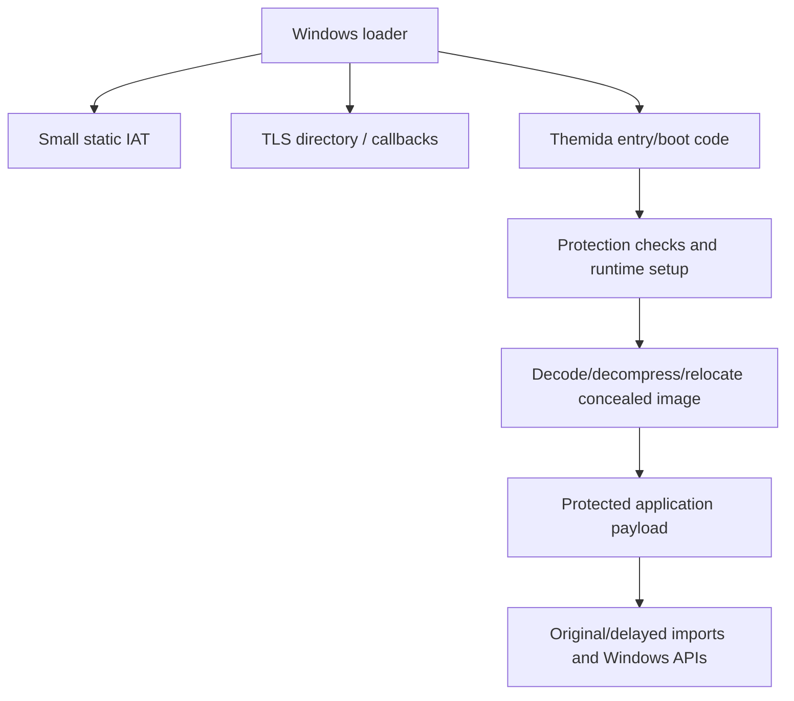
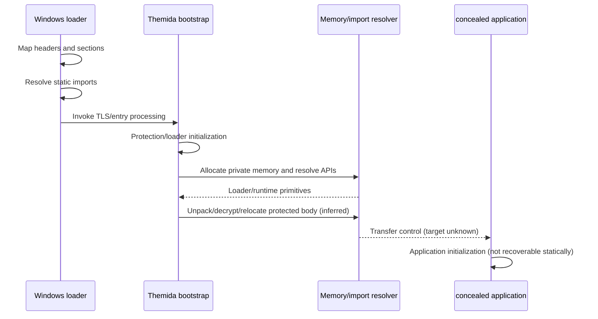

# `Test2.exe` reverse-engineering report

**Analysis date:** 2026-09-30  
**Input:** `Test2.exe` (32,868,040 bytes)  
**SHA-256:** `1fe62f8ea1879b34d5cc711a8999e878e3394896dbd761d8bd95b8d8c51f0e27`

## Executive Summary

`Test2.exe` is a 32-bit Windows GUI PE file whose on-disk image is dominated by a Themida/WinLicense-style protection/loader layer. The file contains an intentionally opaque/packed code region, nonstandard section names, a small native import table, a large “boot” region, and a very small final executable stub. Static analysis can establish the protector and its loader interfaces with high confidence, but it does **not** recover the protected application's original control flow.

The strongest application-level clues are embedded in the protected image's delayed-import/data material: `skeleton.dll`, `TestHello`, `dummy`, `OREG`, and `TEMP`. These are evidence of embedded or protected payload metadata, not proof of a particular feature. The normal import table includes broad Windows UI, registry, shell, printing, sound, networking, version, and system-information APIs; because these are imported by the protection/runtime image and the original import table is also represented in protected data, each API cannot safely be attributed to application code.

No execution trace was available in this environment (there is no Windows runtime/tooling available), and the sample was not unpacked or modified. Conclusions below explicitly distinguish **confirmed**, **strongly inferred**, and **uncertain** findings.

## File and Binary Identification

| Property | Finding | Confidence/evidence |
|---|---|---|
| Format | PE32 executable, i386 machine (`0x014c`) | **Confirmed**, PE header at file offset `0x100` |
| Subsystem | Windows GUI (`0x2`) | **Confirmed**, optional header |
| Image base | `0x00400000` | **Confirmed** |
| Image size | `0x04a7f000` | **Confirmed** |
| Entry RVA | `0x04a7d000`; nominal VA `0x00400000 + 0x04a7d000 = 0x04e7d000` | **Confirmed** |
| Section count | 21 | **Confirmed** |
| CLR | No CLR directory | **Confirmed**; not a .NET assembly |
| Debug directory | Absent | **Confirmed** |
| Timestamp | PE timestamp decodes to 2025-10-10 09:24:29 UTC | **Confirmed**, but timestamps are mutable metadata |
| Certificate table | File offset `0x01f55e58`, size `0x2870` | **Confirmed** |
| Protection | Resource strings identify “Themida - Advanced Windows Software Protection”, version 3.2.4.52, Oreans Technologies | **Confirmed** from `VS_VERSION_INFO` |
| Packing/obfuscation | Large opaque regions and invalid-looking entry-stub disassembly are consistent with Themida virtualization/packing | **Strongly inferred**; section layout and strings support it |

The DOS stub contains the usual “This program must be run under Win32” text. The raw file has substantial high-entropy/non-text material; ordinary `strings` output is mostly noise until the resource and import areas are reached.

## Architecture

The on-disk architecture is best modeled as a protector loader plus a concealed application:



The visible PE image has these notable regions (RVA/size, raw file offset/size):

| Section/name | RVA | Virtual size | Raw offset | Raw size | Interpretation |
|---|---:|---:|---:|---:|---|
| unnamed, 0 | `0x1000` | `0xffbfd4` | `0x600` | `0x5a4200` | large protected/packed image |
| unnamed, 1 | `0xffd000` | `0x916c` | `0x5a4800` | `0x4e00` | protected metadata/code |
| unnamed, 2 | `0x1007000` | `0x24314` | `0x5a9600` | `0x15c00` | protected data/code |
| `.bss` | `0x102c000` | `0x9f5c` | `0x5bf200` | 0 | uninitialized storage |
| unnamed, several | `0x1036000`–`0x1040000` | small | `0x5bf200`–`0x5c0000` | small | loader/TLS/delay metadata |
| unnamed, 9 | `0x1040000` | `0x1820c0` | `0x5c0200` | `0xd7e00` | protected content |
| unnamed, 10 | `0x11c3000` | `0x6cc4e8` | `0x698000` | `0x325800` | protected content |
| `.edata` | `0x1890000` | `0x1000` | `0x9bd800` | `0x200` | protector export metadata |
| `.vm_sec` | `0x1891000` | `0x8000` | `0x9bda00` | `0x8000` | likely VM/protector support region; name is evidence, exact role not recovered |
| `.idata` | `0x1899000` | `0x1000` | `0x9c5a00` | `0x600` | static imports |
| `.tls` | `0x189a000` | `0x1000` | `0x9c6000` | `0x800` | TLS data/directory |
| `.rsrc` | `0x189b000` | `0xc000` | `0x9c6800` | `0xc000` | resources |
| `.winlice` | `0x18a7000` | `0x1c52000` | `0x9d2800` | 0 | virtual/reserved protection area |
| `.boot` | `0x34f9000` | `0x1582c00` | `0x9d2800` | `0x1582c00` | large protector bootstrap/packed region |
| `.data` | `0x4a7c000` | `0x400` | `0x1f55400` | `0x400` | final stub data/import strings |
| `.text` | `0x4a7d000` | `0x600` | `0x1f55800` | `0x600` | final entry stub |
| `.reloc` | `0x4a7e000` | `0x1000` | `0x1f55e00` | `0x54` | relocations |

## Dependencies and External Interfaces

### Static imports

The import directory is at RVA `0x01899329`. It is small and loader-oriented:

- **kernel32.dll:** `GetModuleHandleA`, `GetProcessHeap`, `GetVersionExA`, `HeapAlloc`, `LoadLibraryA`, `VirtualAlloc`, `VirtualFree`, `GetCurrentThreadId`, `GetCommandLineA`, `HeapFree`, `FreeLibrary`.
- **oleaut32.dll:** `SysFreeString`.
- **advapi32.dll:** `RegQueryValueExW`.
- **user32.dll:** `CharNextW`, `MessageBoxA`.
- **gdi32.dll:** `WidenPath`.
- **version.dll:** `VerQueryValueA`.
- **IMAGEHLP.DLL:** `ImageDirectoryEntryToData`.
- **SHFolder.dll:** `SHGetFolderPathW`.
- **netapi32.dll:** `NetWkstaGetInfo`.
- **ole32.dll:** `CreateILockBytesOnHGlobal`.
- **comctl32.dll:** `InitializeFlatSB`, `ImageList_EndDrag`.
- **shell32.dll:** `ShellExecuteExA`.
- **comdlg32.dll:** `PrintDlgW`.
- **wsock32.dll:** `__WSAFDIsSet`.
- **msvcrt.dll:** `memset`.
- **winspool.drv:** `OpenPrinterW`.
- **winmm.dll:** `sndPlaySoundW`.
- **shlwapi.dll:** `PathRelativePathToW`.
- **oledlg.dll:** `OleUIObjectPropertiesW`.
- **IMM32.dll:** `ImmSetCompositionWindow`.

Imports prove that the image has interfaces for these operations, not that all are executed in a particular run. Several are plausible original-application imports preserved in the protector's import reconstruction; attribution is therefore **uncertain** without an unpacked trace.

### Delayed/protected imports

A delay-import directory exists at RVA `0x0103c000`, size `0xb34`. The `.data` region contains a second-looking import/string structure with names including `dummy`, `kernel32.dll`, `GetCommandLineA`, `GetCurrentThreadId`, `GetModuleHandleA`, `GetProcessHeap`, `GetVersionExA`, `HeapAlloc`, `HeapFree`, `LoadLibraryA`, `VirtualAlloc`, `VirtualFree`, `MessageBoxA`, `IMM32.dll`, `comctl32.dll`, `skeleton.dll`, and `TestHello`.

This is **strong evidence** that the protected payload has an application/import descriptor or protector reconstruction data. It is not sufficient to claim that `skeleton.dll` is loaded, or that `TestHello` is called, during every execution.

## Entry Point

The PE entry RVA is `0x04a7d000`, at the start of the 0x600-byte `.text` section. Linear disassembly at this location produces nonsensical instructions, privileged instructions, invalid branches, and inconsistent control flow (for example `enter`, `out`, `hlt`, `iret`, and many impossible memory references). This is expected when a protected/encoded entry stub is treated as ordinary x86 code.

The **confirmed** entry sequence is therefore only:

1. Windows maps the PE and resolves the static imports.
2. It processes the TLS directory and relocations as applicable.
3. Control transfers to RVA `0x04a7d000`.
4. Themida's bootstrap/protection logic takes control; the actual next-stage address is not statically recoverable from the encoded stub.

The export directory at RVA `0x01890000` is named `Themida.exe` and advertises four ordinal entries. The name-pointer table is malformed according to `objdump`, while the raw area contains protector names such as `TMethodImplementationIntercept`, `__dbk_fcall_wrapper`, `dbkFCallWrapperAddr`, and `madTraceProcess`. These are protector/runtime artifacts, not recovered application symbols.

## Complete Initialization Flow

The following is the deepest defensible reconstruction:



### Stages and dependencies

1. **Process creation and image mapping — confirmed by PE structure.** The loader maps a PE32 GUI image at the preferred base when possible, or applies the small relocation set. No DLL entry point is involved because this is an EXE.
2. **Static import resolution — confirmed.** Windows must load/resolve the listed DLLs before normal entry execution. Failures can prevent startup.
3. **TLS handling — confirmed directory, callback semantics uncertain.** A TLS directory is at RVA `0x0189a668`, size `0x18`. The data around it contains loader-looking pointers/values. A callback can be established from the directory, but this analysis did not execute the image or validate callback behavior.
4. **Protector bootstrap — strongly inferred.** Themida resource metadata, `.vm_sec`, `.winlice`, `.boot`, the tiny final stub, and opaque entry bytes indicate a runtime loader/virtual machine stage.
5. **Environment and anti-analysis checks — strongly inferred as a capability, not individually confirmed.** Themida commonly performs integrity and environment checks, and the layout supports such a stage. No specific debugger, VM, mutex, timing, or process enumeration check was recovered from readable code.
6. **Memory setup and payload materialization — strongly inferred.** `VirtualAlloc`, `VirtualFree`, heap APIs, `LoadLibraryA`, `GetModuleHandleA`, and `ImageDirectoryEntryToData` are consistent with resolving and materializing the protected body. The precise transformation/key/order is unknown.
7. **Application initialization — unknown.** The original entry point, global constructors, configuration reads, UI setup, worker creation, and application event loop are hidden.

## Major Components

| Component | Evidence | Technical role |
|---|---|---|
| Windows PE loader interface | headers, IAT, relocations, TLS | maps image and resolves prerequisites |
| Themida bootstrap | version resource, `Themida.exe`, `.boot`, `.winlice`, `.vm_sec`, opaque entry | protection, decoding, dispatch, integrity checks (exact subfeatures unknown) |
| Runtime API resolver | `LoadLibraryA`, `GetProcAddress`-like data in protected material; `VirtualAlloc`/heap APIs | dynamically obtains runtime/payload dependencies (partly inferred) |
| Protected application body | large unnamed regions and `.boot`; strings/import descriptors | concealed original program, not statically decoded |
| Windows UI/system interface set | user32, comctl32, comdlg32, shell32, IMM32, etc. | possible application/protector UI and system operations |
| Embedded resources | icon, controls, version metadata, manifest | presentation and metadata; application dialog behavior not recoverable |

No reliable classes, function names, vtables, object layouts, worker thread routines, or event-loop functions can be named from the protected file. The ordinal exports are not valid application symbols.

## Functions and Important Symbols

The only reliable named functions are imports listed above and resource/version strings. Important addresses are:

- PE header: file offset `0x100`.
- Entry point: RVA `0x04a7d000` / VA `0x04e7d000`.
- `.edata`: RVA `0x01890000`; export name `Themida.exe`.
- `.idata`: RVA `0x01899000`; import directory RVA `0x01899329`.
- TLS directory/data: RVA `0x0189a668`.
- Resources: RVA `0x0189b000`.
- Delay-import directory: RVA `0x0103c000`.
- Certificate: file offset `0x01f55e58`, length `0x2870`.

The name `TestHello` is a readable string in the final data area, not a symbol. `TMethodImplementationIntercept`, `__dbk_fcall_wrapper`, `dbkFCallWrapperAddr`, and `madTraceProcess` are raw export strings associated with the protector/runtime and should not be treated as application functions.

## Data Structures

Confirmed structures are standard PE structures: DOS/PE headers, section table, data directories, import descriptors, export directory, TLS directory, resource directory, relocation blocks, and WIN_CERTIFICATE. The image also contains protector-private metadata and an embedded import-like table, but its record formats were not reconstructed.

The relocation directory is only `0x54` bytes and contains blocks for RVA `0x0189a000` and `0x04a7d000`; `objdump` reports four fixups in the former and 30 in the latter. This supports a small loader stub plus fixed protector metadata, rather than a normal fully relocatable, symbol-rich application image.

## Runtime State and Control Flow

No live execution evidence was obtained. Static evidence supports these runtime states:

```text
Mapped -> imports/TLS satisfied -> protector bootstrap
       -> [integrity/environment decision]
       -> [payload decode/relocation]
       -> protected application entry (unknown)
       -> application-specific states (unknown)
       -> process exit or GUI event loop (unknown)
```

Branches, loops, callbacks, and error paths inside the protected body cannot be reconstructed without a memory dump after unpacking or a debugger trace. The presence of `MessageBoxA`, `GetVersionExA`, and `RegQueryValueExW` shows that failure/reporting and environment/configuration interfaces exist, but not the exact messages or conditions.

## Feature-by-Feature Analysis

### Protection/virtualization layer — **confirmed / strongly inferred**

The version resource explicitly identifies Themida 3.2.4.52. The section layout, entry stub, VM-like section name, boot region, and runtime exports strongly indicate code virtualization/packing and a loader that reconstructs protected code in memory. Exact Themida options are unknown.

### GUI and common-controls capability — **confirmed imports; behavior uncertain**

`user32`, `comctl32`, `comdlg32`, `IMM32`, `gdi32`, and `oledlg` interfaces support message boxes, flat scroll bars/image lists, printing dialogs, IME composition, path/GDI operations, and OLE property dialogs. No window class, caption, dialog ID, message handler, or event-loop implementation was recoverable.

### Files/shell/printer/audio capability — **confirmed imports; execution uncertain**

`ShellExecuteExA`, `SHGetFolderPathW`, `PathRelativePathToW`, `OpenPrinterW`, and `sndPlaySoundW` expose shell execution, known-folder lookup, path comparison, printer access, and wave playback. Static imports alone do not establish that these operations occur.

### Registry/system/network capability — **confirmed imports; execution uncertain**

`RegQueryValueExW`, `NetWkstaGetInfo`, `GetVersionExA`, and `__WSAFDIsSet` expose registry value querying, workstation information, OS version querying, and Winsock-set testing. There are no readable hostnames, URLs, sockets creation APIs, HTTP libraries, or credential strings attributable to the payload. The certificate's CRL/OCSP URLs are certificate metadata, not application network destinations.

### Payload named `skeleton.dll` / `TestHello` — **strongly inferred metadata**

The final `.data` area contains `skeleton.dll` and `TestHello` near a protected import-like structure. This may represent a DLL and exported procedure used by the original payload, or protector bookkeeping. No load/call sequence was recovered, so runtime use is **uncertain**.

## Detailed Program Logic

The meaningful logic cannot be decompiled from the on-disk entry bytes: the apparent code is encoded/garbled and the original body is hidden. A defensible pseudocode model is:

```c
// conceptual model; not recovered source code
process_start() {
    windows_maps_pe32();              // confirmed by format
    resolve_static_imports();         // confirmed by import directory
    process_tls_and_relocations();    // directories present; callback use uncertain

    protector_bootstrap();            // strongly inferred from Themida artifacts
    if (protector_rejects_environment_or_integrity())
        fail_or_exit();               // branch exists conceptually; condition/action unknown

    image = materialize_protected_payload(); // strongly inferred; algorithm unknown
    resolve_payload_interfaces(image);      // inferred from loader/delay metadata
    transfer_to_original_entry(image);      // inferred; address unknown
}
```

No algorithm, encryption key, compression format, configuration parser, state machine, input transformation, or application output can be stated without fabrication.

## Filesystem Behavior

**Confirmed:** no file I/O API such as `CreateFile`, `ReadFile`, `WriteFile`, or `DeleteFile` appears in the static import list. `SHGetFolderPathW` and `PathRelativePathToW` are present, so path/folder operations are possible. The protection layer may resolve APIs dynamically, and the concealed payload may have its own imports; therefore absence from the visible IAT does **not** prove no file I/O.

No created, read, modified, or deleted path was observed. `TEMP` is a readable string in protected data, but is not proof of a temporary-file operation.

## Registry/System Interaction

`RegQueryValueExW` is a visible import and proves the capability to query an existing registry value. No root key, subkey, value name, write API, service API, scheduled-task API, or persistence location was recovered. `GetVersionExA`, `NetWkstaGetInfo`, `GetCurrentThreadId`, `GetCommandLineA`, `GetModuleHandleA`, and `SHGetFolderPathW` provide environment/process context.

There is no static evidence of registry writes, service installation, autorun persistence, or privilege elevation.

## Process and Thread Behavior

The file is an EXE, not a DLL. `GetCurrentThreadId` is imported; the TLS directory creates a possible early callback mechanism. No `CreateThread`, `CreateProcess`, process enumeration, mutex, job, or synchronization API is visible in the static IAT. Themida may use lower-level or dynamically resolved APIs, and the protected body may contain additional behavior. No thread count or worker routine is confirmed.

## Network/IPC Behavior

`wsock32.dll!__WSAFDIsSet` is the only obvious Winsock import. It is insufficient to establish a network connection. No `socket`, `connect`, `send`, `recv`, WinInet, WinHTTP, URLMon, named-pipe, RPC, or COM-server interface is visible in the static list. The URLs extracted from the certificate are Certum CRL/OCSP distribution points and should not be misclassified as application C2.

## Configuration

No application configuration file name, command-line grammar, environment-variable name, registry path, or serialized configuration format was recovered. `GetCommandLineA`, `RegQueryValueExW`, `GetVersionExA`, `SHGetFolderPathW`, and the strings `OREG`/`TEMP` indicate possible configuration/environment handling, but the specific semantics are unknown.

## Resources

The resource directory is at RVA `0x0189b000`, size `0xbff4`, language entries are primarily `0x0409` (English US), with a `0x0419` entry also present. Readable resource content includes:

- `MAINICON` icon name.
- Standard control/class strings: `Arial`, `scroll`, `radio`, `button`, `combo`, `check`, `SysListView32`, `msctls_progress32`, `SysDateTimePick32`.
- `VS_VERSION_INFO` with `CompanyName=Oreans Technologies`, `FileDescription=Themida - Advanced Windows Software Protection`, `FileVersion=3.2.4.52`, `OriginalFilename=Themida`, `ProductName=Themida`, `ProductVersion=3.2.4.52`.
- An XML manifest fragment containing `asmv3:windowsSettings` and the `6595b64144ccf1df` public key token.

These resources identify the protection product and generic UI/resource vocabulary; they do not establish that the protected program displays every listed control.

## Error Handling

The visible interface includes `MessageBoxA`, `VirtualAlloc`/`VirtualFree`, heap allocation/free, `LoadLibraryA`/`FreeLibrary`, and `SysFreeString`. These are consistent with loader error reporting and cleanup. Exact error conditions, text, exit codes, exception handlers, and fallback branches are not recoverable. There is no visible debug directory or source symbol information.

## Security-Relevant Behavior

- **Packing/obfuscation:** **Confirmed/strongly inferred.** Themida metadata, encoded entry stub, opaque large regions, unusual sections, and protected boot region.
- **Anti-analysis/integrity:** **Strongly inferred as a protector capability**, but no specific anti-debug API or check was statically proven. `ImageDirectoryEntryToData`, TLS, relocations, and dynamic allocation are compatible with such checks.
- **Privilege/persistence:** No confirmed UAC elevation, service, scheduled task, autorun, or registry write behavior.
- **Credential handling:** No confirmed password, token, key, or credential storage/collection.
- **Encryption:** Protected code/data are non-readable and likely encoded, but the algorithm is unknown; do not infer a particular cipher.
- **Communication:** No confirmed application network communication.
- **Code injection:** No confirmed `WriteProcessMemory`, remote thread, or process injection interface in `Test2.exe`'s visible IAT. The separate `test.exe` present in the repository has such strings, but it is a different file and was not used as evidence for `Test2.exe` behavior.

The signed certificate material is a PKCS#7/CMS certificate chain containing Certum Trusted Network CA 2 / Certum CA URLs. The presence of certificate data does not, by itself, establish that the executable has a valid trusted Authenticode signature; full signature verification was not performed.

## Reverse-Engineering Evidence

| Conclusion | Supporting artifact | Rating |
|---|---|---|
| 32-bit native PE GUI | PE machine `0x14c`, PE32 optional header, subsystem 2, no CLR directory | Confirmed |
| Themida-protected image | version resource, `Themida.exe`, Oreans metadata, `.vm_sec`, `.winlice`, `.boot` | Confirmed/strongly inferred |
| Entry is a protection stub | entry RVA in tiny `.text`; nonsensical linear disassembly; large protected regions | Strongly inferred |
| Dynamic memory/API resolution capability | `VirtualAlloc`, `LoadLibraryA`, `GetModuleHandleA`, heap functions | Confirmed capability; use uncertain |
| TLS/early initialization possible | TLS directory RVA `0x0189a668`, `.tls` sections | Confirmed directory; callback behavior uncertain |
| UI/system feature capability | explicit imports and generic control strings | Confirmed capability; feature use uncertain |
| `skeleton.dll` / `TestHello` payload clues | strings/data at around file offsets `0x1f554xx` and embedded import-like descriptors | Strongly inferred metadata |
| No proven C2/persistence/credential theft | no direct static interfaces/strings; protected code limits certainty | Limited negative finding |

## Confirmed vs Inferred Findings

### Confirmed

- PE32/i386 Windows GUI executable.
- SHA-256 and layout stated above.
- Entry RVA, sections, data directories, static imports, resources, TLS directory, relocations, and certificate table exist as listed.
- Resource metadata identifies Themida 3.2.4.52/Oreans Technologies.
- Static interfaces include registry read, allocation, dynamic loading, UI, shell, printer, audio, version, workstation, and limited Winsock APIs.

### Strongly inferred

- The executable is packed/virtualized and uses a runtime loader to conceal the original application.
- The original body is materialized or dispatched after protector initialization.
- The `.boot`/`.vm_sec`/`.winlice` regions participate in protection/loader operation.
- `skeleton.dll`, `TestHello`, `OREG`, and `TEMP` belong to protected payload/protector metadata.

### Uncertain

- Actual original entry point and all application functions.
- Whether each imported API is called, and by which layer.
- Exact anti-debug/anti-VM checks, unpacking algorithm, key, compression, configuration, UI, thread model, filesystem effects, network behavior, and exit/error paths.

## Unknowns and Limitations

1. No Windows execution, debugger, API monitor, sandbox trace, or post-unpack memory dump was available.
2. The entry point and major code regions are protected/encoded; disassembling them as plain x86 is misleading.
3. No symbols, debug directory, source paths, or reliable application function boundaries are present.
4. Static IAT attribution is ambiguous because protector and protected-payload metadata coexist.
5. Dynamic imports and runtime-decrypted strings can conceal behavior absent from the file.
6. The separate `test.exe` in the checkout was not assumed to be the same program; its strings/imports must not be projected onto `Test2.exe`.
7. Certificate presence was inspected structurally, not validated against a trust store or signer identity.

A stronger reconstruction would require controlled Windows execution, breakpoints at the original-entry transfer, a memory dump after unpacking, import reconstruction, API/file/registry/network tracing, and comparison of pre/post memory mappings.

## Reconstructed Execution Flow

```text
CreateProcess(Test2.exe)
  |
  v
PE32 GUI mapping at preferred base or relocation
  |
  v
Resolve visible DLL imports
  |
  v
TLS directory processing / possible callback
  |
  v
Jump to RVA 0x04a7d000
  |
  v
Themida bootstrap: loader, integrity/environment decisions [inferred]
  |
  v
Allocate/prepare/decode protected image [inferred]
  |
  v
Resolve protected/delayed interfaces [inferred]
  |
  v
Transfer to hidden original entry [unknown]
  |
  +--> hidden application initialization [unknown]
  +--> hidden GUI/event loop or other functionality [unknown]
  +--> exit/error path [unknown]
```

## Overall Technical Architecture

`Test2.exe` should be treated as a protected container rather than a normally analyzable application binary. The observable architecture is a small Windows loader-facing shell around a large Themida-managed body. The shell establishes enough imports, TLS, relocation, resource, and certificate metadata for Windows and the protector to start; the protector then controls the transition to the concealed application. The available evidence supports detailed identification of the container, its interfaces, and the initialization boundary, but not a truthful function-by-function reconstruction of the original program. Any report claiming specific application algorithms, persistence, network destinations, or user-facing behavior beyond the evidence above would be speculative.
