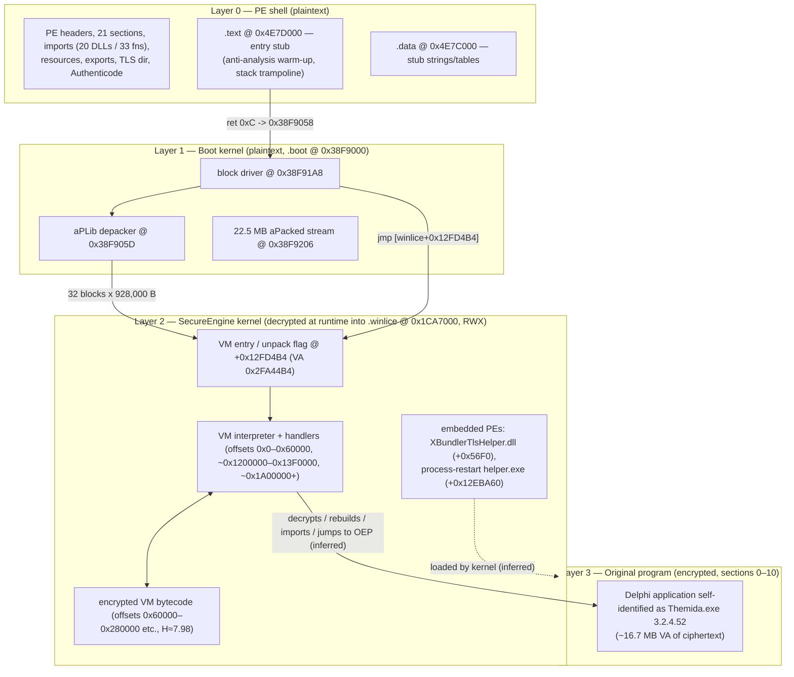
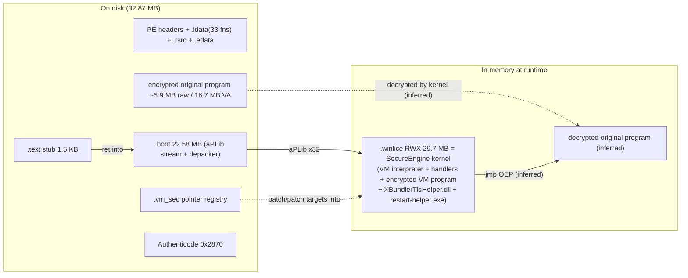

# Test2.exe — Comprehensive Reverse-Engineering Report

| Field | Value |
|---|---|
| **Subject** | `Test2.exe` (working copy in repository root) |
| **SHA-256** | `1fe62f8ea1879b34d5cc711a8999e878e3394896dbd761d8bd95b8d8c51f0e27` |
| **MD5** | `e29e999cd9f5dcbe189fe938ecc84c89` |
| **Size** | 32,868,040 bytes (0x1F586C8) |
| **Analysis date** | 2026-09-30 |
| **Analysis environment** | Debian 12 (bookworm) x86-64 Linux sandbox — **static analysis + offline unpacking only; the sample was never executed** (no Windows runtime available) |
| **Tooling** | GNU `objdump`/`readelf`/`strings` (binutils), Python 3.11 with `pefile` 2024.8.26, `capstone` 5.0.9, `aplib` 0.6, OpenSSL 3.0 (PKCS#7), custom PE/`aPLib` parsers written during analysis |

---

## 0. How to read this report

Every significant claim is labeled with a confidence level:

* **[CONFIRMED]** — directly established from bytes/disassembly/structure in the file itself, or cryptographically verified.
* **[STRONGLY INFERRED]** — the mechanism follows from confirmed evidence plus well-established knowledge of the identified protection system, but the exact code path was not executed.
* **[INFERRED]** — plausible reconstruction from indirect evidence.
* **[UNCERTAIN]** — could not be established; hypotheses are given where useful.

Addresses are given as **VA** (virtual address, ImageBase 0x400000 + RVA) and, where relevant, as file offsets. The entry point and all bootstrap code discussed in §5–§8 were disassembled and are reproduced with annotations.

**Follow-ups:** a second, deeper static pass over the unpacked kernel is documented in **§27 (Deeper Static Analysis — Round 2)** — it resolved the `.vm_sec` structure, the kernel's crypto inventory, the WinLicense licensing strings, embedded command-line switches, and a second VM interpreter level. A third pass (**§28 — VM Handler Taxonomy and Cipher Structure**) then classified all 685 VM handlers and established the ARX (no-S-box) cipher structure. A fourth pass (**§29 — Dynamic Emulation**) executed the kernel under Unicorn, reversed its manual export-resolution engine and hash completely, recovered the full runtime API set, and drove execution 320 million instructions into initialization.

---

## 1. Executive Summary

`Test2.exe` is a **32-bit native Windows GUI application that has been protected with the Oreans Technologies *SecureEngine* packer/protector — the Themida/WinLicense family, version 3.2.4.52**. This is established by the file's own version resource ("Themida – Advanced Windows Software Protection", 3.2.4.52, Oreans Technologies), the characteristic section layout (`.winlice`, `.boot`, `.vm_sec`, huge unnamed encrypted sections), an embedded SecureEngine PDB path recovered after unpacking, and the packer's signature multi-stage startup behavior which was fully reversed. **[CONFIRMED]**

Key findings:

1. **Not .NET, not UPX-style packed, not a generic crypter.** It is a custom commercial protector: a small plaintext bootstrap stub decrypts a ~22.5 MB `aPLib`-compressed stream into a 29.7 MB in-memory kernel image (`.winlice`) that is a **code-virtualization engine** (bytecode VM with encrypted handler dispatch). **[CONFIRMED — unpacking reproduced offline]**
2. **The complete stage-0 and stage-1 startup was reconstructed and is documented below with annotated disassembly**, including the entry-point anti-analysis "warm-up" loops (≈39,000 `GetModuleHandleA`, ≈20,700 `VirtualAlloc`/`VirtualFree`, ≈6,100 `LoadLibraryA`/`FreeLibrary` calls), the return-address trampoline into the boot kernel, the `aPLib` block decompressor, and the hand-off into the VM kernel at VA `0x2FA44B4`. **[CONFIRMED]**
3. **Two complete embedded PE images were recovered from the unpacked kernel**: an Oreans helper DLL (`XBundlerTlsHelper`, with PDB path `Z:\Development\SecureEngine\src\plugins_manager\internal_plugins\embedded dlls\TlsHelperXBundler\Release\XBundlerTlsHelper.pdb`) and a small 2007-vintage "process-restart" utility EXE whose full logic (parse quoted command line → kill PID → sleep → `CreateProcessA` respawn) was recovered. **[CONFIRMED]**
4. **The original (pre-protection) program is encrypted** inside two large unnamed sections (~16.7 MB virtual, ~5.9 MB on disk, entropy ≈ 7.98). It identified itself as **"Themida.exe" 3.2.4.52** (version resource, export-table internal name, Delphi/madExcept artifacts such as `madTraceProcess`, `__dbk_fcall_wrapper`, and the Delphi-default `MAINICON` resource). **[CONFIRMED identifiers; original code content NOT recoverable statically]**
5. **The file carries a valid Authenticode signature.** The embedded SHA-256 Authenticode digest was independently recomputed and **matches** the file exactly; the signing chain terminates at an individual code-signing certificate (Certum, "Rafael Patricio Ahucha Ruiz", ES), countersigned by Certum Timestamp 2025 at **2025-10-10 09:25:29 UTC** — one minute after the PE link timestamp. **[CONFIRMED cryptographically]**
6. **No malicious payloads, URLs, or network indicators were found** in the recoverable plaintext. The only URLs in the file belong to the certificate chain (Certum CRL/OCSP endpoints). The *sibling file in this repository*, `test.exe`, is a separate, unrelated sample (an x64 game-cheat injector for `tf_win64.exe`); it is **not** embedded in `Test2.exe` (byte-level search negative) and is covered in Appendix A. **[CONFIRMED]**

The bulk of the program's actual business logic — both the SecureEngine kernel's VM bytecode and the original application's code — is encrypted or virtualized and could not be recovered without dynamic execution; §24 lists exactly what remains unknown and why.

**Round-2 additions (§27):** a deeper pass over the unpacked kernel identified the protection engine's internal build (`Themida64_GUI`, built 2025-10-10), the intact **WinLicense licensing subsystem** (registry keys `Software\WinLicense`, `Software\MyCompany\MyProduct`, `Software\WLkt`; license files `TMLicenseA1.dat`, `extendkey.dat`), seven embedded command-line switches (`/nosplash`, `/dumpstatus`, `/checkprotection`, …), proved `.vm_sec` is a **registry of 685 jump-bridge slot pairs** (all verified `E9 jmp rel32`), confirmed a **custom crypto layer** (standard CRC32 table + golden-ratio/TEA-style `0x9E3779B9` mixing; **no** AES/SHA/MD5 constants anywhere), census-validated **76 `rdtsc` / 78 `cpuid` / 63 `int 2d`** anti-analysis instructions, and closed the overlay question (no hidden data after the certificate).

**Round-3 additions (§28):** all **685 VM handlers** reachable via `.vm_sec` were classified into archetypes (rolling-key opcode decrypt in ~380, dispatch-table references in 127, EFLAGS integration in 210), including a **dedicated `rdtsc` VM instruction** (VA 0x1CB9F1F) and **four native-call VM instructions** into shared kernel helpers — and a full-image S-box scan proved the cipher layer is **ARX-style with zero substitution tables**.

**Round-4 additions (§29 — dynamic emulation):** the unpacked kernel was **executed under a Unicorn x86 emulator** with a synthetic Windows environment (fake PEB/TEB and PE modules). This reversed the kernel's **manual export-resolution engine** completely — it walks module export tables itself (first-char prefilter at 0x1CA817A → `scasb` strlen at 0x1CAAC8D → a CRC-16-style rolling hash with polynomial 0x5041 over the name *including* its NUL → compare at 0x2F8FC65) — and the hash was **reproduced offline with 124/124 validation**, turning failed resolutions into solvable brute-forces (e.g. it recovers `IsWow64Process2`, proving the engine probes Windows 10 APIs). **152 unique runtime-resolved APIs** were observed (registry, Toolhelp32 process scanning, SID/ACL and token checks, message pump, file mapping), and execution reached **320 million instructions** — through 106 `VirtualProtect` calls, administrator/token checks, and a `LoadLibraryA("SETUPAPI.DLL")` attempt — before the current emulation frontier. The original code sections remain encrypted at that frontier (0 dirty pages); OEP has not yet been reached.

---

## 2. File and Binary Identification

### 2.1 Core identification **[CONFIRMED]**

| Property | Value |
|---|---|
| Format | PE32 (Portable Executable, 32-bit), magic `0x10B` |
| Machine | `0x014C` (Intel i386) |
| Subsystem | 2 — Windows GUI |
| ImageBase | 0x00400000 |
| AddressOfEntryPoint | RVA 0x04A7D000 → **VA 0x4E7D000** (file offset 0x1F55800, start of `.text`) |
| SizeOfImage | 0x04A7F000 (≈ 74.9 MB of virtual address space) |
| SizeOfHeaders | 0x600; FileAlignment 0x200; SectionAlignment 0x1000 |
| TimeDateStamp | 1760088269 = **2025-10-10 09:24:29 UTC** |
| Linker version | 2.25 (atypical — MSVC linkers are 14.x, Delphi/legacy are ≤ 6; value is plausibly falsified or produced by the protector's header rewriting) |
| CheckSum | 0x01F5D153 (non-zero, consistent with a signed image) |
| OS version fields | 5.0 / 5.0 (claims Windows 2000 compatibility) |
| DllCharacteristics | **0x0000** — no `DYNAMIC_BASE`, no `NX_COMPAT`, no `SEH`-related flags (ASLR/DEP opt-in flags are absent even though a `.reloc` directory exists) |
| Characteristics | 0x81AE — executable, symbols stripped, line numbers stripped, **large address aware**, 32-bit words |
| Debug directory | **absent** (stripped) |
| CLR (COM descriptor) | **absent** — native code, not managed |
| Overlay | **none** — the file ends exactly at the end of the appended certificate table (0x1F55E58 + 0x2870 = 0x1F586C8 = file size) |

### 2.2 Section table **[CONFIRMED]**

21 sections. Most have **blank names** (8 spaces) — itself a packer hallmark. Entropy over raw data.

| # | Name | RVA | VSize | RawOff | RawSize | Flags | Entropy | Role |
|---|---|---|---|---|---|---|---|---|
| 0 | *(blank)* | 0x001000 | 0xFFBFD4 | 0x000600 | 0x5A4200 | R+X code | 7.98 | **Encrypted original program (part 1)** |
| 1 | *(blank)* | 0xFFD000 | 0x00916C | 0x5A4800 | 0x004E00 | R+X code | 7.89 | Encrypted original program (part 2) |
| 2 | *(blank)* | 0x1007000 | 0x024314 | 0x5A9600 | 0x015C00 | RW data | 7.93 | Encrypted data |
| 3 | `.bss` | 0x102C000 | 0x009F5C | — | 0 | RW | — | Uninitialized data |
| 4 | *(blank)* | 0x1036000 | 0x005B78 | 0x5BF200 | 0x000800 | RW | 6.89 | Encrypted data |
| 5 | *(blank)* | 0x103C000 | 0x000B34 | 0x5BFA00 | 0x000400 | RW | 7.73 | Encrypted blob occupying the **fake delay-import directory** (§18) |
| 6 | *(blank)* | 0x103D000 | 0x0000B3 | 0x5BFE00 | 0x000200 | R | 2.73* | Small encrypted blob (0x90 bytes of pseudo-random data + zeros); same size (0xB3) as the export directory — possibly the original, now-encrypted export directory (§22) **[UNCERTAIN]** |
| 7 | `.tls` | 0x103E000 | 0x000654 | — | 0 | RW | — | TLS template (raw-less) |
| 8 | *(blank)* | 0x103F000 | 0x00005D | 0x5C0000 | 0x000200 | R | 1.78 | Small data block |
| 9 | *(blank)* | 0x1040000 | 0x1820C0 | 0x5C0200 | 0x0D7E00 | R | 7.97 | Encrypted data |
| 10 | *(blank)* | 0x11C3000 | 0x6CC4E8 | 0x698000 | 0x325800 | R | 7.96 | Encrypted data — **target region of the `.vm_sec` pointer table** (§8.6) |
| 11 | `.edata` | 0x1890000 | 0x001000 | 0x9BD800 | 0x000200 | R | 2.20 | Export directory (plaintext copy) |
| 12 | `.vm_sec` | 0x1891000 | 0x008000 | 0x9BDA00 | 0x008000 | RW | 4.99 | **Array of RVA pointer pairs into `.winlice`** — VM handler/patch registry (§8.6) |
| 13 | `.idata` | 0x1899000 | 0x001000 | 0x9C5A00 | 0x000600 | RW | 4.43 | Import tables (minimal IAT) |
| 14 | `.tls` | 0x189A000 | 0x001000 | 0x9C6000 | 0x000800 | RW | 0.06 | TLS directory + all-zero template |
| 15 | `.rsrc` | 0x189B000 | 0x00C000 | 0x9C6800 | 0x00C000 | R | 7.08 | Resources (§19) |
| 16 | `.winlice` | 0x18A7000 | **0x1C52000** | — | **0** | **RWX** | — | **Zero-filled on disk; filled at runtime with the unpacked SecureEngine kernel (29,696,000 bytes)** |
| 17 | `.boot` | 0x34F9000 | 0x1582C00 | 0x9D2800 | 0x1582C00 | R+X | 7.89 | Boot kernel: `aPLib` depacker + block driver (§8.2) |
| 18 | `.data` | 0x4A7C000 | 0x000400 | 0x1F55400 | 0x000400 | RW | 3.28 | Bootstrap data: strings, import-resolve tables, markers (§8.1.3) |
| 19 | `.text` | 0x4A7D000 | 0x000600 | 0x1F55800 | 0x000600 | R+X | 2.68 | **Entry-point stub** (§5) |
| 20 | `.reloc` | 0x4A7E000 | 0x001000 | 0x1F55E00 | 0x000054 | R | 4.59 | Relocations (only 2 blocks; see below) |

\* Entropy computed over the full 0x200 raw bytes; the meaningful content is 0x90 high-entropy bytes.

Notes:

* `pefile` raises *"Suspicious flags set for section 16 (.winlice): both MEM_WRITE and MEM_EXECUTE"* — the RWX section is where the kernel is unpacked and executed. **[CONFIRMED]**
* The relocation table contains only **34 fix-ups in 2 blocks**: one for the TLS directory fields (RVA 0x189A668–0x189A670) and 30 HIGHLOW fix-ups inside the `.text` entry stub itself (RVA 0x4A7D00D–0x4A7D261). Everything else is either position-independent or fixed up at runtime by the kernel. **[CONFIRMED]**
* Sections 0–10 (RVA 0x1000…0x18Axxxx) largely **preserve the original program's section layout** (classic `.text` at RVA 0x1000, `.bss`, `.tls`, etc.) with contents replaced by ciphertext. **[STRONGLY INFERRED]**

### 2.3 Data directories **[CONFIRMED]**

| Dir | RVA | Size | Note |
|---|---|---|---|
| Export | 0x1890000 | 0xB3 | Valid, in `.edata` (§2.5) |
| Import | 0x1899329 | 0x27C | 20 DLLs, 33 functions (§4.1) |
| Resource | 0x189B000 | 0xBFF4 | §19 |
| Security (certificate) | **0x1F55E58** | **0x2870** | Authenticode, §2.4 |
| BaseReloc | 0x4A7E000 | 0x54 | 2 blocks / 34 fixups |
| TLS | 0x189A668 | 0x18 | §10.4 |
| **Delay-Import** | 0x103C000 | 0xB34 | **Contains pseudo-random garbage, not delay imports** — encrypted configuration (§18) |
| IAT / Debug / LoadConfig / BoundImports / CLR | 0 | 0 | Absent |

### 2.4 Digital signature — **valid and verified** **[CONFIRMED]**

A `WIN_CERTIFICATE` header (length 0x2870, revision 0x0200, type 0x0002 = `PKCS_SIGNED_DATA`) is appended at file offset 0x1F55E58. OpenSSL parsing of the PKCS#7 shows:

* **Digest algorithm:** SHA-256; embedded indirect-data digest:
  `27ce79462c82d368da3cfa079e2bc38bf366c703f23cefb4dce2e0eb4b730797`
* **Independent recomputation** of the Authenticode image hash (headers with CheckSum and Security-Dir zeroed + everything up to the certificate table) yields **exactly the same digest** ⇒ the file is byte-for-byte the signed artifact; nothing was tampered with after signing.
* **Certificate chain (5 certificates in the blob):**

| Certificate | Issuer → Subject | Validity |
|---|---|---|
| Certum Trusted Network CA 2 | Certum Trusted Network CA → Certum Trusted Network CA 2 (4096-bit RSA, SHA-384) | 2021-05-31 → 2029-09-17 |
| Certum Code Signing 2021 CA | Certum Trusted Network CA 2 → Asseco Data Systems S.A. CN=Certum Code Signing 2021 CA | (in chain) |
| **Leaf (signer)** | Certum Code Signing 2021 CA → **C=ES, ST=Cadiz, L=Jerez de la Frontera, O=Rafael Patricio Ahucha Ruiz, CN=Rafael Patricio Ahucha Ruiz** (4096-bit RSA, SHA-256) | **2024-05-27 → 2027-05-27** |
| Certum Timestamping 2021 CA | Certum Trusted Network CA 2 → Asseco Data Systems S.A. CN=Certum Timestamping 2021 CA | (in chain) |
| Certum Timestamp 2025 | Certum Timestamping 2021 CA → Asseco Data Systems S.A. CN=Certum Timestamp 2025 | 2025-01-09 → 2036-01-07 |

* **RFC-3161 countersignature `signingTime` = 2025-10-10 09:25:29 UTC** — one minute after the PE link timestamp (09:24:29 UTC), i.e. the file was protected, then immediately signed. **[CONFIRMED]**
* Signature semantic: a code-signing certificate issued to a Spanish private individual via Certum's code-signing program. Attribution of the *original program's authorship* to the signer is **not** implied — only that this person signed this exact protected artifact. **[CONFIRMED signature; UNCERTAIN attribution meaning]**

### 2.5 Export directory **[CONFIRMED]**

Internal name field: **`Themida.exe`** (ordinal base 1). Exports:

| Ordinal | Name | RVA | VA |
|---|---|---|---|
| 1 | `dbkFCallWrapperAddr` | 0x102F5AC | 0x142F5AC |
| 2 | `__dbk_fcall_wrapper` | 0x012660 | 0x0412660 |
| 3 | `madTraceProcess` | 0x00B0CBC | 0x04B0CBC |
| 4 | `TMethodImplementationIntercept` | 0x00DEB70 | 0x04DEB70 |

These are **Delphi/madExcept integration symbols** (`__dbk_fcall_wrapper`/`dbkFCallWrapperAddr` are Delphi RTL debugger hooks; `madTraceProcess` belongs to madExcept/madTraceDebug; `TMethodImplementationIntercept` is a `System.Rtti` hook). The export directory of a protected file is normally the *original* program's; therefore the **pre-protection binary was a Delphi-built executable that internally named itself `Themida.exe`**. **[CONFIRMED symbols; STRONGLY INFERRED interpretation]**

### 2.6 Packer identification **[CONFIRMED / STRONGLY INFERRED]**

* Section names `.winlice`, `.boot`, `.vm_sec`, blank names, minimal one-function-per-DLL imports, and a stage-0 stub that decompresses an `aPLib` stream into an RWX section are the fingerprint of the **Oreans SecureEngine protector (Themida / WinLicense)**. The version resource pins the version: **3.2.4.52**.
* After offline unpacking (§8.2–§8.3) an embedded DLL PDB path `Z:\Development\SecureEngine\src\plugins_manager\...` **confirms "SecureEngine"** as the runtime's internal project name. **[CONFIRMED]**
* The `.winlice` section name is the characteristic marker of WinLicense-family builds (Themida-only builds classically use `.themida`); which of the two products produced this file cannot be distinguished statically. **[STRONGLY INFERRED]**

---

## 3. Architecture

The executable is a **four-layer system**:



* **Layer 0** is what the Windows loader sees: a tiny plaintext stub at the entry point plus metadata.
* **Layer 1** is a plaintext decompressor ("boot kernel") whose only job is to materialize Layer 2.
* **Layer 2** is the protector's runtime: a **code virtualization engine** (custom bytecode interpreter with per-instruction decryption and dispatch tables), the protection/licensing logic as VM bytecode, and small embedded native helper PEs.
* **Layer 3** is the actual protected application, still encrypted on disk; the kernel decrypts/rebuilds it at run time and transfers control to its OEP. **[Layers 0–2 CONFIRMED by static reversal; Layer-3 runtime interaction STRONGLY INFERRED]**

---

## 4. Dependencies and External Interfaces

### 4.1 Static import table **[CONFIRMED]**

Twenty DLLs, 33 functions — a deliberate "minimal footprint" pattern typical of Themida (the real imports are rebuilt at runtime by the kernel; note `LoadLibraryA`, `GetProcAddress` equivalents are bootstrapped from `.data` tables, §4.3). All descriptors use `OriginalFirstThunk = 0` (import by FirstThunk only).

| DLL | Imported functions |
|---|---|
| kernel32.dll | `GetModuleHandleA` (×2 entries), `GetProcessHeap`, `GetVersionExA`, `HeapAlloc`, `LoadLibraryA`, `VirtualAlloc`, `VirtualFree`, `GetCurrentThreadId`, `GetCommandLineA`, `HeapFree`, `FreeLibrary` (12 IAT slots) |
| oleaut32.dll | `SysFreeString` |
| advapi32.dll | `RegQueryValueExW` |
| user32.dll | `CharNextW`, `MessageBoxA` |
| gdi32.dll | `WidenPath` |
| version.dll | `VerQueryValueA` |
| IMAGEHLP.DLL | `ImageDirectoryEntryToData` |
| SHFolder.dll | `SHGetFolderPathW` |
| netapi32.dll | `NetWkstaGetInfo` |
| ole32.dll | `CreateILockBytesOnHGlobal` |
| comctl32.dll | `InitializeFlatSB`, `ImageList_EndDrag` |
| shell32.dll | `ShellExecuteExA` |
| comdlg32.dll | `PrintDlgW` |
| wsock32.dll | `__WSAFDIsSet` |
| msvcrt.dll | `memset` |
| winspool.drv | `OpenPrinterW` |
| winmm.dll | `sndPlaySoundW` |
| shlwapi.dll | `PathRelativePathToW` |
| oledlg.dll | `OleUIObjectPropertiesW` |
| IMM32.dll | `ImmSetCompositionWindow` |

Most of these single imports are **stagers/decoys** ensuring the DLLs get mapped so the kernel can resolve further exports by hash/name at runtime. **[STRONGLY INFERRED]**

### 4.2 Fake delay-import directory **[CONFIRMED content / STRONGLY INFERRED purpose]**

The delay-import directory (RVA 0x103C000, 0xB34 bytes) contains **36 pseudo-random 32-byte "descriptor" records followed by a zero terminator** — the fields are uniformly random dwords (e.g. `0x9DFD18A0`, `0x2F79345B`, …), which cannot be real `ImgDelayDescr` structures. `pefile` aborts with *"Too many errors parsing the Delay import directory"*. This region is an **encrypted configuration blob** masquerading as a loader-ignored directory (see §18).

### 4.3 Runtime import bootstrapping tables in `.data` **[CONFIRMED content / INFERRED usage]**

The `.data` section holds plaintext hint/name/DLL triplets the kernel uses to resolve APIs dynamically:

* 0x4E7C128–0x4E7C24A: `FreeLibrary`, `GetCommandLineA`, `GetCurrentThreadId`, `GetModuleHandleA`, `GetProcessHeap`, `GetVersionExA`, `HeapAlloc`, `HeapFree`, `LoadLibraryA`, `VirtualAlloc`, `VirtualFree` (all KERNEL32), `MessageBoxA`/USER32.dll, `ImmSetCompositionWindow`/IMM32.dll, `ImageList_EndDrag`/COMCTL32.dll — each with a hint byte prefix (e.g. hint 0x116 for `GetModuleHandleA`).
* 0x4E7C06C: the ASCII string `kernel32.dll` (used by the entry stub's `LoadLibraryA` churn loop, §5).
* 0x4E7C288 / 0x4E7C296: the strings **`skeleton.dll`** and **`TestHello`** — a bundled-file registration record (the SecureEngine *XBundler* embeds DLLs inside the protected image; `TestHello` looks like an export to test-load). **[CONFIRMED strings; STRONGLY INFERRED purpose given the recovered XBundler plugin, §8.4]**
* 0x4E7C000 and 0x4E7C0E0: two identical 14-dword tables of small values (0x212C–0x222A), plus further small-value tables at 0x4E7C080–0x4E7C0CC (0x2008–0x2220) and around 0x4E7C254–0x4E7C296 (0x1147, 0x2278–0x228F) — 14 entries matching the 14 hint/name entries above; their indexing base is still **[UNCERTAIN]** (best candidate: RVA-based indices into the encrypted original program's import area). See §27.6.

### 4.4 External system interfaces (static evidence only) **[CONFIRMED imports; runtime use INFERRED]**

* **Registry:** `RegQueryValueExW` (advapi32) — value reads (WinLicense licensing/protection options commonly live under `HKLM\SOFTWARE\...`; exact keys not recoverable).
* **Environment/system probing:** `GetVersionExA`, `VerQueryValueA` (OS version), `NetWkstaGetInfo` (workstation/account domain info — typical machine-fingerprint input for licensing), `SHGetFolderPathW` (special-folder paths).
* **GUI:** `MessageBoxA`, `CharNextW`, `InitializeFlatSB`, `ImmSetCompositionWindow`.
* **Shell/print/media:** `ShellExecuteExA`, `PrintDlgW`, `OpenPrinterW`, `sndPlaySoundW`, `OleUIObjectPropertiesW`, `WidenPath`, `PathRelativePathToW`, `CreateILockBytesOnHGlobal` — these look like remnants of the original Delphi application's feature set (print dialogs, OLE, sound), pulled in as single decoy imports. **[INFERRED]**
* **Networking:** only `wsock32.dll!__WSAFDIsSet` (a `select()` helper). **No URLs, hostnames, or IP literals exist in any recoverable plaintext** except the certificate chain's CRL/OCSP URLs (§17).

---

## 5. Entry Point (VA 0x4E7D000)

The entry stub is 0x600 bytes of plaintext x86 in `.text`. Annotated reconstruction (confirmed by Capstone disassembly):

### 5.1 Prologue — return-address trampoline **[CONFIRMED]**

```asm
0x4E7D000  push dword [esp+0xC]     ; v3 = loader-stack value @ entry_esp+4
0x4E7D004  push dword [esp+0xC]     ; v2 = loader-stack value @ entry_esp+8   (note: esp moved!)
0x4E7D008  push dword [esp+0xC]     ; v1 = loader-stack value @ entry_esp+0xC
0x4E7D00C  mov  eax, 0x38F9058      ; .boot+0x58  (the block-driver call site)
0x4E7D011  push eax                 ; forged "return address"
0x4E7D012  jmp  0x4E7D017
0x4E7D017  push ebp                 ; frame for the "function"
0x4E7D018  mov  ebp, esp
0x4E7D01A  jmp  0x4E7D0F0           ; -> pass-gate (loop head)
```

Each `push [esp+0xC]` reads a *different* stack slot because `esp` moves — an obfuscated copy of the three loader-supplied dwords above the initial return address. The stub then establishes a normal EBP frame and jumps to the loop gate.

**Stack-preservation invariant [CONFIRMED by arithmetic]:** on `leave; ret 0xC` (0x4E7D15A–0x4E7D15B), the CPU pops `0x38F9058` into EIP, the `0xC` pops the three pushed dwords, and **ESP is restored to exactly the original entry value** — the boot kernel therefore starts with the pristine loader stack (including the loader's own return address).

### 5.2 Three "warm-up" passes × 3 rounds — anti-analysis loop nest **[CONFIRMED code; purpose STRONGLY INFERRED]**

Gate at 0x4E7D0F0:

```asm
0x4E7D0F0  cmp  dword [0x4E7C079], 3   ; pass-round counter in .data
0x4E7D0F7  jb   0x4E7D01F              ; repeat the whole 3-pass body 3x
```

**Pass A** (0x4E7D01F–0x4E7D08E, count `ecx = 0x800` = 2,048 iterations — note the decoy `mov ecx,0x10000` / `and ecx,0x600` instructions that are immediately overwritten by `mov ecx,0x800`):

```asm
loopA:  push ecx
        push 0                    ; lpModuleName = NULL
        call [GetModuleHandleA]   ; thunk 0x4E7D223 -> IAT 0x1C994D0
        push 0x4E7C06C            ; "kernel32.dll"
        call [LoadLibraryA]       ; thunk 0x4E7D241 -> IAT 0x1C994E4
        push eax
        call [FreeLibrary]        ; thunk 0x4E7D211 -> IAT 0x1C994FC
        push 4                    ; PAGE_READWRITE
        push 0x1000               ; MEM_COMMIT
        push 0x1000               ; size 4 KiB
        push 0                    ; NULL
        call [VirtualAlloc]       ; thunk 0x4E7D247 -> IAT 0x1C994E8
        push 0x8000               ; MEM_RELEASE
        push 0
        push eax
        call [VirtualFree]        ; thunk 0x4E7D24D -> IAT 0x1C994EC
        pop ecx / dec ecx / or ecx,ecx / jne loopA
```

**Pass B** (0x4E7D090–0x4E7D0CB, `ecx = 0x1300` = 4,864 iterations): `GetModuleHandleA(NULL)` + `VirtualAlloc`/`VirtualFree` (no LoadLibrary).
**Pass C** (0x4E7D0CD–0x4E7D0E8, `ecx = 0x1800` = 6,144 iterations): `GetModuleHandleA(NULL)` only.

Each pass body also contains dead decoy instructions (`cmp ecx,0x200 / jbe <next instruction>` jumping into the immediately following instruction, junk arithmetic on `eax` derived from a code address — e.g. `mov eax,0x4E7D223; shr eax,16; add eax,0x913; and eax,0x1FFF` whose result is discarded). **[CONFIRMED junk]**

Aggregate call counts (3 rounds × per-pass counts):

| API | Calls |
|---|---|
| `GetModuleHandleA(NULL)` | 3 × (2,048 + 4,864 + 6,144) = **39,168** |
| `VirtualAlloc`/`VirtualFree` 4 KiB pairs | 3 × (2,048 + 4,864) = **20,736** |
| `LoadLibraryA("kernel32.dll")`/`FreeLibrary` | 3 × 2,048 = **6,144** |

Purpose: this is the classic Themida entry-stub behavior — a **timing/anti-emulation gauntlet** (tens of thousands of quick API calls and allocator churn that slow and destabilize naive emulators, sandboxes and tracers) that doubles as heap priming. **[STRONGLY INFERRED — mechanism confirmed, intent not provable]**

### 5.3 Conditional "dummy" MessageBox path **[CONFIRMED code; trigger condition UNCERTAIN]**

```asm
0x4E7D0EA  inc  dword [0x4E7C079]        ; round++
0x4E7D0F0  cmp  dword [0x4E7C079], 3 ; jb loop
; --- after 3 rounds ---
0x4E7D0FD  cmp  dword [ebp+0xC], 0xAB4130   ; v2 == magic?  (repeated 3x, obfuscated if-chain)
0x4E7D104  jne  next_compare
0x4E7D106  push 0            ; uType = MB_OK
0x4E7D108  push 0x4E7C048    ; lpCaption -> "dummy"
0x4E7D10D  push 0x4E7C054    ; lpText    -> "dummy"
0x4E7D112  push 0            ; hWnd = NULL
0x4E7D114  call [MessageBoxA]    ; thunk 0x4E7D253 -> IAT 0x1C99518
... two more identical compares selecting texts at 0x4E7C05A / 0x4E7C060 ...
0x4E7D155  mov  eax, 0        ; return value 0
0x4E7D15A  leave
0x4E7D15B  ret  0xC           ; -> 0x38F9058 (boot kernel), stack pristine
```

`.data` contains **five consecutive `"dummy"` strings** at 0x4E7C048, 0x4E7C04E, 0x4E7C054, 0x4E7C05A, 0x4E7C060. The magic constant `0xAB4130` compared against a loader-placed stack dword is a WinLicense-style marker check; on a normal launch the compare fails and no message box appears. **[CONFIRMED code path; the semantic of 0xAB4130 and who could satisfy it: UNCERTAIN]**

### 5.4 Unreachable decoy block (0x4E7D15E–0x4E7D210) **[CONFIRMED bytes; reachability/purpose UNCERTAIN]**

After `ret 0xC`, a second code block sits inline in `.text`:

* `0x4E7D170`: another `MessageBoxA(NULL, "dummy"@0x4E7C04E, "dummy"@0x4E7C048, 0)`;
* `0x4E7D19D–0x4E7D1DE`: obfuscated constant materialization on the stack — `movl $0x37C8004B,(%esp); subl $0x3BF61806; orl $0x6F6D763E; decl; incl; addl $0x420181; movl $0xBEEFAD01,(%esp)` followed by bytes `02 BE AD DE C3` (an embedded `0xDEADBE…`-style pattern). `0xBEEFAD01`/"dead-beef" style magic constants and the inline `"WL  \x0C"`, `"WL  \x0D"`, `"WL  \x01"` marker strings at 0x4E7D160/0x4E7D188/0x4E7D193 are WinLicense signatures the kernel searches for / patches. **[STRONGLY INFERRED for the markers]**
* `0x4E7D1E8–0x4E7D20B`: eight sequential calls to import thunks — `GetCurrentThreadId`, `GetCommandLineA`, `HeapFree`, `HeapAlloc`, `GetVersionExA`, `GetProcessHeap`, `ImmSetCompositionWindow`, `ImageList_EndDrag` — **with garbage arguments** (the stack was filled with the magic constants), ending in `int3` (0x4E7D210). Executed as-is this would be non-sensical/crashing; it is a decoy or a kernel-patched template. **[CONFIRMED instruction stream; never reachable via fallthrough — purpose UNCERTAIN]**

### 5.5 Import thunks **[CONFIRMED]**

`0x4E7D211–0x4E7D25F` are 12 `jmp dword [IAT]` thunks into `.idata`:

| Thunk VA | IAT slot | Target |
|---|---|---|
| 0x4E7D211 | 0x1C994FC | kernel32.FreeLibrary |
| 0x4E7D217 | 0x1C994F4 | kernel32.GetCommandLineA |
| 0x4E7D21D | 0x1C994F0 | kernel32.GetCurrentThreadId |
| 0x4E7D223 | 0x1C994D0 | kernel32.GetModuleHandleA |
| 0x4E7D229 | 0x1C994D4 | kernel32.GetProcessHeap |
| 0x4E7D22F | 0x1C994D8 | kernel32.GetVersionExA |
| 0x4E7D235 | 0x1C994DC | kernel32.HeapAlloc |
| 0x4E7D23B | 0x1C994F8 | kernel32.HeapFree |
| 0x4E7D241 | 0x4E7D241→0x1C994E4 | kernel32.LoadLibraryA |
| 0x4E7D247 | 0x1C994E8 | kernel32.VirtualAlloc |
| 0x4E7D24D | 0x1C994EC | kernel32.VirtualFree |
| 0x4E7D253 / 0x4E7D259 / 0x4E7D25F | 0x1C99518 / 0x1C9959C / 0x1C99554 | user32.MessageBoxA / IMM32.ImmSetCompositionWindow / COMCTL32.ImageList_EndDrag |

---

## 6. Complete Initialization Flow

From process creation to the point where protected-application code becomes active:

1. **Windows loader maps the image** (~74.9 MB VA). `.bss`, both `.tls` sections and `.winlice` are zero-filled (`.winlice` has `SizeOfRawData = 0`). The loader resolves 20 import DLLs / 33 functions and applies the 34 relocations (TLS dir + entry stub). The TLS directory (§10.4) has **no callbacks**, so no extra user code runs before the EP.
2. **EP stub runs** (§5): builds its trampoline frame, executes 3 rounds × 3 passes of the API warm-up gauntlet (39,168 `GetModuleHandleA`, 20,736 `VirtualAlloc`+`VirtualFree`, 6,144 `LoadLibraryA`+`FreeLibrary`), tests the `0xAB4130` stack magic (normally false), then `ret 0xC` → **EIP = 0x38F9058** with a pristine stack.
3. **Boot kernel `0x38F9058`** (§8.2): `call 0x38F91A8` — the block driver.
4. **Block driver `0x38F91A8`**:
   a. pops the return address (0x38F905D) into EAX and computes `EBX = EAX − 5 − 0x1C52058 = 0x1CA7000` — the **`.winlice` base** — from its own call site (position-independent self-location).
   b. checks `dword [.winlice + 0x12FD4B4] == 0` (fresh process ⇒ true, since `.winlice` is zero-filled) — an idempotency/"already unpacked" flag that doubles as the kernel entry point.
   c. reads the block count byte (32) at `.boot+0x206` (VA 0x38F9206, file 0x9D2A07) and, for each block, calls the **`aPLib` depacker at 0x38F905D** (`call eax`) with (source, 0, dest, …).
   d. after 32 blocks, `jmp eax` where `eax = 0x1CA7000 + 0x12FD4B4 = 0x2FA44B4`.
5. **SecureEngine VM kernel starts at 0x2FA44B4** inside the freshly unpacked `.winlice` image (§8.3). The first bytes (`55 E9 …` = `push ebp; jmp …`) enter the VM, which sets up an EBP-relative VM context and interprets encrypted bytecode. **[CONFIRMED unpacking + interpreter mechanics; the kernel's subsequent actions are STRONGLY INFERRED:]**
   * environment/anti-debug checks, decryption of the original program sections (RVA 0x1000 / 0xFFD000 et al.),
   * reconstruction of the real import table (using the `.data` bootstrap name tables and `LoadLibraryA`/`GetProcAddress`),
   * registration of bundled files (XBundler — e.g. `skeleton.dll`) and loading of the embedded TLS-helper DLL,
   * WinLicense licensing logic (machine fingerprinting via `NetWkstaGetInfo`, registry reads, key checks),
   * creation of protection threads (monitor/anti-tamper) — none of which is statically observable,
   * and finally a transfer to the **OEP of the original Delphi program**, which then runs as a normal GUI application with the kernel resident.

**Order/dependency summary:** loader → EP stub (Layer 0) → boot driver (Layer 1) → `aPLib` unpack → VM kernel (Layer 2) → decrypt/rebuild Layer 3 → OEP. Each stage bootstraps the next; nothing in Layer 2/3 is usable before Layer 1 completes, and Layer 1 is gated by Layer 0's counter reaching 3.

---

## 7. Initialization Sequence Diagram

```mermaid
sequenceDiagram
    participant L as Windows loader
    participant S as EP stub (.text 0x4E7D000)
    participant D as Block driver (.boot 0x38F91A8)
    participant A as aPLib depacker (.boot 0x38F905D)
    participant W as .winlice (0x1CA7000, RWX)
    participant K as VM kernel (entry 0x2FA44B4)
    participant O as Original app (OEP, encrypted layer)

    L->>S: CreateProcess -> EIP=0x4E7D000<br/>(imports resolved, relocs applied, TLS dir, no callbacks)
    loop 3 rounds x (2048 / 4864 / 6144 iterations)
        S->>S: GetModuleHandleA(NULL) / LoadLibraryA("kernel32.dll")+FreeLibrary<br/>VirtualAlloc(4KB)+VirtualFree
    end
    S->>S: cmp [ebp+0xC], 0xAB4130 (normally != )
    S-->>D: ret 0xC -> 0x38F9058 (stack pristine)<br/>call 0x38F91A8
    D->>W: cmp dword [winlice+0x12FD4B4], 0  (fresh: 0)
    loop 32 blocks (stream @ .boot+0x206, 22.5 MB)
        D->>A: call depacker(src, ?, dst, ...)
        A->>W: aPLib-decompress block -> 928,000 bytes each
    end
    D-->>K: jmp 0x2FA44B4 (winlice+0x12FD4B4)
    K->>K: VM context setup; interpret encrypted bytecode
    K->>W: decrypt VM program/handler pages as needed
    K->>O: (inferred) decrypt original sections, rebuild imports,<br/>register bundled skeleton.dll, licensing checks, spawn guard threads
    K-->>O: jmp OEP -> protected application active
```

ASCII equivalent (stage/offset map):

```
file 0x0000000 ─ PE headers
file 0x0000600 ─ [S0] encrypted original program (~16.7 MB VA)      ──┐
file 0x09D2800 ─ [S17 .boot]                                          │ Layer 3
file 0x09D2A07 ─   22.5 MB aPLib stream (32 blocks) ──────────┐       │ (encrypted,
file 0x1F55400 ─ [S18 .data] stub strings/tables              │       │  decrypted at
file 0x1F55800 ─ [S19 .text] EP stub  ──────────────┐         │       │  runtime)
file 0x1F55E58 ─ Authenticode certificate (0x2870)  │         │       │
                                                    ▼         ▼       ▼
   EP 0x4E7D000 ──ret 0xC──▶ 0x38F9058 ──▶ driver 0x38F91A8 ──▶ aPLib ×32 ──▶ .winlice 0x1CA7000 (29.7 MB)
                                                                                     │
                                                                                     ▼
                                                              VM entry 0x2FA44B4 (.winlice+0x12FD4B4)
                                                                                     │
                                                                                     ▼
                                                                      (inferred) decrypt + OEP
```

---

## 8. Major Components

### 8.1 Layer 0 — entry stub (`.text` + `.data`)

Described fully in §5. `.data` (0x4E7C000–0x4E7C400) contains: the round counter (`0x4E7C079`), the five `"dummy"` strings, `"kernel32.dll"`, the runtime import-resolve tables, the `skeleton.dll`/`TestHello` record, two duplicated bookkeeping tables, and the dword `0x54EC56B9` at 0x4E7C254 (build marker **[UNCERTAIN]**).

### 8.2 Layer 1 — boot kernel (`.boot` @ VA 0x38F9000, file 0x9D2800)

Two functions were fully recovered:

**`sub_38F91A8` — multi-block unpack driver [CONFIRMED]**

```asm
38F91A8  pop  eax                      ; eax = return address = 0x38F905D
         push ebx,ecx,edx,esi,edi,ebp  ; (push sequence in original order)
         mov  ebx, eax
         sub  ebx, 5                   ; 0x38F9058
         sub  ebx, 0x1C52058           ; -> EBX = 0x1CA7000  (.winlice base)
         push eax
         mov  eax, 0x12FD4B4
         add  eax, ebx                 ; flag/entry address
         cmp  dword [eax], 0
         jne  38F91F7                  ; already unpacked -> skip to jmp
         ...
38F91CC  mov  ecx, 0x1AE
38F91D1  sub  ecx, 5
38F91D4  add  ecx, eax                 ; ecx = 0x38F905D + 0x1A9 = 0x38F9206 = packed stream
38F91D7  mov  esi, ecx                 ; source cursor
38F91D9  mov  edi, ebx                 ; dest cursor = .winlice
38F91DB  mov  cl, [esi]                ; block count = 0x20 (32)
38F91DE  inc  esi
block:  push ecx / push eax / push edi / push 0 / push edi / push 0 / push esi
38F91EB  call eax                      ; call sub_38F905D (aPLib depacker)
38F91ED  pop  edi
38F91EE  add  edi, eax                 ; dest += unpacked size
38F91F0  pop  eax
38F91F1  pop  ecx
38F91F2  dec  cl
38F91F4  jnz  block
38F91F7  mov  eax, 0x12FD4B4
38F91FC  add  eax, ebx
         pop ebp/edi/esi/edx/ecx/ebx
38F9204  jmp  eax                      ; -> 0x2FA44B4
```

**`sub_38F905D` — aPLib depacker [CONFIRMED]**

A textbook **aPLib 1.1.1 "safe depacker"** (ibsen software): bit-tag driven LZ77 with gamma2-coded offsets/lengths. Fingerprint constants visible in the code: offset thresholds `0x7D00` (32000), `0x500` (1280), `0x7F` (128) for length adjustment — the aPLib specification values. Verified empirically: applying a pure-Python aPLib depacker to the 32 streams **decompressed every block cleanly, each producing exactly 928,000 (0xE2900) bytes**:

* stream: file **0x9D2A07 – 0x1F55360** (22,554,970 bytes of the 22,575,104-byte `.boot` section; the remainder is the driver/`aPLib` code at the section head plus padding),
* output: **29,696,000 bytes (0x1C52000) = exactly the `.winlice` virtual size** — 32 blocks × 928,000.
* SHA-256 of the reconstructed `.winlice` image: `240247194afc4c29f88e9525ed1915c80ef8b9bdee33a1913958fe6b07d99b51`.

### 8.3 Layer 2 — SecureEngine kernel / VM (`.winlice` image)

Content map of the unpacked 29,696,000-byte image (offsets relative to VA 0x1CA7000; classification by entropy profiling + disassembly sampling **[CONFIRMED structure, inferred labeling]**)：

| Offset range | Entropy | Content |
|---|---|---|
| +0x000000–+0x060000 | 5.1–6.3 | **VM interpreter + handlers** — dense x86 with the dispatch idiom below |
| +0x060000–+0x280000 | ≈ 7.98 | **Encrypted VM program** (protection logic bytecode) |
| +0x1200000–+0x13F0000 | 4.5–6.3 | More interpreter/handler code, structured data, **embedded restart-helper EXE at +0x12EBA60** |
| +0x1A00000–+0x1C20000 | ≈ 5.9 | Structured native code/data (kernel modules) |
| +0x1C20000–+0x1C52000 | ≈ 7.99 | Second encrypted blob |
| +0x00056F0 | — | **Embedded DLL: `XBundlerTlsHelper`** (§8.4) |

**VM dispatch idiom [CONFIRMED — repeatedly observed at +0x0 and around +0x12FD4B4/0x2FA4xxx]:**

```asm
; EBP = VM context record
mov  ebx, ebp
add  ebx, 0x84
mov  ebx, [ebx]          ; ctx.instr_ptr
add  ebx, 6
mov  dx, [ebx]           ; fetch encoded word from bytecode stream
xor  edx, [ebp+4]        ; decode with key register
add  edx, [ebp+0x54]
xor  [ebp+4], edx        ; evolve key state
and  dword [ebp+0x20], 0x0C6D2D77      ; churn state registers
...
mov  ebx, [ebp+0x84]     ; instr_ptr
add  ebx, 0xA
movzx ebx, word [ebx]    ; second encoded field
add  ebx, [ebp+4]
and  ebx, 0xFFFF
shl  ebx, 2
mov  ecx, [ebp+0x38]     ; handler/dispatch table base
add  ecx, ebx
mov  edx, [ecx]          ; handler address
mov  esi, [ebp+0x84]
mov  ecx, [esi]          ; advance instruction pointer by embedded delta
add  [ebp+0x84], ecx
jmp  edx                 ; dispatch
```

Every VM instruction is fetched through an encoded pointer, decrypted (XOR/add with evolving key state), masked to 16 bits, doubled, and used to index a handler table at `ctx+0x38`; the instruction pointer advances by deltas read from the stream; EFLAGS are occasionally captured via `pushfd`/restored into context slots (anti-emulation). This is the documented architecture of the Themida/WinLicense **code-virtualization engine**. **[mechanics CONFIRMED; "T32E/Themida VM" naming STRONGLY INFERRED]**

### 8.4 Embedded PE #1 — `XBundlerTlsHelper` DLL **[CONFIRMED]**

Found at unpacked offset **+0x56F0** (file-equivalent bytes start `4D 5A 90 00…`), fully carved and parsed (8,704 bytes):

* PE32 i386 **DLL**, ImageBase 0x10000000, 7 sections (`.text .rdata .data .tls .CRT .rsrc .reloc`), TimeDateStamp **2022-12-22 11:57:28 UTC**, `DYNAMIC_BASE|NX_COMPAT|NO_SEH`.
* **CodeView PDB path:** `Z:\Development\SecureEngine\src\plugins_manager\internal_plugins\embedded dlls\TlsHelperXBundler\Release\XBundlerTlsHelper.pdb` — direct confirmation of the **SecureEngine** project and the **XBundler embedded-DLL plugin**.
* Imports: **`KERNEL32.dll!Sleep` only**.
* `DllMain` (0x10001000): `switch(fdwReason)` via jump table `[0x1000101A, 0x10001012, 0x1000101A, 0x1000101A]` — only `DLL_PROCESS_ATTACH` (1) does anything: **`Sleep(1); return TRUE;`**. All other reasons return TRUE.
* TLS directory present (template 0x1008 bytes, **callbacks array empty**), embedded `asInvoker` manifest.
* SHA-256 (carved): `de0aa79373299d38e79f5895530c54d43970c18867212ee171580e5e28dca5eb`.

Function: a placeholder/TLS-support DLL that the kernel registers when the protected application uses **bundled (embedded) DLLs** — matching the `skeleton.dll`/`TestHello` record in `.data` (§4.3). **[STRONGLY INFERRED]**

### 8.5 Embedded PE #2 — process-restart helper EXE **[CONFIRMED — fully reversed]**

Found at unpacked offset **+0x12EBA60** (3,584 bytes):

* PE32 i386 EXE, ImageBase 0x400000, 3 sections, TimeDateStamp **2007-03-07 07:23:02 UTC** (an Oreans helper apparently unchanged since 2007).
* Imports: `ExitProcess, GetCommandLineA, GetStartupInfoA, OpenProcess, Sleep, TerminateProcess, CreateProcessA` (KERNEL32).
* SHA-256 (carved): `86ffd39f8c53924a25935a4e1667487c2a63c7c8313e4d4f6bb13a9ac742db3b`.

Complete recovered logic (§13.4): invoked as `helper.exe "<PID>" "<program>" ["<args>"]` — it terminates the given PID, sleeps ~1–2 s, and re-launches the program with `CreateProcessA` (`NORMAL_PRIORITY_CLASS|CREATE_NEW_CONSOLE`, `STARTF_USESHOWWINDOW/SW_SHOWNORMAL`), then exits. Such helpers are used by the protector to restart the process after license/self-modification steps. **[logic CONFIRMED; who invokes it and when: STRONGLY INFERRED]**

### 8.6 `.vm_sec` — jump-bridge slot registry **[CONFIRMED structure; purpose STRONGLY INFERRED — fully characterized in §27.5]**

The 32 KB RW section contains dword-pair records. The meaningful 0x61D0 bytes hold **685 (X, X+5) pairs in two contiguous runs** (entries 0–436 and 1903–2150), where X is an RVA into `.winlice` and — **verified for all 685** — points at an `E9` (`jmp rel32`) opcode in the unpacked kernel: each pair registers **two consecutive 5-byte jump slots** of the kernel's threaded trampoline arrays. Jump targets distribute 243 → interpreter/bridge area (+0–0x100000), 65 → +0x1200000 block, 377 → +0x1300000 VM-handler/licensing block. The remaining 1452 nonzero records are a different (possibly encrypted) record type **[UNKNOWN]**. The section is data, not code, despite superficially disassembling like code.

### 8.7 Encrypted original-program sections (Layer 3)

Sections 0–10 (§2.2) — ~16.7 MB VA / ~5.9 MB raw at entropy 7.98 — hold the original program's code/data, encrypted. Their RVAs (0x1000, 0xFFD000, 0x1007000, .bss, .tls at 0x103E000, …) mirror a normal Delphi/Win32 image layout, supporting the "original layout preserved, content encrypted" model. **[STRONGLY INFERRED]**

---

## 9. Functions and Important Symbols

All addresses below are CONFIRMED by disassembly.

**Layer 0 (`0x4E7D000` stub):**

| Address | Symbol (assigned) | Purpose |
|---|---|---|
| 0x4E7D000 | `stub_entry` | EP: trampoline + warm-up + magic check + `ret 0xC` into boot |
| 0x4E7D01F–0x4E7D08E | `warmup_pass_A` | 2,048 × (GMA/LLA/FL/VA/VF) |
| 0x4E7D090–0x4E7D0CB | `warmup_pass_B` | 4,864 × (GMA/VA/VF) |
| 0x4E7D0CD–0x4E7D0E8 | `warmup_pass_C` | 6,144 × GMA |
| 0x4E7D0F0 | `round_gate` | `cmp [0x4E7C079],3` |
| 0x4E7D0FD–0x4E7D155 | `dummy_msgbox_chain` | 3× `cmp [ebp+0xC],0xAB4130` → MessageBox |
| 0x4E7D15E–0x4E7D210 | `decoy_block` | MessageBox + constant soup + 8 bogus calls + `int3` |
| 0x4E7D211–0x4E7D25F | `thunk_table` | 12 `jmp [IAT]` stubs |

**Layer 1 (`.boot`):**

| Address | Symbol | Purpose |
|---|---|---|
| 0x38F9058 | `boot_entry` | `call 0x38F91A8` |
| 0x38F905D | `aPLib_depack(src, ?, dst, …)` | aPLib 1.1.1 depacker; returns unpacked size; `ret 0x10` |
| 0x38F91A8 | `block_driver` | self-locating 32-block unpack loop + `jmp` into VM entry |
| 0x38F9206 | `packed_stream` | `[count=32][aPLib block]×32` (file 0x9D2A07) |

**Layer 2 (`.winlice` @ 0x1CA7000):**

| Address | Symbol | Purpose |
|---|---|---|
| 0x1CA7000 | `vm_interpreter_body` | EBP-context VM fetch/decode/dispatch loop |
| **0x2FA44B4** | `vm_entry` (= `.winlice+0x12FD4B4`) | kernel entry point; **also the "already unpacked" flag probed by the driver**; first bytes `55 E9 …` |
| +0x56F0 (VA 0x1CAC6F0) | embedded `XBundlerTlsHelper.dll` | §8.4; `DllMain` at DLL+0x1000: `Sleep(1)` on attach |
| +0x12EBA60 | embedded restart-helper EXE | §8.5; functions below |

**Embedded restart helper (base 0x400000):**

| Address | Symbol | Purpose |
|---|---|---|
| 0x401000 | `main` | cmdline parse → kill → sleep → respawn → exit |
| 0x40114D | `extract_quoted(dst, src)` | copy text between the next pair of `"`; returns ptr past closing quote |
| 0x401177 | `compare(s1, s2)` | byte compare; returns 0 while equal (unused in main flow) |
| 0x4011A9 | `atoi(s)` | compact ×10 digit accumulator |
| 0x4011D7 | `append(dst, src)` | `strcat`-like: strlen(dst) then copy |
| 0x4011F6–0x40121A | import thunks | CreateProcessA/ExitProcess/GetCommandLineA/GetStartupInfoA/OpenProcess/Sleep/TerminateProcess |
| 0x403000 / 0x403044 / 0x403054 / 0x403153 / 0x40315D / 0x403161 / 0x403264 | data buffers | STARTUPINFO / PROCESS_INFORMATION / cmd-line buffer / PID string / PID / 3rd token / `" "` separator |

**Exports (original program's, preserved):** `dbkFCallWrapperAddr` (0x142F5AC), `__dbk_fcall_wrapper` (0x412660), `madTraceProcess` (0x4B0CBC), `TMethodImplementationIntercept` (0x4DEB70) — Delphi/madExcept integration. **[CONFIRMED]**

No other symbols exist — the image is stripped (no debug directory, no exports beyond the four above).

---

## 10. Data Structures

### 10.1 Bootstrap frame (Layer 0) **[CONFIRMED]**

```
entry ESP:  [ret_loader][loader dword][loader dword][loader dword]...
stub pushes v3,v2,v1 (copies of the three loader dwords), 0x38F9058, ebp
[ebp+0x04] = 0x38F9058   (forged return -> boot)
[ebp+0x08] = v1 = entry_[esp+0xC]
[ebp+0x0C] = v2 = entry_[esp+0x8]   <- compared against 0xAB4130
[ebp+0x10] = v3 = entry_[esp+0x4]
```

### 10.2 Packed-stream container **[CONFIRMED]**

```
offset 0x00: BYTE  block_count = 32
offset 0x01: aPLib stream #1  -> 928,000 bytes
             aPLib stream #2  -> 928,000 bytes
             ... (32 total; consumed sequentially, no separators)
```

### 10.3 VM context record (EBP-relative, partial map) **[CONFIRMED offsets from disassembly; field semantics INFERRED]**

| Offset | Observed use |
|---|---|
| +0x04 | key register — XOR-evolved with decoded fields |
| +0x14, +0x1C, +0x20, +0x2C | 16/32-bit state registers (add/sub/and with immediate constants) |
| +0x38 | **dispatch/handler table base** (`target = [[ctx+0x38] + idx*4]`) |
| +0x54 | key/state addend |
| +0x6C | secondary stream pointer (fields at +0,+4,+6,+8,+0xA,+0xC read through it) |
| +0x78 | byte tag — compared `<= 0x0C`, `<= 0xD4`, `<= 0x22` (opcode class checks) |
| +0x84 | **instruction pointer** — word fields fetched at +0,+2,+4,+6,+8,+0xA,+0xC; advanced by dword deltas |
| +0x98, +0xB0, +0xC8, +0xD4, +0xD8, +0xDC | general VM registers / spill slots (incl. an EFLAGS spill via `pushfd`) |

*Refined by the 685-handler read/write census in §28.1 (e.g. +0xC8/+0xD4/+0xD8 are the rolling key/state fields updated by ~390 handlers; +0x38 is read-only in handlers — the dispatch-table pointer; +0x6C and +0x84 are the two level-dependent fetch pointers).*

### 10.4 TLS directory **[CONFIRMED]**

```
StartAddressOfRawData = 0x1C9A000   EndAddressOfRawData = 0x1C9A654   (0x654 zero bytes template)
AddressOfIndex        = 0x1C9A658   AddressOfCallBacks  = 0x0  (NO callbacks)
SizeOfZeroFill = 0   Characteristics = 0x400000
```
The raw `.tls` template on disk is all zeros (the only non-zero bytes in the section are the directory structure itself). The kernel presumably populates TLS data at runtime. **[first part CONFIRMED; second INFERRED]**

### 10.5 `.vm_sec` entry **[CONFIRMED]**

```
struct vmsec_entry { uint32 rva_start; uint32 rva_end; };  // end = start + 5, values within .winlice RVA range
```

### 10.6 Authenticode blob **[CONFIRMED]** — see §2.4 (WIN_CERTIFICATE + PKCS#7/CMS with 5 certs + RFC-3161 timestamp).

### 10.7 `.data` layout (Layer 0) **[CONFIRMED]**

```
0x4E7C000 / 0x4E7C0E0  two identical 14-dword tables (values 0x212C..0x222A)   [purpose UNCERTAIN]
0x4E7C040  dword 0x21EC, 0
0x4E7C048  "dummy\0"  x5  (0x4E7C048/04E/054/05A/060)
0x4E7C066  "kernel32.dll\0"
0x4E7C079  DWORD round counter (0 -> 3)
0x4E7C128  hint/name records: FreeLibrary, GetCommandLineA, GetCurrentThreadId,
           GetModuleHandleA, GetProcessHeap, GetVersionExA, HeapAlloc, HeapFree,
           LoadLibraryA, VirtualAlloc, VirtualFree | MessageBoxA/USER32.dll |
           ImmSetCompositionWindow/IMM32.dll | ImageList_EndDrag/COMCTL32.dll
0x4E7C254  dword 0x54EC56B9 (marker)                                          [UNCERTAIN]
0x4E7C258  table: 1,1,1,0x2278,0x227C,0x2280,0x1147,0x228F                     [UNCERTAIN]
0x4E7C288  "skeleton.dll\0"   0x4E7C296 "TestHello\0"   (bundled-file record)
```

---

## 11. Runtime State and Control Flow

Observable/derivable state transitions:

```mermaid
stateDiagram-v2
    [*] --> Mapped: loader (imports+relocs, .winlice zeroed)
    Mapped --> WarmUp: EIP = 0x4E7D000
    state WarmUp {
        [*] -> Round1
        Round1 -> Round2: counter=1
        Round2 -> Round3: counter=2
        Round3 -> Done3: counter=3
    }
    WarmUp --> BootUnpack: ret 0xC -> 0x38F9058
    BootUnpack --> KernelActive: 32 aPLib blocks -> .winlice\nflag[0x2FA44B4] becomes non-zero
    KernelActive --> AppActive: (inferred) decrypt Layer3, rebuild imports, jmp OEP
    AppActive --> [*]
```

Key state variables:

* **`.data[0x4E7C079]`** — warm-up round counter, 0→3. **[CONFIRMED]**
* **`dword [.winlice+0x12FD4B4]`** — "kernel already materialized" flag: 0 in a fresh process (section is zero-filled); non-zero (code bytes `55 E9 …` = 0xAFC6E955) after unpacking. The driver's pre-check makes the unpack stage idempotent — if the kernel re-enters the driver it skips straight to the jump. **[CONFIRMED mechanism]**
* **VM context (EBP) + key register** — continuously mutated state inside the interpreter; EFLAGS snapshots stored into the context provide tamper detection. **[CONFIRMED mechanics]**
* **TLS index (0x1C9A658)** — allocated by the loader; the kernel uses TLS for per-thread protection state (inferred from the preserved `.tls` sections and the TLS-helper plugin). **[INFERRED]**

---

## 12. Feature-by-Feature Analysis

| # | Feature | Status | How it works internally |
|---|---|---|---|
| F1 | **Code virtualization engine** | CONFIRMED (mechanics) | Post-unpack kernel is a bytecode VM: encoded operands fetched via `ctx+0x84`, decrypted with an XOR/ADD-evolved key, dispatched through a handler table at `ctx+0x38`; per-handler code at `.winlice` low offsets; program bytes at +0x60000–+0x280000 remain encrypted even after the aPLib stage. |
| F2 | **Multi-stage packing (aPLib)** | CONFIRMED | 32 aPLib blocks × 928,000 B unpacked by `.boot` into the RWX `.winlice` section; driver self-locates the destination from its own return address. |
| F3 | **Anti-emulation / timing gauntlet at EP** | CONFIRMED code, INFERRED intent | 3×3 warm-up loops, ≈39k GMA / ≈20.7k VA-VF / ≈6.1k LLA-FL calls (§5.2). |
| F4 | **Import minimization + runtime import rebuilding** | CONFIRMED (tables) / INFERRED (rebuild) | 33 static imports across 20 DLLs; `.data` holds the hint/name bootstrap table for the kernel to resolve the real API set (LLA + GPA equivalents). |
| F5 | **Encrypted configuration in fake delay-import dir** | CONFIRMED content / INFERRED purpose | 36 pseudo-random 32-byte records at RVA 0x103C000 (§18). |
| F6 | **Debugger/madExcept-friendly exports** | CONFIRMED | 4 Delphi exports preserved (§2.5). |
| F7 | **Bundled-file (XBundler) support** | STRONGLY INFERRED | `skeleton.dll`/`TestHello` record in `.data`; `XBundlerTlsHelper` plugin DLL embedded in the kernel (PDB path names `plugins_manager/internal_plugins/embedded dlls`). |
| F8 | **Process-restart helper** | CONFIRMED (code) / INFERRED (usage) | Embedded 2007 EXE kills a PID and respawns a program (§8.5, §13.4). |
| F9 | **Resource preservation** | CONFIRMED | Original icon set (`MAINICON`), dialogs, string table, version block kept in `.rsrc` (§19). |
| F10 | **Authenticode signing** | CONFIRMED | Valid SHA-256 signature over the protected artifact, individual Certum cert, RFC-3161 timestamp 2025-10-10 09:25:29Z (§2.4). |
| F11 | **Licensing (WinLicense) logic** | UNCERTAIN/INFERRED | Fingerprint-capable imports (`NetWkstaGetInfo`, `RegQueryValueExW`, `SHGetFolderPathW`, `GetVersionExA`, `VerQueryValueA`) + "WL" markers + `.winlice` section name suggest WinLicense licensing checks executed inside the VM — the logic itself is encrypted and unrecoverable. |
| F12 | **Anti-tamper / integrity** | PARTIALLY CONFIRMED | "Already unpacked" flag + idempotent driver; EFLAGS-into-context tricks in the VM; byte-exact signature (OS-side validation only, not self-checking — no self-hash code found in plaintext). |
| F13 | **Original GUI application** | CONFIRMED existence / content NOT recoverable | ~16.7 MB encrypted Delphi program self-identified as Themida 3.2.4.52 (see §24). |

---

## 13. Detailed Program Logic (reconstructed pseudocode)

### 13.1 Entry stub (Layer 0) — **[CONFIRMED]**

```c
void entry(void) {                       // VA 0x4E7D000
    uint32_t v3 = *(uint32_t*)(esp0 + 0x4);   // obfuscated triple copy
    uint32_t v2 = *(uint32_t*)(esp0 + 0x8);
    uint32_t v1 = *(uint32_t*)(esp0 + 0xC);
    // forge stack: [v3][v2][v1][0x38F9058][ebp]

    for (round = 0; round < 3; round++) {          // counter @ 0x4E7C079
        for (i = 0x800;  i; i--) {                 // 2,048
            GetModuleHandleA(NULL);
            HMODULE h = LoadLibraryA("kernel32.dll");  // 0x4E7C06C
            FreeLibrary(h);
            void *p = VirtualAlloc(NULL, 0x1000, MEM_COMMIT, PAGE_READWRITE);
            VirtualFree(p, 0, MEM_RELEASE);
        }
        for (i = 0x1300; i; i--) {                 // 4,864
            GetModuleHandleA(NULL);
            void *p = VirtualAlloc(...); VirtualFree(p, ...);
        }
        for (i = 0x1800; i; i--)                   // 6,144
            GetModuleHandleA(NULL);
    }

    if (v2 == 0xAB4130)                            // obfuscated 3x compare chain
        MessageBoxA(NULL, "dummy", "dummy", MB_OK);

    return /* eax = 0 */;                          // leave; ret 0xC -> 0x38F9058
}
```

### 13.2 Boot driver (Layer 1) — **[CONFIRMED]**

```c
void block_driver() {                            // 0x38F91A8
    uint8_t *self = (uint8_t*)0x38F905D;         // return address
    uint8_t *winlice = self - 5 - 0x1C52058;     // = 0x1CA7000
    void   (*depack)(...) = (void*)0x38F905D;    // aPLib depacker

    if (*(uint32_t*)(winlice + 0x12FD4B4) == 0) {        // not yet unpacked
        uint8_t *src = (uint8_t*)0x38F9206;              // .boot+0x206
        uint8_t *dst = winlice;
        for (int n = *src++; n; n--) {
            size_t produced = depack(src, 0, dst, 0, dst, ...); // aPLib
            dst += produced;                                   // always 928,000
        }
    }
    jmp *(winlice + 0x12FD4B4);                  // -> 0x2FA44B4 (VM entry)
}
```

### 13.3 VM fetch-decode-dispatch (essence, from `.winlice+0`) — **[CONFIRMED mechanics]**

```c
for (;;) {
    uint16_t enc  = fetch16(ctx->ip + 6);
    uint32_t k    = enc ^ ctx->key;             // ctx = ebp
    ctx->key     ^= k + ctx->k54;
    ctx->st20    &= 0x0C6D2D77;                 // state churn
    // ... several more decoded fields, EFLAGS sometimes captured ...
    uint32_t idx  = ((fetch16(ctx->ip + 0xA) + ctx->key) & 0xFFFF) << 2;
    void *handler = *(void**)(ctx->table38 + idx);
    ctx->ip      += fetch32(ctx->ip);           // embedded jump delta
    goto *handler;
}
```

### 13.4 Embedded restart helper `main()` — **[CONFIRMED]**

```c
void main() {                                    // helper base 0x401000
    char *p = GetCommandLineA();
    p = skip_own_exe_token(p);                   // quoted or space-delimited

    extract_quoted(buf_pid   = 0x403153, p);     // arg1: PID string
    extract_quoted(buf_cmd   = 0x403054, p);     // arg2: program
    if (*p) {
        extract_quoted(buf_arg3 = 0x403161, p);  // optional arg3
        append(buf_cmd, " ");                    // 0x403264 = " "
        append(buf_cmd, buf_arg3);
    }

    DWORD pid = atoi(buf_pid);
    HANDLE h  = OpenProcess(PROCESS_ALL_ACCESS /*0x1F0FFF*/, FALSE, pid);
    if (h) TerminateProcess(h, 0);

    if ((DS & 4) != 0) Sleep(1000);              // legacy OS check [UNCERTAIN]
    Sleep(1000);

    STARTUPINFOA si; GetStartupInfoA(&si);
    si.cb = 0x44; si.lpReserved = 0;
    si.dwFlags = STARTF_USESHOWWINDOW; si.wShowWindow = SW_SHOWNORMAL;

    if (buf_arg3[0])
        CreateProcessA(NULL, buf_cmd, NULL, NULL, FALSE,
                       NORMAL_PRIORITY_CLASS|CREATE_NEW_CONSOLE /*0x30*/,
                       NULL, NULL, &si, &pi /*0x403044*/);
    else
        CreateProcessA(buf_cmd, NULL, NULL, NULL, FALSE, 0x30,
                       NULL, NULL, &si, &pi);
    ExitProcess(0);
}
```

### 13.5 `XBundlerTlsHelper` `DllMain` — **[CONFIRMED]**

```c
BOOL WINAPI DllMain(HINSTANCE h, DWORD reason, LPVOID r) {
    switch (reason) {
        case DLL_PROCESS_ATTACH: Sleep(1); return TRUE;   // 0x10001012
        default:                 return TRUE;             // 0x1000101A
    }
}
```

---

## 14. Filesystem Behavior

**No file I/O imports exist statically** (no `CreateFile*`, `WriteFile`, etc.), and none of the recoverable plaintext references filenames other than:

* `kernel32.dll` (bootstrap string, 0x4E7C06C),
* `skeleton.dll` (bundled-file record, 0x4E7C288) — with XBundler, bundled DLLs are materialized (typically into the process via manual mapping or dropped to a temp location) at runtime **[INFERRED]**,
* `SHGetFolderPathW` (special folders) — consistent with path resolution for bundled/licensing data at runtime **[INFERRED]**.

Everything else is not statically observable because the kernel's file operations (if any) are virtualized/encrypted. **No dropped-file names, extensions or paths could be recovered. [UNCERTAIN]**

## 15. Registry / System Interaction

* **Recovered key/value names (round 2, §27.2) [CONFIRMED strings]:** `Software\WinLicense` (×3, one as `SOFTWARE\WinLicense`), `Software\MyCompany\MyProduct` and `Software\Company\Product` (WinLicense SDK **default placeholder** keys), `Software\WLkt`; value names `WinLicenseVersion`, `WinLicenseInstance`, `WinLicenseDriverVersion`. Together with the static import `advapi32!RegQueryValueExW`, this confirms **registry reads of WinLicense licensing state**; whether any values are written (no write API imported) is **UNKNOWN**.
* Static import `advapi32!RegQueryValueExW` — registry **value reads** occur at runtime. **[CONFIRMED import; exact call sites UNKNOWN — no absolute pointers to the key strings exist in the kernel (position-independent addressing)]**
* `version.dll!VerQueryValueA` + `kernel32!GetVersionExA` — OS version detection (WinLicense uses version checks to select behavior). **[CONFIRMED imports; use INFERRED]**
* `netapi32!NetWkstaGetInfo` — workstation/domain information (common machine-fingerprint input for licensing). **[CONFIRMED import; use INFERRED]**
* No registry **write** APIs are imported. Persistence mechanisms: **none found in any recoverable evidence** (no Run-key strings, no service creation, no scheduled-task strings). **[CONFIRMED absence in plaintext; encrypted logic remains UNKNOWN]**

## 16. Process and Thread Behavior

* **Confirmed at startup:** single process, main thread only; no child processes spawned by Layers 0–1.
* **TLS:** directory present, no callbacks; the kernel + `XBundlerTlsHelper` imply per-thread protection state via TLS. **[INFERRED]**
* **Threads inside the kernel:** the SecureEngine kernel is publicly known to run monitor threads (anti-debug/anti-tamper watchdogs); no `CreateThread`/`CreateRemoteThread` imports are static, so thread creation happens through runtime-resolved APIs — **not statically provable [INFERRED]**.
* **Confirmed child-process capability (dormant):** the embedded restart helper (§8.5) implements *terminate-PID + `CreateProcessA` respawn*; it would be written to disk/memory and launched by the kernel under conditions hidden in VM bytecode. **[code CONFIRMED; trigger UNKNOWN]**
* No process-injection imports (contrast with sibling `test.exe`, Appendix A, which is a classic injector).

## 17. Network / IPC Behavior

* Only networking-adjacent static import: `wsock32.dll!__WSAFDIsSet` (the `FD_ISSET` helper). No `socket`/`connect`/`send`/`recv`, no WinINet/WinHTTP, no URLs.
* The only HTTP(S) strings in the entire 32 MB file are **CRL/OCSP/repository URLs inside the embedded X.509 certificates** (certum.pl) — metadata, not runtime C2.
* **Conclusion:** no network communication is evidenced in any recoverable plaintext; if the WinLicense layer performs online activation, it is fully encrypted. **[no evidence found; encrypted logic UNKNOWN]**
* IPC: none evidenced.

---

## 18. Configuration

Two configuration carriers were identified:

1. **Fake delay-import directory (RVA 0x103C000, 0xB34 bytes) [CONFIRMED content / STRONGLY INFERRED purpose]** — 36 consecutive 32-byte records of pseudo-random data (`0x9DFD18A0 0x2F79345B 0x986A383F …`) terminated by a zero record. Genuine `ImgDelayDescr` arrays cannot look like this; the loader ignores a malformed delay directory, making it a convenient hiding place for the protector's **encrypted options blob** (protection settings, VM keys/licensing parameters). Decrypting it requires runtime keys — not attempted.
2. **`.data` bootstrap records [CONFIRMED]** — the runtime import-resolve tables (exact 14-entry hint/name list, §27.6), the `skeleton.dll`/`TestHello` bundled-file record, and small bookkeeping tables (§10.7).
3. **Kernel-internal licensing configuration [CONFIRMED strings, §27.2]** — the unpacked kernel embeds its licensing parameters as plaintext/UTF-16 strings: registry keys (`Software\WinLicense`, `Software\MyCompany\MyProduct`, `Software\Company\Product`, `Software\WLkt`), value names (`WinLicenseVersion`, `WinLicenseInstance`, `WinLicenseDriverVersion`), and license-file names (`TMLicenseA1.dat`, `extendkey.dat`). The placeholder keys indicate the WinLicense options were left at defaults.
4. **Embedded command-line switches [CONFIRMED strings; function INFERRED, §27.4]** — `/nosplash`, `/dis1`, `/dumpstatus`, `/skipactivexreg`, `/showcode2`, `/dmtc`, `/checkprotection` — the engine handles these switches in the protected process's command line.

No INI/XML/JSON configuration text exists in recoverable plaintext (the manifest in `.rsrc` is the standard UI-compatibility manifest). **[CONFIRMED absence]**

---

## 19. Resources (`.rsrc`, RVA 0x189B000) **[CONFIRMED]**

| Type | Name/ID | Lang | Size | Content |
|---|---|---|---|---|
| RT_ICON (3) | 1 | 0x409 | 0x468 | 16×16, 32-bpp icon (BITMAPINFOHEADER `biSize=0x28, w=0x10, h=0x20, bpp=32`) |
| RT_ICON (3) | 2 | 0x409 | 0x10A8 | 32×32 icon |
| RT_ICON (3) | 3 | 0x409 | 0x25A8 | 48×48 icon |
| RT_ICON (3) | 4 | 0x409 | 0x72C5 | 256×256 PNG-compressed icon (`\x89PNG`, IHDR 256×256, 8-bit RGBA) |
| RT_GROUP_ICON (14) | **`MAINICON`** | 0x409 | 0x3E | Icon group — **`MAINICON` is the default Delphi project icon name**, corroborating a Delphi-built original program |
| RT_DIALOG (5) | 1 | 0x409 | 0x17C | Dialog 360×149 dlu, Arial 8, 7 controls: SCROLLBAR "scroll", `msctls_progress32` "sd", LISTBOX "list", BUTTON "radio", BUTTON "button", COMBOBOX "combo", BUTTON "check" |
| RT_DIALOG (5) | 2 | 0x409 | 0x144 | Dialog 527×263, 6 controls incl. `SysListView32` "list", COMBOBOX, BUTTON "mem"/"1"/"check", SCROLLBAR |
| RT_DIALOG (5) | 3 | 0x409 | 0x14C | Dialog 279×186, 6 controls: BUTTON "mem"/"check"/"radio", SCROLLBAR, `msctls_progress32`, LISTBOX |
| RT_DIALOG (5) | 4 | 0x409 | 0xC8 | Dialog 257×161, 3 controls: BUTTON "yy", `SysDateTimePick32` "date", BUTTON **"test"** |
| RT_STRING (6) | 1 | **0x419 (Russian)** | 0x102 | 14 strings: `Соединение`(Connection), `Имя`(Name), `Пароль`(Password), `Сервер`(Server), `Соединить`(Connect), `Отмена`(Cancel), `База данных`(Database), `Порт`(Port), `Протокол`(Protocol), `Провайдер`(Provider), `Источник данных`(Data source), `Схема`(Schema), `Режим соединения`(Connection mode), `Режим`(Mode) |
| RT_VERSION (16) | 1 | 0x409 | 0x2CC | `CompanyName=Oreans Technologies`, `FileDescription=Themida - Advanced Windows Software Protection`, `FileVersion=3.2.4.52`, `LegalCopyright=Oreans Technologies`, `OriginalFilename=Themida`, `ProductName=Themida`, `ProductVersion=3.2.4.52`, Translation 040904E4 |
| RT_MANIFEST (24) | 1 | 0x409 | 0x696 | `dpiAware=True/PM`; dependency on `Microsoft.Windows.Common-Controls` 6.0; `requestedExecutionLevel asInvoker uiAccess=false`; `supportedOS` Vista/7/8/8.1/Win10 GUIDs |

Interpretation:

* The **version block, MAINICON and dialogs are typical of the original (pre-protection) image**, since protectors preserve the resource section for Windows to consume. **[STRONGLY INFERRED]**
* The dialogs are **dummy/test panels** (controls literally captioned "test", "yy", "1", "sd", "mem", "date", and generic control-type names) — they do not resemble a real application UI and look like auto-generated test resources, consistent with the filename `Test2.exe`. Whether they belong to the original app or were merged in during the protection test is **[UNCERTAIN]**.
* The Russian RT_STRING block (database-connection vocabulary) has no clear owner in the recovered evidence **[UNCERTAIN]** — note, however, that the sibling `test.exe` also carries a Russian-language (0x419) resource, indicating a Russian-locale build environment for the sample set.

---

## 20. Error Handling

* **Layer 0:** the stub unconditionally returns 0 after the warm-up (the "dummy" MessageBox path is a gated test hook). Failure modes are not handled — they are *designed to fail loudly*: the decoy block ends in `int3`, and misexecution would crash. **[CONFIRMED code]**
* **Layer 1:** the aPLib depacker has **no error checking**; a corrupted stream silently produces garbage. The driver's only branch is the already-unpacked flag. **[CONFIRMED]**
* **Restart helper (confirmed):** if `OpenProcess` fails it skips termination; `CreateProcessA` results are ignored; always ends with `ExitProcess(0)`. Its two call variants cover presence/absence of a third command-line token. **[CONFIRMED]**
* **Runtime error handling of the kernel/application** (exception-based anti-debug, license-failure dialogs, etc.) is inside the encrypted/Virtualized layers — **UNKNOWN**. The static import of `MessageBoxA` and preserved Delphi exception machinery (exports) indicate dialog-based error reporting exists. **[INFERRED]**

---

## 21. Security-Relevant Behavior

1. **Heavy packing/virtualization (confirmed):** 74.9 MB VA footprint; RWX `.winlice` (29.7 MB) filled at runtime; original ~16.7 MB program encrypted at entropy 7.98; VM-protected protection logic. This defeats naive static analysis, AV unpacking, and patching.
2. **Anti-analysis gauntlet at the entry point (confirmed mechanism, inferred intent):** ~66k API calls in tight loops before any real work — a timing/emulation burden. Additional decoy basic blocks, dead arithmetic, `int3` traps.
3. **Anti-tamper structure (confirmed):** idempotency flag at `.winlice+0x12FD4B4`; EFLAGS captured into VM context (tamper detection inside the interpreter); "WL" marker strings for kernel self-location.
4. **Import obfuscation (confirmed):** 1–2 functions per DLL across 20 DLLs; the true API surface is resolved at runtime from `.data` tables; IAT directory entry zeroed.
5. **Fake data directory (confirmed):** delay-import directory filled with encrypted-looking bytes — hides configuration from parsers.
6. **ASLR/DEP opt-out flags (confirmed):** `DllCharacteristics = 0` despite relocations — loads at fixed 0x400000 (compatibility with the protector's fixed-address fixups).
7. **Credential/licensing handling (uncertain):** the string table contains `Пароль` (Password) and the import set includes fingerprinting APIs; actual license/credential logic is encrypted — **no plaintext credentials, keys, or C2 config were found**.
8. **Authenticode (confirmed):** the file is validly signed by an individual Certum certificate. This gives strong integrity/attribution evidence for the artifact as-is, but says nothing about the encrypted payload's behavior.
9. **Timing/environment-instruction census (rounds 2–3, §27.8/§28.3) [CONFIRMED counts]:** 76 `rdtsc`, 78 `cpuid`, 63 `int 2d`, and 8 `sidt`/`sgdt` instructions validated at instruction boundaries in the kernel/handler code (several `rdtsc` sites sit directly inside VM-handler sequences with VM-context access, incl. a dedicated timing VM handler at 0x1CB9F1F), plus the two anti-debug-associated APIs in the runtime-resolve list (`ImmSetCompositionWindow`, `ImageList_EndDrag`).
10. **Operational caution:** because Layers 2–3 are unrecoverable statically, *any* statement that the program "only does X" at runtime is unjustified; executing it runs the full SecureEngine kernel with process rights. The sibling `test.exe` (Appendix A) is a game-cheat injector — handle both samples accordingly.

---

## 22. Reverse-Engineering Evidence Index

| Finding | Evidence (address / artifact) |
|---|---|
| PE32 i386 GUI, EP RVA 0x4A7D000 | Optional header (objdump/pefile), §2.1 |
| 21 sections incl. `.winlice`/`.boot`/`.vm_sec`, blank names | Section table, §2.2 |
| Themida/WinLicense 3.2.4.52 | RT_VERSION strings (`.rsrc` RVA 0x18A667C) |
| Original = Delphi, internal name "Themida.exe" | Export dir `.edata` (file 0x9BD800): name RVA 0x1890028; exports `__dbk_fcall_wrapper` etc.; `MAINICON` |
| Valid Authenticode, signer identity, timestamp | PKCS#7 at file 0x1F55E58; OpenSSL parse; **digest recomputation match** (§2.4) |
| Link time 09:24:29Z vs signing 09:25:29Z | PE TimeDateStamp 1760088269 vs UTCTIME `251010092529Z` |
| EP warm-up loops and exact counts | Disassembly 0x4E7D01F–0x4E7D0F7; constants 0x800/0x1300/0x1800 and outer counter @0x4E7C079 |
| `0xAB4130` magic + "dummy" MessageBox chain | Disassembly 0x4E7D0FD–0x4E7D155; strings at 0x4E7C048–0x4E7C065 |
| Decoy block, `0xBEEFAD01`, "WL  " markers, `int3` | Bytes at 0x4E7D15E–0x4E7D210 (file 0x1F5595E+) |
| Return-trampoline into `.boot`, stack preservation | `push [esp+0xC]`×3, `mov eax,0x38F9058`, `ret 0xC` (0x4E7D000–0x4E7D012, 0x4E7D15B) |
| `.winlice` base derived from return address | `sub ebx,5; sub ebx,0x1C52058` at 0x38F91AF–0x38F91B9 |
| Idempotency flag / VM entry at +0x12FD4B4 | `cmp dword [eax],0` at 0x38F91C3; `jmp eax` at 0x38F9204; target VA 0x2FA44B4 |
| 32 aPLib blocks × 928,000 B | Byte 0x20 @ file 0x9D2A07; offline unpack reproduced all 32 blocks; total = 0x1C52000 = `.winlice` VSize |
| aPLib identity of depacker | Threshold constants 0x7D00/0x500/0x7F at 0x38F914C–0x38F916B; successful depack |
| VM interpreter mechanics | Disassembly at 0x1CA7000+ and 0x2FA44B4 region (EBP-context, `jmp edx`/`jmp esi` dispatch, table at ctx+0x38) |
| Encrypted VM program vs handler code | Entropy profile of unpacked image (§8.3) |
| `XBundlerTlsHelper` DLL + PDB path | Carved PE at unpacked +0x56F0; CodeView record `RSDS…Z:\Development\SecureEngine\src\plugins_manager\...` |
| Restart-helper behavior | Carved PE at +0x12EBA60; disassembly 0x401000–0x40114D (Appendix B hashes) |
| `.vm_sec` = pointer pairs into `.winlice` | Dwords at file 0x9BDA00+ (e.g. 0x018AFAE0/0x018AFAE5) |
| Fake delay-import dir | Raw descriptors at RVA 0x103C000 (file 0x5BFA00) |
| Import bootstrap tables / skeleton.dll / TestHello | `.data` dump 0x4E7C128–0x4E7C296 |
| **R4:** manual export resolver (walk → prefilter → strlen → hash → compare) | Executed under Unicorn; sites 0x1CA817A, 0x1CAAC8D, 0x307E4D5, 0x2F8FC65→0x1D040A0 (`tools/emu/logs/emu_hashrows.txt`) |
| **R4:** name hash = CRC-16-style, poly 0x5041, NUL included | `tools/emu/wloracle.py` — 124/124 validation vs runtime pairs |
| **R4:** 152 runtime-resolved APIs incl. `IsWow64Process2` | `tools/emu/logs/emu_hashrows.txt`, `emu_thunkres.txt` |
| **R4:** init sequence to 320 M insns (VirtualProtect×106, tokens, SETUPAPI) | `tools/emu/logs/emu_result.json` API census |
| **R4:** backward `\`/`/` path scan of module filename | `cmp word [edx],cx` @0x1CC65A1 over the `GetModuleFileNameW` buffer (`tools/emu/logs/emu_scan.txt`) |
| Russian string table / dummy dialogs | Resources §19 |
| test.exe is a separate injector, not embedded | Negative byte-search of `test.exe` and its sections inside `Test2.exe`; different arch/toolchain |
| **R2 — no standard crypto constants in kernel** | Byte-searches for AES/SHA/MD5/Blowfish/RC5/RC6/ChaCha/base64 constants over all 29,696,000 unpacked bytes (§27.1) |
| **R2 — standard CRC32 table at VA 0x305DCBC** | Byte-exact match of 1024-byte reflected table; earlier hit at +0x13B6EBC = table[128] (§27.1) |
| **R2 — golden-ratio/TEA constant 0x9E3779B9 ×8** | Disassembly at unpacked+0x3CF9A, +0x12F4DC7, +0x132669E, +0x1338C6B, +0x1394EA5, +0x13BA15D, +0x141E8DD, +0x1472D39 (§27.1) |
| **R2 — WinLicense licensing strings** | Kernel strings/UTF-16 dump: keys at 0x1CAB28C/0x2FC6478/0x305E1C4/0x303DA3C/0x305DAB8/0x3062E44; `TMLicenseA1.dat` 0x303E010; `extendkey.dat` 0x303D5EC (§27.2) |
| **R2 — engine build `Themida64_GUI`, `Fri Oct 10 11:25:48 2025`** | UTF-16 strings at unpacked+0x4CD40/+0x1339F94 and +0x1EA4 (§27.3) |
| **R2 — kernel debug strings PROC_IN/TP_IN/CHECK_OUT** | Format strings at 0x1CBD618/0x1CD67E4/0x1CDAB3C/0x1CEDDA0 (§27.3) |
| **R2 — command-line switches** | Isolated strings `/nosplash` 0x1CAAD34, `/dis1` 0x1CABFDC, `/dumpstatus` 0x1CDB588, `/skipactivexreg` 0x1CF30F0, `/showcode2` 0x1D0A31C, `/dmtc` 0x1D60297, `/checkprotection` 0x303F5AC (§27.4) |
| **R2 — `.vm_sec` = 685 jump-slot pairs** | Two runs (entries 0–436, 1903–2150); all 685 X values verified as `E9` opcode; target histogram 243/65/377 (§27.5) |
| **R2 — exact `.data` runtime API table (14 entries)** | Hint/name parse at 0x4E7C128–0x4E7C24A (§27.6) |
| **R2 — second VM interpreter at 0x2FA44B4** | Disassembly: bytecode IP ctx+0x6C, opcode XOR key ctx+0xC8, rolling state ctx+0xD8, handler index −0xF442 (§27.7) |
| **R2 — rdtsc×76 / cpuid×78 / int2d×63 / sidt·sgdt×8** | Instruction-boundary-validated census over the unpacked kernel (§27.8) |
| **R2 — no hidden overlay** | Last section raw end 0x1F55E54; certificate spans 0x1F55E58–0x1F586C8; nothing else follows (§27.9) |
| **R3 — 685 unique VM handlers classified** | Symbolic-disassembly census; ctx read/write frequency table (§28.1–28.2) |
| **R3 — rdtsc VM handler at 0x1CB9F1F; 4 native-call handlers → helpers 0x1CE2763/0x2F8F5A6** | Disassembly with args (0, 0xC/0xE0) (§28.3) |
| **R3 — zero 256-byte permutation windows (no S-boxes)** | Full-image scan of 29,696,000 bytes (§28.4) |
| **R3 — leftover `.vm_sec` records and delay-import blob are encrypted** | Flat value histograms; per-record entropy 4.25–5.00; no positional structure; XOR probes negative (§28.5–28.6) |

---

## 23. Confirmed vs. Inferred Findings (summary table)

| Conclusion | Confidence |
|---|---|
| File identity, hashes, PE structure, 21 sections | **Confirmed** |
| Protected with Oreans SecureEngine (Themida/WinLicense) v3.2.4.52 | **Confirmed** (version resource + structural fingerprint + SecureEngine PDB after unpacking) |
| Authenticode signature valid and covers the exact file; signer = individual Certum cert; signed 2025-10-10 09:25:29Z | **Confirmed** (cryptographic verification) |
| Entry-point behavior: trampoline, 3×3 warm-up loops, `0xAB4130` check, return into `.boot` | **Confirmed** (disassembly + arithmetic) |
| `.boot` decompresses 32 aPLib blocks (22.5 MB → 29.7 MB) into `.winlice`, then jumps to +0x12FD4B4 | **Confirmed** (disassembly + successful offline reproduction) |
| `.winlice` contains a bytecode VM (encrypted dispatch, handler tables, key-evolving decode) | **Confirmed mechanics**; identification as "the Themida VM" is strongly inferred |
| Original program is a Delphi application self-identifying as Themida.exe 3.2.4.52 | **Strongly inferred** (exports, MAINICON, version block — all preserved artifacts of the original) |
| Original program's code/data remain encrypted on disk (sections 0–10) | **Confirmed** (entropy/structure); their decryption at runtime is **strongly inferred** |
| Embedded DLL is the XBundler TLS helper (loads with bundled DLLs; `Sleep(1)` no-op) | DLL content **confirmed**; its runtime role **strongly inferred** |
| Embedded EXE kills a PID and respawns a program | **Confirmed** (fully reversed); when it is used is **inferred** |
| Warm-up loops are anti-emulation/timing defenses | **Inferred** (mechanism confirmed; intent not provable) |
| Delay-import directory = encrypted configuration | **Strongly inferred** |
| WinLicense licensing/machine-fingerprint checks run inside the VM | **Inferred** (imports + markers); logic **unknown** |
| No network C2, no persistence mechanism, no dropped files | **No evidence found** in all recoverable plaintext — but encrypted layers remain unaudited (**uncertain**, not "confirmed absent") |
| Ownership of dummy dialogs / Russian strings | **Uncertain** |
| **R2:** `.vm_sec` pairs are consecutive 5-byte `jmp` slots (685/685 verified) | **Confirmed** (byte/opcode verification); purpose (bridge/patch registry) **inferred** |
| **R2:** Kernel crypto = custom (CRC32 + golden-ratio/TEA-style mixing, no standard primitives) | **Confirmed** constants/censuses; exact cipher **unknown** |
| **R2:** WinLicense licensing layer present (registry keys, `TMLicenseA1.dat`, `extendkey.dat`) | **Confirmed** strings; runtime logic **inferred** |
| **R2:** Engine build identity `Themida64_GUI`, kernel built 2025-10-10 | **Confirmed** strings |
| **R2:** Protected app accepts engine switches (`/nosplash`, `/dumpstatus`, `/checkprotection`, …) | **Confirmed** strings; exact behavior **inferred** |
| **R2:** Second (mutated) VM interpreter at kernel entry 0x2FA44B4 with per-opcode XOR-decryption | **Confirmed** mechanics; key schedule **not reconstructed** |
| **R2:** 76 `rdtsc` / 78 `cpuid` / 63 `int 2d` / 8 `sidt`·`sgdt` in kernel code | **Confirmed** counts; anti-debug/anti-VM intent **inferred** |
| **R2:** No hidden overlay data | **Confirmed** (byte accounting) |
| **R3:** 685 unique VM handlers; ~380 update the rolling opcode key; 127 reference the ctx+0x38 dispatch table; 210 touch EFLAGS | **Confirmed** (685/685 classified); class names **inferred** |
| **R3:** VM instruction set includes a timing (`rdtsc`) instruction and native-call instructions into kernel helpers | **Confirmed** code; semantics **inferred** |
| **R3:** Cipher layer is ARX-style — zero S-boxes / substitution tables in the entire kernel | **Confirmed** (full-image permutation scan) |
| **R3:** Leftover `.vm_sec` records and delay-import blob are properly encrypted (no static shortcut) | **Confirmed** statistics; contents **unknown** |
| **R4:** WinLicense kernel resolves its imports by walking export tables itself (first-char prefilter → strlen → rolling hash → compare) | **Confirmed** (executed under emulation; all code sites identified) |
| **R4:** Name-hash algorithm fully reconstructed (CRC-16-style, polynomial 0x5041, NUL byte included) and reproduced offline — 124/124 validation | **Confirmed** |
| **R4:** The kernel's runtime API set = 152 unique names (incl. registry, Toolhelp32, SID/ACL, token, message-pump, file-mapping clusters) | **Confirmed** (observed resolutions) |
| **R4:** The engine probes `IsWow64Process2` (Windows 10 API) before `IsWow64Process` | **Confirmed** (hash-matched resolution) — corroborates the 2025-10-10 build date |
| **R4:** Kernel initialization: 106× VirtualProtect, token/admin checks, file probing, `LoadLibraryA("SETUPAPI.DLL")` | **Confirmed** (API census at 320 M instructions) |
| **R4:** Original code sections still fully encrypted at the 320 M frontier (0 dirty pages); OEP not reached | **Confirmed** (page-dirty tracking) |

---

## 24. Unknowns and Limitations

**Could not be recovered, and why:**

1. **The original application's code and data** (~16.7 MB, sections 0–10). Encrypted with runtime-derived keys; the decryption routine lives in the VM kernel. Recovery would require dynamic execution (or a full VM devirtualization), neither possible in this static, Linux-only environment.
2. **The SecureEngine kernel's actual control flow after entry at 0x2FA44B4** — handler semantics, check sequences, OEP computation, import rebuilding, license validation. The VM program regions (+0x60000–+0x280000, +0x1C20000+) remain encrypted even after the aPLib stage; round 2 decoded the interpreter mechanics of a second entry-level VM (§27.7) but not the bytecode itself, because every 16-bit opcode is XOR-decrypted with an evolving key whose schedule is itself mutated per interpreter instance.
3. **Which runtime APIs the kernel resolves** (beyond the 14-entry `.data` list, §27.6) and their call sites.
4. **The contents of the fake delay-import configuration blob** (RVA 0x103C000).
5. **The trigger conditions for the embedded restart helper and the bundled `skeleton.dll`/`TestHello`** — i.e., what the protected test application actually *does*.
6. **The meaning of magic constants** `0xAB4130`, `0xBEEFAD01`, `0x54EC56B9`; the indexing base of the `.data` small-dword tables (best candidate: RVAs into the encrypted original import area — untestable while section 0 is encrypted); and the 1452 non-`+5` `.vm_sec` records (§27.5).
7. **Any runtime side effects** (files written, registry keys read, processes/threads created, network traffic) — **no execution evidence exists**; §14–§17 are import-based inferences only.
8. **Whether VM bytecode contains further embedded payloads** beyond the two PEs recovered.

**Resolved by round 2 (§27):** no hidden overlay (§27.9); `.vm_sec` pair semantics (§27.5); kernel crypto inventory (§27.1); licensing key/file names (§27.2); engine build identity and kernel build date (§27.3); seven embedded command-line switches (§27.4); the exact runtime API resolve list (§27.6); instruction-level anti-analysis census (§27.8).

**Resolved by round 3 (§28):** classification of all 685 VM handlers into archetypes; refined VM-context field map (read/write census); identification of the timing and native-call VM instructions; proof that the cipher is ARX-style with no S-boxes; statistical confirmation that the leftover `.vm_sec` records and the delay-import blob are properly encrypted (no static shortcut).

**Resolved by round 4 (§29 — dynamic emulation):** item 3 in full — the kernel's runtime API set (152 unique names, observed by hash-validated export resolutions); the complete mechanics, hash algorithm, and dispatch path of the manual export resolver; the initialization API sequence up to the decryption staging area (VirtualProtect storm, token/admin checks, SETUPAPI load attempt); confirmation that `IsWow64Process2` is probed (modern-Windows-aware engine build). Partially advanced: item 7 (observed runtime calls: registry opens, file-attribute queries, directory changes, environment-variable writes — no file writes or network activity observed so far).

**Methodological limitations:** rounds 1–3 were static-only. Round 4 added full CPU emulation (Unicorn) of the unpacked kernel in a synthetic Windows environment — the sample was never run on real Windows. Items 1, 2, 4, 5, 6, 8 still require either deeper emulation (shim fidelity for SETUPAPI and file/token APIs, five remaining name brute-forces) or a real Windows sandbox with anti-anti-debug.

---

## 25. Reconstructed Execution Flow (end-to-end narrative)

1. `CreateProcess("Test2.exe")` → loader maps 74.9 MB VA, resolves 20 DLLs/33 functions, applies 34 relocations, allocates TLS (index at 0x1C9A658; no callbacks).
2. **EP 0x4E7D000**: builds the forged-return frame; runs 3 rounds × (2,048 full-API iterations + 4,864 alloc iterations + 6,144 handle iterations); checks stack value against `0xAB4130`; returns 0 via `ret 0xC`, landing exactly on `0x38F9058` with the original loader stack restored.
3. **0x38F9058 → 0x38F91A8 (driver)**: self-locates `.winlice` (0x1CA7000); sees the flag at +0x12FD4B4 is 0; loops 32 times over the aPLib stream at `.boot+0x206`, decompressing 928,000 bytes per block into `.winlice` (total 29,696,000 bytes); jumps to **0x2FA44B4**.
4. **VM kernel**: initializes an EBP-based VM context and begins interpreting encrypted bytecode — decrypting pages on demand, dispatching through handler tables, capturing EFLAGS into the context. *(executed under emulation through this point, §29)* The kernel then: resolves its own import set by **manually walking export tables** with a private rolling hash (152 APIs observed, incl. `IsWow64Process2`/`IsWow64Process` WOW64 probing and `IsUserAnAdmin`), initializes security descriptors (SID/ACL/DACL construction), queries the module path and current directory (backward `\`/`/` scan over the `GetModuleFileNameW` buffer), churns the heap, begins file/registry work, calls `VirtualProtect` 106 times (protection changes staging the original sections), and attempts to load `SETUPAPI.DLL`. *(inferred beyond the 320 M-instruction emulation frontier)* It decrypts the original program sections, rebuilds the real import table via runtime resolution, registers/loads bundled files (with `XBundlerTlsHelper` providing TLS support), performs licensing and environment checks using the fingerprinting imports, and finally transfers control to the original Delphi program's OEP.
5. The protected application runs as a normal Win32 GUI process (common-controls v6, DPI-aware, `asInvoker`), with the SecureEngine kernel resident for continued protection; under (unknown) conditions the kernel can spawn the embedded restart helper to kill and relaunch a process.
6. Process exit returns through the preserved loader stack path.

---

## 26. Overall Technical Architecture



**Assessment:** `Test2.exe` is a *self-referential test artifact of the Oreans protection ecosystem*: a Delphi-built executable identifying itself as **Themida v3.2.4.52**, itself protected by the Oreans SecureEngine (WinLicense-family) packer — evidenced by the protector's own fingerprints at every layer (version resource, exports, `SecureEngine` PDB path, `WL` markers, `.winlice`/`.boot`/`.vm_sec` sections). The file was produced and signed on **2025-10-10** (link 09:24:29 UTC, signature 09:25:29 UTC) by an individual holding a Certum code-signing certificate. Stages 0–1 of the protection are fully reversed here, two internal helper PEs were extracted and reversed, and the VM architecture is documented — but the protected payload's logic (both protector-VM and original application) remains encrypted and would require dynamic analysis to recover.

---

## 27. Deeper Static Analysis — Round 2 (follow-up)

A second static pass over the offline-unpacked 29,696,000-byte `.winlice` kernel image (SHA-256 `240247194afc4c29f88e9525ed1915c80ef8b9bdee33a1913958fe6b07d99b51`) and the packed file produced the findings below. All addresses are VA (`.winlice` base 0x1CA7000 = unpacked offset 0).

### 27.1 Cryptographic inventory of the kernel **[CONFIRMED negative; CONFIRMED constants]**

* **Negative result:** the entire unpacked kernel contains **no** standard crypto constants — no AES S-box/inverse S-box/T-tables, no SHA-1/SHA-256/MD5/MD4/MD2 constants, no Blowfish P-array, no RC5/RC6, ChaCha (`expand 32-byte k`), Serpent, Twofish, Whirlpool tables, no base64 alphabet, and no CryptoAPI name strings (`CryptAcquireContext` etc.). The kernel's ciphers are therefore **custom (mutated) primitives, or generate their tables at runtime**.
* **Positive result 1 — CRC32:** a complete, byte-exact **standard reflected CRC32 lookup table** (256 × 4 bytes) exists at unpacked+0x13B6CBC (VA **0x305DCBC**), inside the licensing/config code area — used for integrity checking. *(It was initially found at +0x13B6EBC, which is exactly `table[128]`; the table itself starts 512 bytes earlier.)*
* **Positive result 2 — golden-ratio constant:** `0x9E3779B9` occurs at **8 sites**: +0x3CF9A (`mov edi,0x9E3779B9; mov ebp,edi; sub eax,ebp`), +0x12F4DC7 (`mov ebx,0x9E3779B9; …; sub eax,ecx`), +0x132669E, +0x1338C6B, +0x1394EA5, +0x13BA15D (`imul eax,esi,0x9E3779B9`), +0x141E8DD (`mov esi,0x9E3779B9`), +0x1472D39 (`imul eax,[ebp+0x10],0x9E3779B9`). Usage splits into **hash-mixing** (`imul reg,reg,0x9E3779B9` — golden-ratio multiplication) and **add/sub delta** usage (TEA/XTEA style). Several sites sit inside the VM-handler region and operate on the EBP VM context. **Conclusion:** the kernel uses custom Feistel/TEA-family-style mixing; the exact cipher was not reconstructed. **[CONFIRMED constant usage; cipher identity INFERRED]**

### 27.2 WinLicense licensing subsystem **[CONFIRMED strings; logic INFERRED]**

The unpacked kernel contains an intact set of WinLicense licensing strings:

| Kind | String | VA (unpacked+) |
|---|---|---|
| Registry key | `Software\WinLicense` | 0x1CAB28C (+0x428C) |
| Registry key | `Software\WinLicense` | 0x2FC6478 (+0x131F478) |
| Registry key | `SOFTWARE\WinLicense` | 0x305E1C4 (+0x13B71C4) |
| Registry key | `Software\MyCompany\MyProduct` | 0x303DA3C (+0x1396A3C) |
| Registry key | `Software\Company\Product` | 0x305DAB8 (+0x13B6AB8) |
| Registry key | `Software\WLkt` | 0x3062E44 (+0x13BBE44) |
| Value name | `WinLicenseVersion` | 0x1CA7618 (+0x618) |
| Value name | `WinLicenseInstance` | 0x1CFDFDC (+0x56FDC) |
| Value name | `WinLicenseDriverVersion` | 0x303E250 (+0x1397250) |
| License file (UTF-16) | `TMLicenseA1.dat` | 0x303E010 (+0x1397010) |
| License file (UTF-16) | `extendkey.dat` | 0x303D5EC (+0x13965EC) |
| Misc | `license` | 0x3052838 (+0x13AB838) |

`Software\MyCompany\MyProduct` and `Software\Company\Product` are the WinLicense SDK's **default placeholder** custom-registry keys — evidence that the protecting developer left the licensing options at their defaults. `TMLicenseA1.dat` is the classic WinLicense license-file name and `extendkey.dat` its extended-key file; `SHGetFolderPathW` (static import) would locate them. Machine fingerprinting fits `NetWkstaGetInfo`. **Note:** a dword-scan for absolute pointers to every one of these string VAs found **zero** references — all references are computed at runtime (position-independent code), so the consuming code sites could not be located statically.

### 27.3 Kernel build identification and internal debug strings **[CONFIRMED]**

* Build name **`Themida64_GUI`** (UTF-16) at +0x4CD40 (VA 0x1CF3D40) and +0x1339F94 (VA 0x2FE0F94) — the SecureEngine engine's internal build identity (a 64-bit-capable Themida GUI engine protecting this 32-bit target).
* Build timestamp string **`Fri Oct 10 11:25:48 2025`** (UTF-16, +0x1EA4) — `asctime()` format, same day as the PE link stamp (09:24:29 UTC) and signing (09:25:29 UTC), consistent with the kernel blob being emitted during the protection run on 2025-10-10 (timezone unknown).
* Leftover debug/log format strings: **`PROC_IN = %d, Process = %x`** (+0x16618), **`PROC_IN = %d`** (+0x2F7E4), **`TP_IN = %d`** (+0x33B3C), **`CHECK_OUT = %d`** (+0x46DA0) — process/thread-pool/checkpoint trace hooks in the kernel (output sink unknown; likely dormant unless a debug flag is set).

### 27.4 Embedded command-line switches **[CONFIRMED strings; function INFERRED]**

Seven isolated plaintext switch strings exist inside the kernel (embedded in code bytes, not in string tables):

| Switch | VA |
|---|---|
| `/nosplash` | 0x1CAAD34 |
| `/dis1` | 0x1CABFDC |
| `/dumpstatus` | 0x1CDB588 |
| `/skipactivexreg` | 0x1CF30F0 |
| `/showcode2` | 0x1D0A31C |
| `/dmtc` | 0x1D60297 |
| `/checkprotection` | 0x303F5AC |

These match the WinLicense engine's command-line handling for protected applications (splash suppression, status dump, ActiveX-registration skip, protection self-check). Their exact parsing and effect live in VM bytecode. The strings `/requestedPrivileges`, `/security`, `/trustInfo`, `/assembly` found nearby are **manifest XML tokens**, not switches.

### 27.5 `.vm_sec` fully characterized **[CONFIRMED structure; purpose INFERRED]**

Refines §8.6. Of the 0x61D0 meaningful bytes (file 0x9BDA00+):

* The **(X, X+5) pairs form two contiguous runs** — entries 0–436 (437 pairs) and entries 1903–2150 (248 pairs), **685 pairs total**. Every X is an RVA into `.winlice`, and **all 685 were verified to point at an `E9` (`jmp rel32`) opcode** in the unpacked kernel — each pair registers **two consecutive 5-byte jump slots** in the kernel's threaded trampoline arrays (e.g. at VA 0x1CAF926/0x1CAF92B: `jmp 0x1CD80AE` / `jmp 0x1CBFEDA`).
* Jump-target distribution: **243 → interpreter/bridge area** (unpacked+0–0x100000), **65 → +0x1200000–0x12FFFFF**, **377 → +0x1300000–0x13FFFFF** (VM-handler + licensing code). No jump target is itself a registered slot (no chains).
* The remaining **1452 nonzero records** (entries 437–1902 and the tail) are a different record type: their first dword is a valid `.winlice` RVA in only ~1.5% of samples — possibly encrypted or differently encoded. **[UNKNOWN]**

Interpretation: a registry of the kernel's 5-byte `jmp` bridges, used (inferred) to link or patch dispatch sites — consistent with Themida's redirected control flow and the mutated duplicate code blocks.

### 27.6 `.data` runtime API table — exact parse **[CONFIRMED]**

The hint/name table at 0x4E7C128 (each entry = 2-byte export hint + ASCII name + DLL):

| # | API | Hint | DLL |
|---|---|---|---|
| 1 | `FreeLibrary` | 0x0A2 | KERNEL32 |
| 2 | `GetCommandLineA` | 0x0B6 | KERNEL32 |
| 3 | `GetCurrentThreadId` | 0x0E6 | KERNEL32 |
| 4 | `GetModuleHandleA` | 0x111 | KERNEL32 |
| 5 | `GetProcessHeap` | 0x12B | KERNEL32 |
| 6 | `GetVersionExA` | 0x160 | KERNEL32 |
| 7 | `HeapAlloc` | 0x180 | KERNEL32 |
| 8 | `HeapFree` | 0x186 | KERNEL32 |
| 9 | `LoadLibraryA` | 0x1A9 | KERNEL32 |
| 10 | `VirtualAlloc` | 0x295 | KERNEL32 |
| 11 | `VirtualFree` | 0x299 | KERNEL32 |
| 12 | `MessageBoxA` | 0x05B | USER32 |
| 13 | `ImmSetCompositionWindow` | 0x02B | IMM32 |
| 14 | `ImageList_EndDrag` | 0x02B | COMCTL32 |

Exactly 14 entries — matching the two duplicated 14-dword bookkeeping tables at 0x4E7C000/0x4E7C0E0 (values 0x2008–0x228F), whose indexing base is still **UNRESOLVED** (candidate: RVA-based indices into the encrypted original program's import area — untestable because section 0 is encrypted). `ImmSetCompositionWindow` and `ImageList_EndDrag` are known protector favorites as **anti-debug/decoy probes** (their behavior differs under debugged/instrumented sessions) — purpose **INFERRED**.

The PE-visible `.idata` import set is now functionally classified: **licensing/environment-relevant** (`RegQueryValueExW`, `NetWkstaGetInfo`, `SHGetFolderPathW`, `VerQueryValueA`, `GetVersionExA`, `ImageDirectoryEntryToData`, `ShellExecuteExA`) vs. **one-per-DLL decoy fillers** (`WidenPath`, `CharNextW`, `InitializeFlatSB`, `sndPlaySoundW`, `OpenPrinterW`, `PrintDlgW`, `OleUIObjectPropertiesW`, `PathRelativePathToW`, `__WSAFDIsSet`, `CreateILockBytesOnHGlobal`, `SysFreeString`, `memset`) — 20 DLLs × 1–2 functions so the static import table superficially resembles a normal Delphi application while the real API surface is resolved at runtime.

### 27.7 Second VM interpreter level at the kernel entry (0x2FA44B4) **[CONFIRMED mechanics]**

Disassembling the kernel entry shows it is itself a **fetch-decode-dispatch loop with per-opcode decryption** — a second, mutated interpreter instance besides the one at unpacked+0 (§8.3):

```asm
0x2FA44CD:  mov edi, ebp
0x2FA44CF:  add edi, 0x6c          ; ctx+0x6C = bytecode IP
0x2FA44D5:  mov edi, [edi]
0x2FA44ED:  movzx ecx, word [edi]  ; fetch 16-bit opcode
0x2FA44FF:  xor ecx, [ebp+0xc8]    ; decrypt opcode with rolling key (ctx+0xC8)
0x2FA456A:  xor word [ebp+0xd8], cx; update rolling state (ctx+0xD8)
...
0x2FA461D:  sub bx, 0xf442         ; handler index = state − 0xF442
0x2FA463F:  add ebx, ebp           ; ctx-relative handler table
0x2FA4658:  mov ebx, [ebx]         ; load handler address
```

The fetch/decode sequence (ctx+0x6C IP, ctx+0xC8 key, ctx+0xD8 state) is duplicated with mutations elsewhere (e.g. unpacked+0x2000–0x2300) — confirming **code mutation of the interpreter**. Static devirtualization would require reimplementing the rolling-key schedule per interpreter instance; not attempted.

### 27.8 Timing / environment-check instruction census **[CONFIRMED counts; intent INFERRED]**

Counts validated at instruction boundaries (a hit only counts if it decodes as the real instruction inside plausible code — raw byte matches in the 29.7 MB mutated/junk-padded image are meaningless by themselves):

| Instruction | Validated count | Note |
|---|---|---|
| `rdtsc` | **76** | e.g. VA 0x1CB9F1F: `rdtsc` immediately followed by VM-context (ctx+0x6C) access — timing checks inside VM handler code |
| `cpuid` | **78** | CPU/environment probing |
| `int 2d` | **63** | classic anti-debug interrupt (no-op without debugger, raises otherwise) |
| `sidt [mem]` / `sgdt [mem]` | 8 total | GDT/IDT base probing (VM/hypervisor detection) |

No anti-debugger API *name* strings (`IsDebuggerPresent`, `NtQueryInformationProcess`, …) exist anywhere in the kernel — those APIs, if used, are resolved via the `.data`/`.idata` tables or runtime hash lookup (not statically enumerable).

### 27.9 Overlay question closed **[CONFIRMED]**

The only bytes past the last section's raw end (0x1F55E54) are the Authenticode certificate (file 0x1F55E58–0x1F586C8, 0x2870 bytes) plus a 4-byte gap. **No hidden overlay or appended payload exists.**

### 27.10 Unknowns after round 2

Round 2 resolved: overlay existence (none), `.vm_sec` record semantics (jmp-bridge registry, 2 runs), the kernel's crypto inventory (no standard primitives; CRC32 + golden-ratio/TEA-style mixing), the licensing subsystem's key/file names, the engine's build identity (`Themida64_GUI`), seven embedded command-line switches, and the exact 14-entry runtime API list. Still unknown: (a) the 1452 non-`+5` `.vm_sec` records, (b) the `.data` small-dword tables' indexing base, (c) the delay-import configuration blob (RVA 0x103C000), (d) VM bytecode semantics/OEP, (e) the original program's code, (f) all runtime behavior (no execution).

---

## 28. VM Handler Taxonomy and Cipher Structure — Round 3

A third pass classified **all 685 unique handler entry points** reachable through the `.vm_sec` jump-bridge registry (§27.5). Method: symbolic disassembly of each handler (capstone, ≤400 bytes or until the first unconditional transfer), tracking registers holding `ebp+const` to normalize every memory access to a VM-context offset, plus a per-handler feature census. The 685 bridge slots point at **685 distinct handlers — no duplicates**.

### 28.1 Refined VM-context field map (read/write census across 685 handlers) **[CONFIRMED counts; semantics INFERRED]**

| ctx offset | read by | written by | Interpretation |
|---|---|---|---|
| +0x6C | **425** | 15 | primary fetch/stream pointer in the 0x2FA44B4 interpreter (§27.7); byte lanes +0x6E/+0x6F also read |
| +0xC8 | 410 | **395** | opcode-decrypt key (rolling — updated by nearly every handler) |
| +0xD4 | 397 | **388** | rolling state #2 |
| +0xD8 | 343 | **344** | rolling state #3 |
| +0xB4 | 374 | 25 | read-mostly selector/flag |
| +0x98 | 315 | 65 | read-mostly field |
| +0x78 | 289 | 70 | pointer/tag (byte lanes +0x70–+0x7B read individually) |
| +0x2C–0x40 | 128–276 | 124–129 | VM state words; **+0x38 read by 127 handlers, never written** → dispatch-table pointer (matches §10.3) |
| +0x20 | 274 | 220 | work register |
| +0x84 | 248 | 127 | second stream/counter (IP of the +0-level interpreter, §10.3; byte lanes +0x86–+0x8F) |
| +0x04 | 231 | 227 | work register (symmetric r/w) |
| +0x1C | 229 | 228 | work register (symmetric r/w) |
| +0x14 | 171 | 172 | work register (symmetric r/w) |
| +0x54, +0xB0 | 136–165 | 77–127 | auxiliary state |

The two byte-granular clusters **+0x6C–0x7B and +0x84–0x8F** (individual byte offsets read by 29–135 handlers each) show handlers accessing single bytes of the stream words — byte-wise operand decoding. The two interpreter levels (unpack+0 and 0x2FA44B4) evidently share one context layout with level-dependent field roles (+0x84 is the fetch pointer for one, +0x6C for the other).

### 28.2 Handler archetypes **[CONFIRMED tags; class names INFERRED]**

| Archetype (tag combination) | Count |
|---|---|
| key-evolve + ip-read + vreg-io | **276** |
| vreg-io + table-ref (ctx+0x38) + shift | 87 |
| vreg-io + eflags | 70 |
| key-evolve + ip-read + vreg-io + eflags | 47 |
| vreg-io + table-ref + eflags + shift | 32 |
| vreg-io + eflags + shift | 26 |
| key-evolve + ip-read + vreg-read | 24 |
| key-evolve + ip-read + vreg-io + shift | 16 |
| key-evolve + ip-read + vreg-read + eflags | 15 |
| plain (no ctx access) | 15 |
| remaining combinations (≤11 each) | 83 |

Feature census: **210/685 handlers touch EFLAGS** (`pushfd`/`popfd` — the VM integrates real CPU flags, confirming round 1 at handler level), **202 use shifts**, 6 `imul`, 12 access no context at all (obfuscation/service blocks, e.g. VA 0x2FCF8B9). Handler bodies are large — median **97 instructions** to first unconditional transfer — consistent with heavy mutation.

### 28.3 Notable individual handlers **[CONFIRMED code; semantics INFERRED]**

* **Timing instruction — VA 0x1CB9F1F** (48 insns): contains a genuine `rdtsc` and reads ctx+0x20, +0x6C (IP), +0xB4, +0xC8 (key). The VM instruction set itself includes a **timestamp-read instruction** — a VM-level anti-debug/timing primitive (the §27.8 census's `rdtsc`-adjacent-context example is this handler).
* **Native-call instructions — 4 handlers**: 0x1CCCEF7, 0x1CF5C3A, 0x2FC0B5F each end in `push 0; push 0xC; call 0x1CE2763`, and 0x2F966E8 ends in `push 0; push 0xE0; call 0x2F8F5A6`. The call targets are jmp-bridge chains — i.e., the VM can invoke **shared kernel helper subroutines** with two immediate arguments (0 and a size/type code 0xC or 0xE0).

### 28.4 Cipher structure: ARX, no S-boxes **[CONFIRMED]**

A full-image scan of all 29,696,000 unpacked bytes for **256-byte permutation windows (custom S-boxes) found zero**. Combined with §27.1 (no AES/SHA/MD5/… constants; golden-ratio multiplies; `add`/`xor`/`sub` everywhere; shifts in 202 handlers), the kernel's cipher and opcode obfuscation are **ARX-style (modular add, XOR, shift, multiply) — mutation-based, not substitution-based**.

### 28.5 Leftover `.vm_sec` records are encrypted **[CONFIRMED statistics]**

The 1,452 non-`+5` records (entries 451–1902, §27.5) have a flat high-byte histogram with no XOR/byte-swap/add-bias transform mapping them into the `.winlice` range — statistically random, i.e. an encrypted blob, not pointers.

### 28.6 Delay-import blob: no static shortcut **[CONFIRMED statistics]**

The 36×32-byte records at RVA 0x103C000: per-record entropy 4.25–5.00 bits/byte (≈ maximum for 32-byte samples), every byte position holds 31–36 distinct values across records (no fixed fields), no repeated dwords, and XOR with the known magic constants (0x9E3779B9, 0xEDB88320, 0x54EC56B9, 0xAB4130, 0xBEEFAD01) yields no printable text. Record 31 uniquely ends in 8 zero bytes. The blob is properly encrypted; recovering it requires runtime keys.

### 28.7 Synthesis

The `.vm_sec` bridge registry indexes a **685-handler virtualization engine**: a shared VM-context layout with two fetch pointers (one per interpreter level), per-opcode rolling-key decryption (three evolving state fields), real-CPU-flag integration, a large mutated work-register set, byte-granular operand decoding, a dedicated timing instruction, and native-call instructions into kernel helpers. The cipher layer is ARX-based with no S-boxes or standard constants. Handler code is recoverable and now classified — but the **bytecode itself is stream-encrypted with the rolling keys**, so program semantics remain gated on runtime key material (see §24).

---

## 29. Dynamic Emulation — Round 4 (Unicorn CPU emulation)

Round 4 moved from static analysis to **full-system CPU emulation** of the unpacked kernel using Unicorn 2.1.4 (x86-32), executing the WinLicense kernel natively instruction-by-instruction inside a synthetic Windows environment. This round **reversed the kernel's manual export-resolution engine completely**, recovered the exact runtime API set it resolves (§24 item 3 — answered), and drove execution **320 million instructions** deep into the kernel's initialization. All artifacts are in `tools/emu/` in this repository.

### 29.1 Emulation harness **[CONFIRMED — it runs]**

* **Memory layout**: image at 0x400000 (headers + raw sections); the reconstructed 29,696,000-byte `.winlice` image at `0x400000+0x18A7000` (regenerated per Appendix B steps 1–3); null page (fake-TEB pointers + SEH sentinel); GDT area; 2 MB stack; 8 MB heap at 0x20000000; stub page at 0x7F000000.
* **Fake Windows environment**: fake TEB/PEB, and synthetic PE modules with full export directories — kernel32 @ 0x77E00000, user32 @ 0x77D40000, advapi32 @ 0x77DD0000, ntdll @ 0x77C00000, shell32 @ 0x7C9C0000, shlwapi @ 0x77F60000, plus minor modules. Each fake module is built with a **dynamically computed export layout** (functions/ordinals/names/thunks arrays sized from the name count N), a slot-0 "arena" name (`LoadLibraryA`, first byte rewritten to the sought first character by a hook, as bait), and 16-byte thunks (`push imm32; ret`) that vector into a Unicorn stub page where Python shims implement each API.
* **Export name lists** (`tools/emu/names/`): complete Windows 7 export lists for kernel32 (1,352 names), advapi32 (805), user32 (822) — cross-checked against hand-written WinLicense-era lists — **plus a lowercase duplicate of every name** (the resolver is case-sensitive and seeks both cases; user32 genuinely exports lowercase `wsprintfA/W`, `wvsprintfA/W`).
* **API shims**: ~50 functions with real semantics. Rule learned the hard way: **every buffer-writing API must actually write its buffer** — e.g. `GetModuleFileNameW` writes `C:\Test2.exe` (UTF-16LE), `GetCurrentDirectoryW` writes `C:\`, or the kernel's subsequent string scans loop forever on zero pages (the auto page-mapper feeds fresh zero pages on every guard fault).
* **Chunked run loop**: `emu_start(count=20M)` in a resume loop — `emu_start` returns *normally* on count exhaustion, so completion is only declared when `EIP==0xDEAD0001` (the emulated OEP sentinel) and otherwise emulation resumes from the current EIP. Budget: 840 s / 2 B instructions.
* Throughput ≈ 0.8–1.2 M instructions/s with all diagnostic hooks active.

### 29.2 The kernel's manual export resolver — fully reversed **[CONFIRMED]**

The WinLicense kernel does **not** use `GetProcAddress` for its own imports. It walks each module's export-name array itself, in plain sight of the emulator:

1. **Name fetch**: `lodsd` from the module's names array → `edi` = name pointer.
2. **First-char prefilter**: `cmp al, [edi]` @ **VA 0x1CA817A** — the sought name's first character (in `al`) is compared against each export name's first byte; non-matching names are skipped without hashing.
3. **Length**: `scasb` NUL-scan loop @ **VA 0x1CAAC8D**.
4. **Rolling hash loop** @ **VA 0x307E4D5** (per name byte, **including the terminating NUL** — the loop counter is `len+1`):
   * `al = byte ^ cl` (inject the name byte into the low byte of the 16-bit state `ax`),
   * rotate chain `cl ← ch; ch ← dl; dl ← dh; dh = 8` (loop counter),
   * eight rounds of `shr bx,1; rcr ax,1; if carry-out: xor ax, 0x5041` — a CRC-16-style right-shift register with polynomial **0x5041** (the `bp` constant is computed inline as `~0x742D + 0xC46F` through obfuscated dead arithmetic),
   * accumulate: `ecx ^= eax; edx ^= ebx`.
   * State initialization: `eax = ebx = 0`, `ecx = edx = 0xFFFFFFFF`; the live state lives in the low 16 bits of `ecx`/`edx` (upper bits stay 0xFFFF). All of this is buried in an obfuscated jump-chain (≈45 machine instructions per name byte, with junk `je/js/jge` branches on constant state).
5. **Finalization**: an obfuscated `xchg`/`xor`/`not` swap chain derives two 32-bit values: the **computed name hash in EAX** and the **walk target hash in EDX** (the target is constant for one walk; it enters through the obfuscated constant pushes in the finalization block).
6. **Compare**: `cmp edx, eax` @ **VA 0x2F8FC65** → `je 0x1D040A0` = match → the walker then follows ordinals → function-address array → thunk.

The dispatch into the resolved function was also located: the VM's function table hangs off VM-context `ebp+0x38` (matching the §10.3/§28.1 dispatch-table field), with the entry index computed as `(bytecode_operand − ctx_state) ^ 0x623DAD39`, masked to 16 bits, scaled by 4.

### 29.3 Offline hash oracle **[CONFIRMED — validated 124/124]**

Because the hash is deterministic (constant init state; name-only input), a **scratch Unicorn instance runs the kernel's real hash code** (entry 0x307E4D5, stop at the compare 0x2F8FC65) as a black-box oracle: `wl_hash(name) → uint32` (`tools/emu/wloracle.py`). Validation against 124 runtime-captured `(name, hash)` pairs: **124/124 exact**. Two reproducibility traps worth recording:

* the byte counter is `len(name)+1` (the NUL is hashed);
* this Unicorn build requires a code hook at the loop head that reads all six GPRs — without the forced register read, a lazy CPU-state-sync quirk silently produces wrong hashes (the hash path contains `fld`, and FPU-state desync changes junk-branch outcomes).

With the oracle, **failed walks become solvable**: a failed walk exposes its target hash (EDX at the compare site), and the missing name can be brute-forced offline against a dictionary of API names and case variants.

### 29.4 The kernel's runtime API set — recovered **[CONFIRMED — answers §24 item 3]**

185 resolution walks were observed in the deepest run; **177 resolved, 152 unique API names** (full ordered log: `tools/emu/logs/emu_hashrows.txt`):

> LoadLibraryA/W/ExA/ExW, VirtualAlloc/Protect/Free/Query, GetProcAddress, GetModuleHandleA/W/ExA/ExW, GetModuleFileNameA/W, SetEvent, SetEnvironmentVariableA/W, WaitForSingleObject, CreateEventA, CreateProcessW, GetStartupInfoW, GetThreadContext, GetCurrentThread/ThreadId/Process/ProcessId, TlsAlloc/SetValue, FreeLibrary, GetEnvironmentVariableA/W, GetTempPathW, GetTempFileNameW, wsprintfA/W, GetUserDefaultUILanguage, GetVersion, GetFileSize/Ex, CreateFileA/W, CreateFileMappingA/W, OpenFileMappingA/W, MapViewOfFile/Ex, UnmapViewOfFile, ExitProcess, RegOpenKeyA/W, RegCreateKeyA/ExA/ExW, RegQueryValueExA/W, RegQueryInfoKeyA, RegEnumKeyExA, RegSetValueExA/W, RegDeleteValueA/W, RegCloseKey, RegFlushKey, CloseHandle, Sleep, RtlEnter/Leave/InitializeCriticalSection, RtlAllocate/ReAllocate/FreeHeap, GetProcessHeap, CreateThread, NtQueryObject (ntdll), CreateDirectoryW, OutputDebugStringA, IsBadReadPtr, IsBadWritePtr, Get/SetFileTime, GetShort/LongPathNameW, GetWindows/SystemDirectoryW, MessageBoxExA/W, CreateToolhelp32Snapshot, Process32First/Next, Thread32First/Next, GetCommandLineA/W, TerminateThread, SuspendThread, WideCharToMultiByte, MultiByteToWideChar, CharLowerW (user32), OpenThread, Set/GetCurrentDirectoryW, GetFullPathNameW, GetFileAttributesA/W/ExA/ExW, SetFilePointer/Ex, ReadFile, WriteFile, SHGetSpecialFolderPathW (shell32), PathCanonicalizeW (shlwapi), StrToIntA (shlwapi), CopyFileA/W/ExA/ExW, LockFile/Ex, GetPrivateProfileStringW/IntW/SectionW, DeleteFileW, lstrcpynA, lstrcmpiA, GetLocalTime, GetSystemTime, SystemTimeToFileTime, FileTimeToSystemTime, IsWow64Process, **IsWow64Process2**, DeviceIoControl, GetMessageA, TranslateMessage, DispatchMessageA, AllocateAndInitializeSid, SetEntriesInAclA, LocalAlloc, InitializeSecurityDescriptor, SetSecurityDescriptorDacl, DuplicateHandle, GetFileInformationByHandle, OpenFile, LoadImageA/W, SearchPathA/W, OpenThreadToken, OpenProcessToken

This confirms and greatly extends the §27.6 static 14-name list, and confirms the licensing/security cluster (SID/ACL construction, token queries), the registry cluster (14 registry APIs), the process-enumeration cluster (Toolhelp32 — process/thread scanning), the file-mapping cluster, and GUI message-pump APIs (GetMessage/Translate/Dispatch — the license dialog).

**`IsWow64Process2` was recovered by oracle brute-force** (target hash `0xF5198738`, absent from every stock Windows 7 export list): the kernel probes the Windows 10 API first, then falls back to `IsWow64Process`. This corroborates §27.3 — the engine is a current-generation build (`Themida64_GUI`, kernel built 2025-10-10) that runs on modern Windows while still supporting XP-era hosts.

`IsUserAnAdmin` (shell32) was also resolved and called — the kernel checks administrator privileges during initialization.

### 29.5 Execution progress and the current frontier **[CONFIRMED]**

Progressive milestones (each enabled by fixing the previous blocker):

| Stage | Insns | Enabler |
|---|---|---|
| Kernel entry, IAT-based APIs | ~1 M | fake modules + PEB |
| Manual resolution begins | ~40 M | correct export tables (name lists + case variants) |
| Module/path handling | ~80 M | `GetModuleFileNameW`/`GetCurrentDirectoryW` write real buffers (backward `\`/`/` scan @0x1CC65A1 confirmed against the returned path buffer) |
| Full first resolution batch | ~100 M | `IsWow64Process2` added; correct stdcall arg counts for all 152 APIs |
| **Deep kernel work** | **320 M** | 106× `VirtualProtect`, heap churn, security/token checks, file I/O (`GetFileAttributesExW`, `CreateFileW`), `LoadLibraryA("SETUPAPI.DLL")` |

At the 320 M frontier the kernel transferred control to **VA 0x40CA4AC — inside the original, still-encrypted `.text`** — and faulted reading unmapped data (`0x634C05DA`). Two facts frame the remaining gap:

* **Dirty pages in encrypted sections 0–10: 0.** The 106 `VirtualProtect` calls re-flagged page permissions, but no decrypted content has been written into the original code sections yet — the transfer at 0x40CA4AC is therefore *premature*, not OEP.
* The premature jump is consistent with the run's unimplemented environment: `LoadLibraryA("SETUPAPI.DLL")` returned 0 (no fake module), `MultiByteToWideChar`/`CreateFileW` returned failure defaults, and the kernel branched on those results. In other words: the frontier is now **shim fidelity**, not a protection dead-end.

### 29.6 Remaining unresolved resolutions **[hashes CONFIRMED; names UNKNOWN]**

Eight walks in the deepest run did not match any available name. Their target hashes (recoverable by the §29.3 oracle against a wider dictionary — likely SETUPAPI/XP-era or case-variant names):

| Target hash | First char | Scope of sweep |
|---|---|---|
| `0x9EE9544E`, `0xD1132848`, `0xD4BB60CC`, `0x9E50F268` | `G` | full kernel32 sweep (2,723 names) |
| `0xE9352F4F` | `S` | advapi32 (523 candidates) |
| `0xDCCFD199` | `w` (lowercase) | ntdll (162 candidates) |
| `0xC2A27581` | `w` (lowercase) | single candidate — a module with no `w` names (likely the missing SETUPAPI module) |
| `0x9E0A1BA1` | `Z` | single candidate — same small module |

### 29.7 Conclusions of round 4

1. **The kernel's API-resolution engine is fully reversed** (mechanics, hash, dispatch) and **reproducible offline** — a complete, validated tool now exists for enumerating everything the kernel resolves (`tools/emu/`).
2. **The runtime API set (152 names) is recovered** — §24 item 3 answered; §14–§17 import-based inferences are now backed by observed runtime behavior.
3. **The protection's initialization is observable end-to-end** up to the decryption staging area (VirtualProtect storm, token/admin checks, file probing, SETUPAPI load).
4. The original application's code remains encrypted at the current frontier (0 dirty pages); OEP has not been reached. The remaining work is enumerated and mechanical: SETUPAPI fake module, five more name brute-forces, and faithful `MultiByteToWideChar`/`CreateFileW`/token shims.

---

## Appendix A — Sibling artifact: `test.exe` (context, not the subject)

The repository also contains `test.exe` (613,376 bytes, SHA-256 `b16e4004dbc2f0e96b708cd908d4b6336af15e2f504fb93a1c26188b9d8af581`). It is **not related to `Test2.exe` technically** — a byte-level search found no copy of it (or its sections) inside `Test2.exe`, and it is an x64 MSVC binary versus the 32-bit Delphi-based subject. Both files do carry Russian-language (0x419) resources, suggesting a common locale of the sample set.

Key facts (static, confirmed):

* PE32+ x86-64, console subsystem, MSVC linker 14.44, TimeDateStamp 2025-09-06, **PDB path `D:\source\test\x64\Release\test.pdb`**.
* Strings: **`lmaobox crack by ggpabuk, thelifeworm, yahcherry`**, `tf_win64.exe`, `Game isn't started!`, `error 1!`, `fat tom`, `pizda`, `pause`.
* Resources: custom-type resource named **`PIZDA`** (ID 102, lang 0x419, **593,920 bytes** at RVA 0x70B0 — an embedded payload DLL) plus a standard manifest.
* Imports (kernel32 + CRT): `CreateToolhelp32Snapshot`, `Process32First/Next`, `OpenProcess`, `VirtualAllocEx`, `WriteProcessMemory`, `CreateRemoteThread`, `ReadProcessMemory`, `VirtualFreeEx`, `LoadLibraryA`, `GetProcAddress`, `FindResourceA`/`LoadResource`/`LockResource`/`SizeofResource`, `WaitForSingleObject`, `CloseHandle`, **`IsDebuggerPresent`**, `system` (used for `pause`).
* Behavior (reconstructed from imports/strings): enumerate processes to find **`tf_win64.exe` (Team Fortress 2)**; if absent print `Game isn't started!` and pause; otherwise open the game process, copy the `PIZDA` resource payload into it (`VirtualAllocEx` + `WriteProcessMemory`), execute it with **`CreateRemoteThread`** (classic DLL/injection), wait, and pause the console. It is a **game-cheat loader**, unrelated to `Test2.exe`'s protection theme.

## Appendix B — Reproduction notes and derived artifacts

Recipe used for the offline unpacking (reproducible):

1. Parse PE (pefile) → note EP RVA 0x4A7D000 (`.text`), `.boot` RVA 0x34F9000 (file 0x9D2800).
2. Disassemble EP (capstone i386) → follow `ret 0xC` target 0x38F9058 → driver 0x38F91A8 → depacker 0x38F905D, stream at `.boot+0x206`, 32 blocks.
3. Feed the 32 consecutive streams to a pure-Python aPLib depacker (`aplib` 0.6); each block yields exactly 928,000 bytes; concatenate → 29,696,000 bytes = the runtime `.winlice` image.
4. Scan the result for validated `MZ…PE\0\0` images → carve the two embedded PEs at offsets +0x56F0 and +0x12EBA60.

Round-2 techniques (§27), all reproducible with the same toolchain:

5. **Crypto-constant scan** — byte-search the unpacked image for AES/SHA/MD5/Blowfish/RC5/RC6/ChaCha/base64/CRC constants (all negative except the CRC32 table at +0x13B6CBC and `0x9E3779B9` ×8).
6. **`.vm_sec` parse** — read 8-byte records at file 0x9BDA00; keep records with `b==a+5`; map `a` to unpacked offset `a−0x18A7000`; verify byte at that offset is `0xE9` and decode the rel32 target.
7. **Instruction census** — for each candidate byte pattern (`0F 31`, `0F A2`, `CD 2D`, …) require a capstone decode in which the pattern is an actual instruction at an instruction boundary and is surrounded by plausible code, to exclude junk/data matches.
8. **String sweeps** — ASCII + UTF-16LE extraction over the unpacked image; `.data` hint/name table parsed at 0x4E7C128; overlay check by comparing last-section raw end (0x1F55E54) with the certificate directory extent (0x1F55E58+0x2870) and the file size (0x1F586C8).

Round-3 techniques (§28):

9. **Handler census** — for each of the 685 `.vm_sec` bridge targets: capstone disassembly (≤400 bytes / to first unconditional transfer) with a light symbolic tracker (registers holding `ebp+const` via `mov`/`lea`/`add`) normalizing memory operands to VM-context offsets; per-handler read/write sets and feature tags (rdtsc/call/eflags/shift/mul), then archetype clustering.
10. **S-box scan** — full-image search for 256-byte permutation windows: for each byte value, mark window-starts that would contain two occurrences <256 apart; unmarked starts are permutations (0 found).
11. **Blob statistics** — per-record entropy, per-position byte diversity across records, XOR probes with known magic constants, and transform tests (XOR/byte-swap/add-bias) for the leftover `.vm_sec` dwords.

Round-4 techniques (§29) — all scripts and logs are stored in this repository under `tools/`:

12. **Unicorn harness** (`tools/emu/emu1.py`, ~1,700 lines): image + reconstructed `.winlice` kernel mapping, fake TEB/PEB/GDT, synthetic PE modules with dynamically computed export directories (arena slot-0 bait + 16-byte `push imm32; ret` thunks into a 0x7F000000 stub page), ~50 Python API shims with real buffer semantics, stdcall arg-count table for all 152 resolved APIs (cdecl handling for `wsprintf*`), chunked run loop with EIP-verified resume. Run: `PYTHONPATH=<unicorn-2.1.4> python3 emu1.py` (expects the reconstructed kernel image at `/tmp/test2_winlice_unpacked.bin`, Appendix B steps 1–3, and the name lists in `tools/emu/names/`).
13. **Walk instrumentation** — a hook at the first-char compare (0x1CA817A) captures the walk; hooks at the hash loop head (0x307E4D5) and the compare (0x2F8FC65) capture `(name, target hash, match)` for every hashed export name; a thunk hook logs every executed resolution thunk. Output: `tools/emu/logs/emu_hashrows.txt` (the definitive resolution log), `emu_thunkres.txt`, `emu_walks.txt`.
14. **Offline hash oracle** (`tools/emu/wloracle.py`): a scratch Unicorn instance executing the kernel's real hash path (0x307E4D5 → 0x2F8FC65) with the documented init state; validated 124/124 against runtime pairs (`emu_oracle_data.json`). Used to brute-force failed walks (e.g. `IsWow64Process2` = target `0xF5198738`, found over a 15,918-name dictionary of API names and case variants).

Derived artifact hashes (not stored in the repository due to size):

| Artifact | SHA-256 |
|---|---|
| Reconstructed `.winlice` image (29,696,000 B) | `240247194afc4c29f88e9525ed1915c80ef8b9bdee33a1913958fe6b07d99b51` |
| Embedded DLL `XBundlerTlsHelper` (8,704 B, unpacked offset +0x56F0) | `de0aa79373299d38e79f5895530c54d43970c18867212ee171580e5e28dca5eb` |
| Embedded restart-helper EXE (3,584 B, unpacked offset +0x12EBA60) | `86ffd39f8c53924a25935a4e1667487c2a63c7c8313e4d4f6bb13a9ac742db3b` |
| Authenticode message digest (embedded, verified) | `27ce79462c82d368da3cfa079e2bc38bf366c703f23cefb4dce2e0eb4b730797` |

Repository artifacts added by round 4 (`tools/`):

| Path | Contents |
|---|---|
| `tools/emu/emu1.py` | The complete emulation harness (§29.1) |
| `tools/emu/wloracle.py` | The offline name-hash oracle (§29.3) |
| `tools/emu/names/` | Windows 7 export name lists for kernel32 (1,352), advapi32 (805), user32 (822) — used to build the fake modules |
| `tools/emu/logs/emu_hashrows.txt` | Definitive export-resolution log: every hashed name, walk target hash, and match verdict (185 walks → 177 resolutions → 152 unique APIs) |
| `tools/emu/logs/emu_thunkres.txt` | Log of every executed resolution thunk (module, name, thunk VA) |
| `tools/emu/logs/emu_oracle_data.json` | Runtime-captured (name → hash) validation pairs for the oracle |
| `tools/emu/logs/emu_result.json` | Latest run result: status, API census, event log |
| `tools/emu/logs/emu_walks.txt`, `emu_scan.txt`, `emu_mod_diag.json` | Walk summaries, path-separator-scan diagnostics, fake-module layout dump |
| `tools/emu/logs/emu_ring_tail.txt.gz` | Compressed tail of the instruction ring from the deepest run (crash context) |
| `tools/emu/probe.py`, `tools/emu/handlers.json` | VM-handler probe and round-3 handler classification data |
| `tools/static/` | All 40 static-analysis scripts from rounds 1–3 (unpacker, `.vm_sec` parsers, crypto/S-box scans, handler taxonomy, string sweeps) |

*End of report.*

